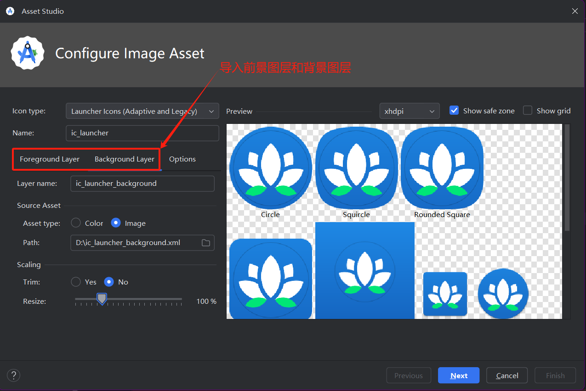
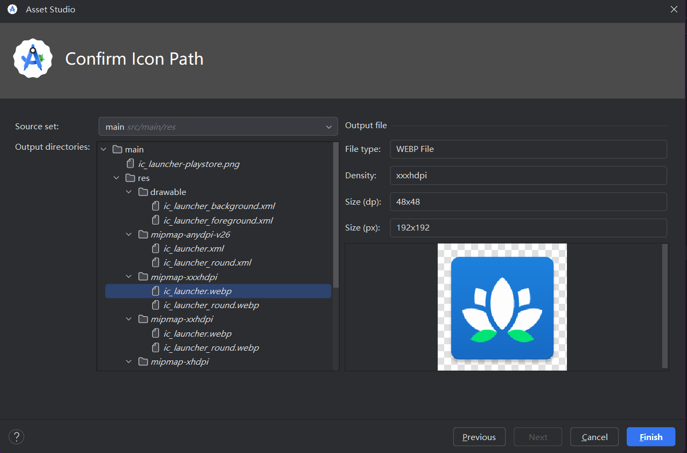

## 启动器图标

设置启动图标的目标是，**无论设备型号或屏幕密度如何，您的启动器图标都会呈现清晰简洁的效果**。为适应不同屏幕密度的设备，您需要提供不同版本的应用图标。

**启动器图标资源位于 `mipmap` 目录**中，而其他应用资源位于 `drawable` 目录中。这是因为，某些启动器显示的应用图标尺寸可能会比设备默认密度级别提供的应用图标尺寸要大。例如，在 `hdpi` 设备上，某种设备启动器可能需要改用 `xhdpi` 版本的应用图标。这些目录包含的图标适用于相比默认密度需要更高或更低密度的图标的设备。

> 为了避免应用图标模糊不清，请务必针对每个密度级别（`mdpi`、`hdpi`、`xhdpi` 等）提供不同的图标位图图片。请注意，设备屏幕密度不会刚好是 160 dpi、240 dpi、320 dpi 等。Android 会根据设备的屏幕密度，以最接近的较大密度级别选择资源，然后将其缩小。


## 自适应图标

**自 [Android 8.0 版本](https://developer.android.google.cn/about/versions/oreo?hl=zh-cn)（API 级别 26）起，系统支持自适应图标**，这种图标能够使应用图标更加灵活并呈现出有趣的视觉效果。对于开发者来说，这意味着**应用图标由两个图层组成：前景图层和背景图层**。


在上面的示例中，白色的 Android 图标位于前景图层中，而蓝白网格位于背景图层中。前景图层会叠加在背景图层上。系统会在其上再叠加一个蒙版（在此例中为圆形蒙版），这样就产生了一个圆形应用图标。

>注意，系统对这些前景和背景图层资源有特定要求，例如它们的尺寸都必须为 108dp x 108dp。您可以在 [AdaptiveIconDrawable 文档](https://developer.android.google.cn/reference/kotlin/android/graphics/drawable/AdaptiveIconDrawable?hl=zh-cn)中查看更多详细信息，还可以在 Material Design 网站上查看 [Android 图标](https://m3.material.io/styles/icons/overview)的设计指南。

**自适应图标是矢量图（由前景矢量可绘制对象、背景矢量可绘制对象以及在其上应用的 OEM 蒙版组合而成）**， 存放于 **mipmap-anydpi** 目录。 打开 `ic_launcher.xml` 文件，相应代码为：

```xml
<?xml version="1.0" encoding="utf-8"?>
<adaptive-icon xmlns:android="http://schemas.android.com/apk/res/android">
    <background android:drawable="@drawable/ic_launcher_background"/>
    <foreground android:drawable="@drawable/ic_launcher_foreground"/>
    <monochrome android:drawable="@drawable/ic_launcher_foreground"/>
</adaptive-icon>
```

该文件中使用了 `<adaptive-icon>` 元素为应用图标的 `<background>` 图层和 `<foreground>` 图层分别提供资源可绘制对象，从而完成对它们的声明。

> 矢量可绘制对象是 Android 平台的矢量图形实现。它们使用 XML 以一组点、线条和曲线以及相关颜色信息的形式进行定义。矢量可绘制对象可针对任何密度进行缩放，而不会降低图片质量。

**向资源目录添加资源限定符，以指定应在具有特定配置的设备上使用的资源（`v24` 或 `v26`）**。**mipmap-anydpi-v26** 资源目录表明添加自适应图标的是 API 级别为 26 的平台，因此自适应图标应该是在具有 `-v26` 资源限定符的 `mipmap` 资源目录中声明的。这个限定符意味着，此目录中的资源只会应用到搭载 API 26 (Android 8.0) 或更高版本的设备。在搭载版本 25 或更低版本，且支持密度级别 mipmap 目录的设备上，系统会忽略此目录中的资源文件。


## 设计自适应图标

[博文“设计自适应图标”](https://medium.com/google-design/designing-adaptive-icons-515af294c783)中“设计注意事项”下的内容，了解一些有关视觉效果的有趣示例。由于您不知道用户将会使用什么设备，或者 OEM 将会为您的图标应用哪种蒙版，您需要设置自己的自适应图标，以免重要信息被裁剪掉。


## 自适应和旧版启动器图标

针对各个密度级别（`mdpi`、`hdpi`、`xhdpi`、`xxhdpi`、`xxxhdpi`）提供不同版本的应用图标位图图片，以便应用图标能够在旧版 Android 上呈现出较高的质量，这被称为**向后兼容性**。

在搭载 **Android 8.0 或更高版本**（API 26 及更高版本）的设备上，系统可以使用**自适应图标**（由前景矢量可绘制对象、背景矢量可绘制对象以及在其上应用的 OEM 蒙版组合而成）。以下是您项目中的相关文件：

```
res/drawable/ic_launcher_background.xml
res/drawable/ic_launcher_foreground.xml
res/mipmap-anydpi-v26/ic_launcher.xml
res/mipmap-anydpi-v26/ic_launcher_round.xml
```

在搭载 **Android 8.0 以下**的任意版本（但高于您的应用所需的最低 API 级别）的设备上，系统将使用**旧版启动器图标**（位于不同密度级别的 `mipmap` 文件夹中的位图图片）。以下是您项目中的相关文件：

```
res/mipmap-mdpi/ic_launcher.webp
res/mipmap-mdpi/ic_launcher_round.webp
res/mipmap-hdpi/ic_launcher.webp
res/mipmap-hdpi/ic_launcher_round.webp
res/mipmap-xhdpi/ic_launcher.png
res/mipmap-xhdpi/ic_launcher_round.webp
res/mipmap-xxhdpi/ic_launcher.webp
res/mipmap-xxhdpi/ic_launcher_round.webp
res/mipmap-xxxhdpi/ic_launcher.webp
res/mipmap-xxxhdpi/ic_launcher_round.webp
```

实际上，在不支持自适应图标的旧版设备上，Android 将回退为使用位图图片。


## 更改应用图标

**使用 Android Studio 中的 Image Asset Studio 为您的应用创建旧版图标和自适应图标。**

1. 首先，删除带有 Android 图标和绿色网格背景的旧版可绘制资源。注意，mipmap-xxx 目录可以直接删除，后面会一次性生成所有 mipmap-xxx 目录以及目录下的应用图标。

   ```
   drawable/ic_launcher_background.xml
   drawable/ic_launcher_foreground.xml
   mipmap-anydpi-v26/
   mipmap-hdpi/
   mipmap-mdpi/
   mipmap-xhdpi/
   mipmap-xxhdpi/
   mipmap-xxxhdpi/
   ```

2. 创建一个新的 **Image Asset**。您可以右键点击 res 目录，然后依次选择 New > Image Asset；也可以先点击 Resource Manager 标签页，再点击 + 图标，然后从下拉菜单中选择 Image Asset，导入前景图层和背景图层。

   

3. **Confirm Icon Path**。您可以点击各个文件，查看预览效果。可以看到，我们仅用两个 xml 文件生成所有 mipmap-xxx 目录以及目录下的应用图标。

   

4. 此时，重启运行项目即可，可以看到应用图标已经更改。


## 了解更多内容

[更改应用图标](https://developer.android.google.cn/codelabs/basic-android-kotlin-compose-training-change-app-icon?hl=zh-cn&continue=https%3A%2F%2Fdeveloper.android.google.cn%2Fcourses%2Fpathways%2Fandroid-basics-compose-unit-3-pathway-2%3Fhl%3Dzh-cn%23codelab-https%3A%2F%2Fdeveloper.android.com%2Fcodelabs%2Fbasic-android-kotlin-compose-training-change-app-icon#7)