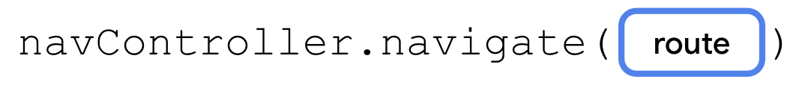

## 应用演示

### 应用屏幕分析

- **Start Order 屏幕**： 向用户显示三个按钮，这些按钮对应于要订购的纸杯蛋糕数量。这由 `StartOrderScreen.kt` 中的 `StartOrderScreen` 可组合项表示。

- **Choose Flavor 屏幕**：选择数量后，应用会提示用户选择纸杯蛋糕的口味。应用使用单选按钮来显示不同的选项。用户可以从多种可选口味中选择一种口味。

- **Choose Pickup Date 屏幕**：用户选择口味后，应用会向用户显示另一些单选按钮，用于选择自提日期。自提选项来自 `OrderViewModel` 中的 `pickupOptions()` 函数返回的列表。
- **Order Summary 屏幕：**用户选择自提日期后，应用会显示 **Order Summary** 屏幕，用户可以在其中检查和完成订单。此屏幕由 `SummaryScreen.kt` 中的 `OrderSummaryScreen` 可组合项实现。

**Choose Flavor** 屏幕和 **Choose Pick-Date** 屏幕均由 `SelectOptionScreen.kt` 中的相同可组合项 `SelectOptionScreen` 表示。为什么要使用相同的可组合项？因为这些屏幕的布局完全相同！唯一的区别在于数据，但您可以使用相同的可组合项来同时显示口味屏幕和自提日期屏幕

### 应用状态

应用的当前状态存储在 `data.OrderUiState.kt` 中。`OrderUiState` 数据类包含用于存储在每个屏幕中为用户提供的可用选项的属性。

### 可重复使用的可组合项

在适当的情况下，本课程中的示例应用可实现最佳实践。Cupcake 应用也不例外。在 **ui.components** 软件包中，您会看到一个名为 `CommonUi.kt` 的文件，其中包含一个 `FormattedPriceLabel` 可组合项。应用中的多个屏幕使用此可组合项来统一设置订单价格的格式。您无需重复定义具有相同格式和修饰符的相同 `Text` 可组合项，而是只需定义一次 `FormattedPriceLabel`，然后根据需要将其重复用于其他屏幕。

同样，口味屏幕和自提日期屏幕也使用可重复使用的 `SelectOptionScreen` 可组合项。此可组合项接受名为 `options` 且类型为 `List<String>` 的参数，该参数表示要显示的选项。这些选项显示在 `Row` 中，后者由一个 `RadioButton` 可组合项和一个包含各个字符串的 `Text` 可组合项组成。整个布局周围有一个 `Column`，还包含一个用于显示格式化价格的 `Text` 可组合项、一个 **Cancel** 按钮和一个 **Next** 按钮。


## 添加代码

Navigation 组件有三个主要部分：

- **NavController**：负责在目标页面（即应用中的屏幕）之间导航。
- **NavGraph**：用于映射要导航到的可组合项目标页面。
- **NavHost**：此可组合项充当容器，用于显示 NavGraph 的当前目标页面。

### [ 定义路线并创建 NavHostController](https://developer.android.google.cn/codelabs/basic-android-kotlin-compose-navigation?hl=zh-cn&continue=https%3A%2F%2Fdeveloper.android.google.cn%2Fcourses%2Fpathways%2Fandroid-basics-compose-unit-4-pathway-2%3Fhl%3Dzh-cn%23codelab-https%3A%2F%2Fdeveloper.android.com%2Fcodelabs%2Fbasic-android-kotlin-compose-navigation#3)

首先，定义 Cupcake 应用的四个路线。

- **`Start`**：从三个按钮之一选择纸杯蛋糕的数量。
- **`Flavor`**：从选项列表中选择口味。
- **`Pickup`**：从选项列表中选择自提日期。
- **`Summary`**：检查所选内容，然后发送或取消订单。

添加一个枚举类来定义路线。

```
/**
 * 定义 Cupcake 应用的四个路线
 */
enum class CupcakeScreen() {
    Start,     // 启动屏幕, 从三个按钮之一选择纸杯蛋糕的数量。
    Flavor,    // 选择纸杯蛋糕的口味
    Pickup,    // 选择纸杯蛋糕的取货日期
    Summary    // 显示订单的摘要，然后发送或取消订单
}
```


### 为应用添加 NavHost

NavHost 是一个可组合项，用于根据给定路线来显示其他可组合项目标页面。例如，如果路线为 `Flavor`，`NavHost` 会显示用于选择纸杯蛋糕口味的屏幕。如果路线为 `Summary`，则应用会显示摘要屏幕。


### 在多个路线之间导航

`NavHostController`（`rememberNavController()` 调用中的 `navController` 属性）负责在多个路线之间导航。但请注意，此属性是在 `CupcakeApp` 可组合项中定义的。您需要从应用中的不同屏幕访问该属性。只需将 `navController` 作为参数传递给每个可组合项即可。

 尽管这种方法很有效，但这并不是构建应用的理想方式。使用 NavHost 处理应用导航的一项优势就是，导航逻辑将各个界面相隔离。此方法可避免将 `navController` 作为参数传递时的一些主要缺点。

- 导航逻辑会保存在一个集中位置，这样可以避免意外允许各个屏幕在应用中随意导航，从而让您的代码更易于维护并预防 bug。
- 在需要处理不同外形规格（例如竖屏模式手机、可折叠手机或大屏平板电脑）的应用中，按钮可能会触发导航，也可能不会触发导航，具体取决于应用的布局。各个屏幕应保持独立，无需了解应用中其他屏幕的信息。

如需导航到其他路线，只需在 `NavHostController` 实例上调用 `navigate()` 方法即可。



navigation 方法仅接受一个参数：与 `NavHost` 中定义的路线相对应的 `String`。如果路线与 `NavHost` 中的 `composable()` 任一调用匹配，应用便会转到该屏幕。

```
@Composable
fun CupcakeApp(
    viewModel: OrderViewModel = viewModel(),
    navController: NavHostController = rememberNavController()
) {

    Scaffold(
        topBar = {
            CupcakeAppBar(
                canNavigateBack = false,
                navigateUp = { /* TODO: implement back navigation */ }
            )
        }
    ) { innerPadding ->
        val uiState by viewModel.uiState.collectAsState()

        NavHost(
            navController = navController,                  // 使用此对象在屏幕之间导航
            startDestination = CupcakeScreen.Start.name,    // 定义应用首次显示 NavHost 时默认显示的目标页面
            modifier = Modifier.padding(innerPadding)
        ) {
            composable(route = CupcakeScreen.Start.name) {
                StartOrderScreen(
                    quantityOptions = DataSource.quantityOptions,
                    onNextButtonClicked = {
                        viewModel.setQuantity(it)
                        navController.navigate(CupcakeScreen.Flavor.name)  // 导航到 Flavor 页面
                    },
                    modifier = Modifier
                        .fillMaxSize()
                        .padding(dimensionResource(R.dimen.padding_medium))
                )

            }
            composable(route = CupcakeScreen.Flavor.name) {
                val context = LocalContext.current
                SelectOptionScreen(
                    subtotal = uiState.price,
                    onNextButtonClicked = { navController.navigate(CupcakeScreen.Pickup.name) },    // 导航到Pickup屏幕
                    onCancelButtonClicked = {
                        cancelOrderAndNavigateToStart(viewModel, navController) // 取消订单并导航到Start屏幕
                    },
                    options = DataSource.flavors.map { id -> context.resources.getString(id) },
                    onSelectionChanged = { viewModel.setFlavor(it) },
                    modifier = Modifier.fillMaxHeight()
                )
            }
            composable(route = CupcakeScreen.Pickup.name) {
                SelectOptionScreen(
                    subtotal = uiState.price,
                    onNextButtonClicked = { navController.navigate(CupcakeScreen.Summary.name) },
                    onCancelButtonClicked = {
                        cancelOrderAndNavigateToStart(viewModel, navController)
                    },
                    options = uiState.pickupOptions,
                    onSelectionChanged = { viewModel.setDate(it) },
                    modifier = Modifier.fillMaxHeight()
                )
            }
            composable(route = CupcakeScreen.Summary.name) {
                OrderSummaryScreen(
                    orderUiState = uiState,
                    onCancelButtonClicked = {
                        cancelOrderAndNavigateToStart(viewModel, navController)
                    },
                    onSendButtonClicked = { subject: String, summary: String ->

                    },
                    modifier = Modifier.fillMaxHeight()
                )
            }
        }

    }
}
```


您现在应当能够在应用的各个屏幕之间导航。请注意，通过调用 `navigate()`，屏幕不仅会发生变化，而且会实际放置在返回堆栈之上。此外，当您点按系统返回按钮时，即可返回到上一个界面。

应用会将每个界面堆叠在上一个界面上，而返回按钮 () 可以移除这些界面。从底部 `startDestination` 到刚才显示的最顶部的屏幕的历史记录称为返回堆栈。


### 跳转至起始屏幕

与系统返回按钮不同，**Cancel** 按钮不会返回上一个屏幕。而是**跳转移除返回堆栈中的所有屏幕，并返回起始屏幕**。您可以通过调用 `popBackStack()` 方法来实现此目的。

```
/**
 * 当用户在任何屏幕上点按 Cancel 按钮时，应用会重置视图模型中的状态并调用 popBackStack()
 * 来返回到开始屏幕。
 */
private fun cancelOrderAndNavigateToStart(
    viewModel: OrderViewModel,
    navController: NavHostController
) {
    viewModel.resetOrder()
    navController.popBackStack(CupcakeScreen.Start.name, inclusive = false)
}
```


### [导航到其他应用](https://developer.android.google.cn/codelabs/basic-android-kotlin-compose-navigation?hl=zh-cn&continue=https%3A%2F%2Fdeveloper.android.google.cn%2Fcourses%2Fpathways%2Fandroid-basics-compose-unit-4-pathway-2%3Fhl%3Dzh-cn%23codelab-https%3A%2F%2Fdeveloper.android.com%2Fcodelabs%2Fbasic-android-kotlin-compose-navigation#5)

 `navController` 不会调用系统界面（例如分享屏幕）。作为替代方案，您可以使用 intent。

**intent 将请求系统执行某项操作，通常用于呈现新的 activity。**有许多不同的 intent，建议您参阅相关文档，查看完整列表。不过，我们感兴趣的是 `ACTION_SEND`。您可以向此 intent 提供某些数据（例如字符串），并为这些数据提供适当的分享操作。

设置 intent 的基本过程如下：

1. 创建一个 intent 对象并指定 intent，例如 `ACTION_SEND`。
2. 指定随 intent 一同发送的其他数据类型。对于简单的一段文本，您可以使用 `"text/plain"`，但也可以使用其他类型，例如 `"image/*"` 或 `"video/*"`。
3. 通过调用 `putExtra()` 方法，向 intent 传递任何其他数据，例如要分享的文本或图片。此 intent 将接受两个 extra：`EXTRA_SUBJECT` 和 `EXTRA_TEXT`。
4. 调用上下文的 `startActivity()` 方法，并传入从 intent 创建的 activity。


### 让应用栏响应导航

在您的应用上下文中，返回按钮和向上按钮的作用相同，都是返回上一个屏幕。

```
 // 获取当前屏幕
    val backStackEntry by navController.currentBackStackEntryAsState()
    val currentScreen = CupcakeScreen.valueOf(
        backStackEntry?.destination?.route ?: CupcakeScreen.Start.name
    )

    Scaffold(
        topBar = {
            CupcakeAppBar(
                currentScreen = currentScreen,
                canNavigateBack = navController.previousBackStackEntry != null,
                navigateUp = { navController.navigateUp() } // 返回到上一个屏幕
            )
        }
    ) 
```