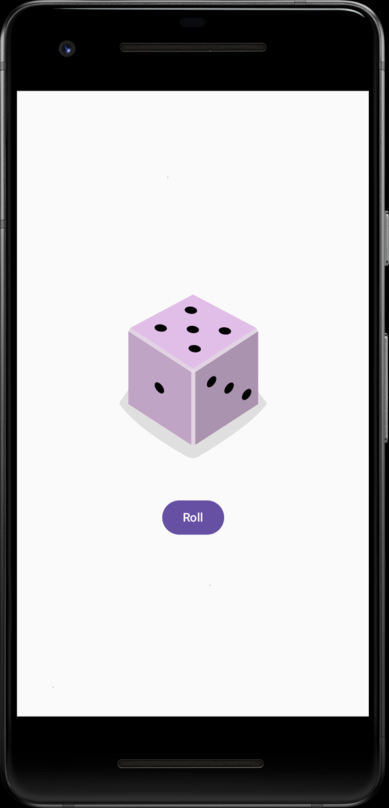

## 项目描述

本项目创建一个交互式 **Dice Roller** 应用，让用户可以通过点按 `Button` 可组合函数的相应界面元素来掷骰子。掷骰子的结果将通过 `Image` 可组合函数显示在屏幕上。

## 学习内容

- 如何使用 Compose 向 Android 应用添加 `Button` 可组合函数。
- 如何使用 Compose 为 Android 应用中的 `Button` 可组合函数添加行为。
- 如何打开和修改 Android 应用的 `Activity` 代码。