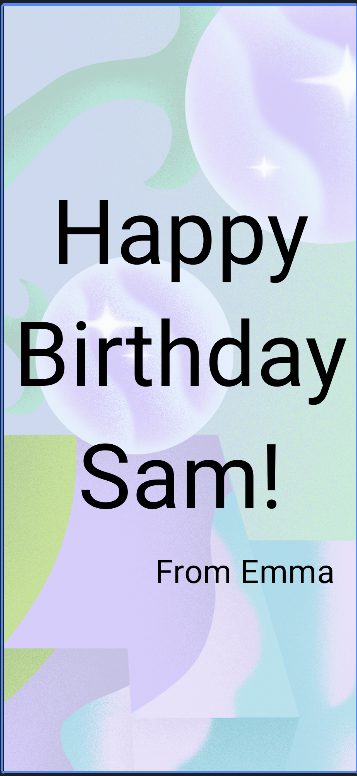

## 项目描述

[本项目](https://developer.android.google.cn/courses/pathways/android-basics-compose-unit-1-pathway-3?hl=zh-cn)构建一个显示文本和图像、界面简单的生日贺卡应用，完成后应如下面的屏幕截图所示：

## 学习内容

- 了解如何编写可组合函数，例如 `Text`、`Column` 和 `Row` 可组合函数。
- 如何在布局中显示应用里的文本。
- 如何设置文本格式，例如更改文本大小。