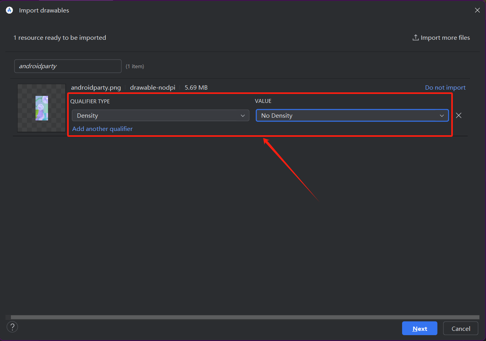
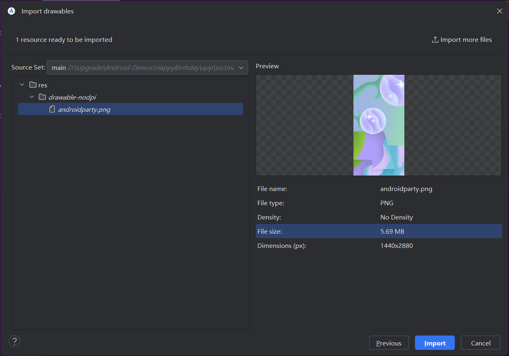

## 添加文本

[使用文本可组合项构建简单的应用](https://developer.android.google.cn/codelabs/basic-android-kotlin-compose-text-composables?hl=zh-cn&continue=https%3A%2F%2Fdeveloper.android.google.cn%2Fcourses%2Fpathways%2Fandroid-basics-compose-unit-1-pathway-3%3Fhl%3Dzh-cn%23codelab-https%3A%2F%2Fdeveloper.android.com%2Fcodelabs%2Fbasic-android-kotlin-compose-text-composables#1)

```kotlin
 Column(
        verticalArrangement = Arrangement.Center, // 垂直居中
        modifier = modifier
    ) {
        Text(
            text = message,
            fontSize = 100.sp,
            lineHeight = 136.sp,
            textAlign = TextAlign.Center // 文本居中
        )
        Text(
            text = from,
            fontSize = 36.sp,
            modifier = Modifier
                .padding(16.dp)
                .align(alignment = Alignment.End)
        )
    }
```


## 添加图片

> [向 Android 应用添加图片](https://developer.android.google.cn/codelabs/basic-android-kotlin-compose-add-images?hl=zh-cn&continue=https%3A%2F%2Fdeveloper.android.google.cn%2Fcourses%2Fpathways%2Fandroid-basics-compose-unit-1-pathway-3%3Fhl%3Dzh-cn%23codelab-https%3A%2F%2Fdeveloper.android.com%2Fcodelabs%2Fbasic-android-kotlin-compose-add-images#1)

### 导入图片

使用 **Resource Manager** 添加图片。Resource Manager 是一个工具窗口，可供您在应用中导入、创建、管理和使用资源。

添加图片，并设置 qualifier 类型。Android 设备具有不同的屏幕尺寸（手机、平板电脑和电视等），而且这些屏幕也具有不同的像素尺寸。也就是说，有可能一部设备的屏幕为每平方英寸 160 个像素，而另一部设备的屏幕在相同的空间内可以容纳 480 个像素。如果不考虑像素密度的这些变化，系统可能会按比例缩放图片，这可能会导致图片模糊或占用大量内存空间，或者图片大小不当。如果所调整的图片超出了 Android 系统可处理的图片大小，系统会抛出内存不足错误。对于照片和背景图片（如当前图片 `androidparty.png`），应将其放在 `drawable-nodpi` 文件夹中，这样会停止调整大小行为。

如需详细了解像素密度，请参阅[支持不同的像素密度](https://developer.android.google.cn/training/multiscreen/screendensities?hl=zh-cn)。



Android Studio 会创建一个 `drawable-nodpi` 文件夹，并将您的图片放在其中。在 Android Studio 的“Project”视图中，资源名称会显示为 `androidparty.png (nodpi)`。在计算机文件系统中，Android Studio 会创建一个名为 `drawable-nodpi` 的文件夹。




### 调用图片

调用图片代码如下：

```kotlin
@Composable
fun GreetingImage(message: String, from: String, modifier: Modifier = Modifier) {
    val image = painterResource(R.drawable.androidparty)
    Box(modifier) {
        Image(
            painter = image,
            contentDescription = null
        )
        GreetingText(
            message = message,
            from = from,
            modifier = Modifier
                .fillMaxSize()
                .padding(8.dp)
        )
    }
}
```

`Image` 可组合项应包含内容说明，以便提高应用的无障碍性。在图片中添加内容说明会使应用更难以通过 TalkBack 进行使用。您可以不设置面向用户的内容说明，而将图片的 `contentDescription` 实参设为 `null`，以便 TalkBack 跳过 `Image` 可组合函数。


### 调整图片

```
Image(
            painter = image,
            contentDescription = null,
            contentScale = ContentScale.Crop, // 调整图片大小，以使其全屏显示
            alpha = 0.5F    // 透明度
        )
```

