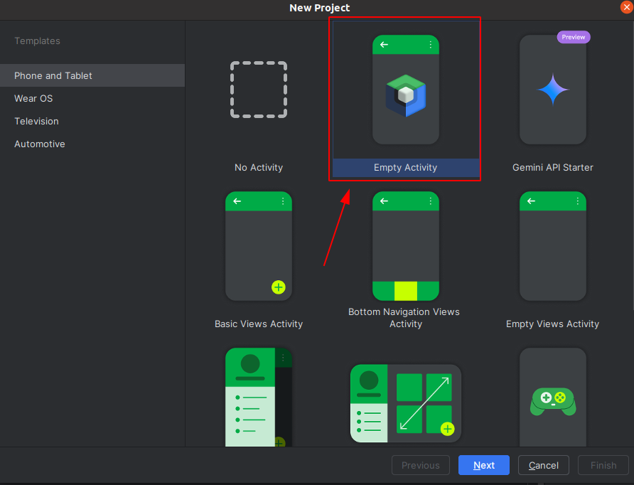
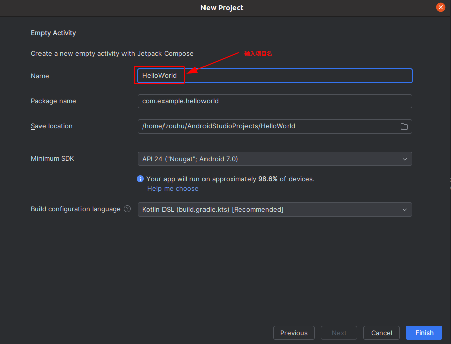
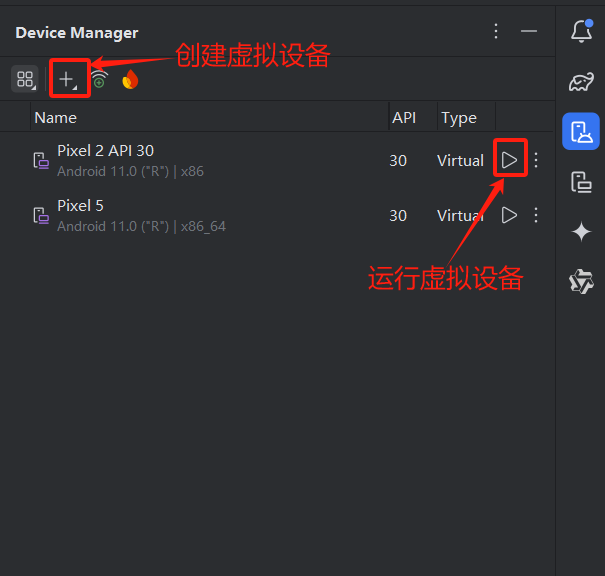
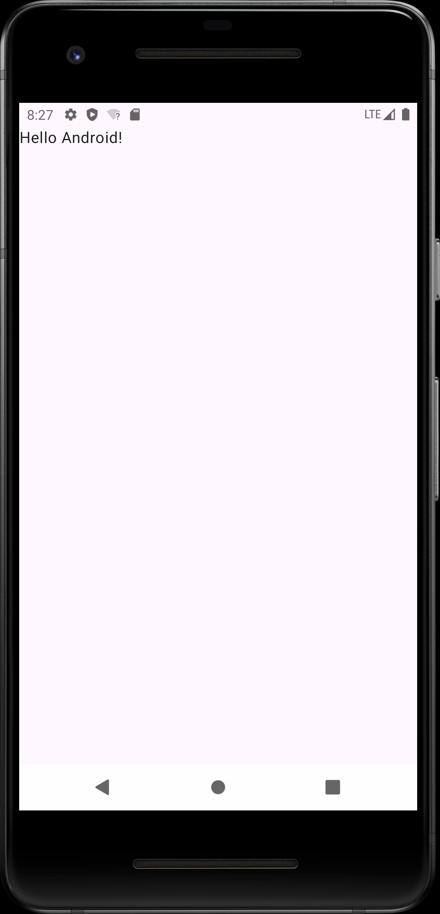
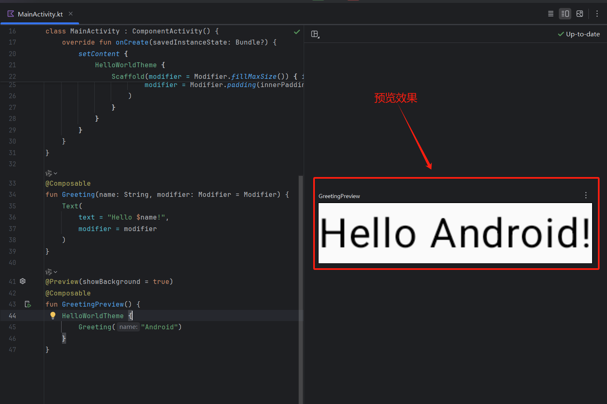

## 创建项目

新建项目，选择 `Empty Activity`。



然后，配置项目信息




## 启动设备

Android 应用可以在真实物理机或者虚拟设备中运行。

如果使用虚拟设备运行项目，创建虚拟设备并启动。




## 运行项目

选择相应的虚拟设备并允许项目，运行结果如下图所示。




## 程序分析

在正式开始分析代码之前，我们需要了解 Compose 的一些函数。

| **组件/方法**       | **作用**                                                   |
| :------------------ | :--------------------------------------------------------- |
| `ComponentActivity` | 支持 Compose 的 Activity 基类。                            |
| `setContent`        | 将 Composable 函数绑定到 Activity。                        |
| `Scaffold`          | 提供 Material Design 的标准布局结构（如 AppBar、FAB 等）。 |
| `Modifier`          | 用于调整组件布局（如 padding、size、clickable 等）。       |
| `Theme`             | 定义颜色、字体和形状等样式，确保 UI 一致性。               |

**(1）Activity 创建**

在 MainActivity.kt 中，Activity 创建代码为

```kotlin
class MainActivity : ComponentActivity() {
    override fun onCreate(savedInstanceState: Bundle?) {
        super.onCreate(savedInstanceState)
        enableEdgeToEdge()
        setContent {
            HelloWorldTheme {
                Scaffold(modifier = Modifier.fillMaxSize()) { innerPadding ->
                    Greeting(
                        name = "Android",
                        modifier = Modifier.padding(innerPadding)
                    )
                }
            }
        }
    }
}
```

这段代码是一个典型的 **Jetpack Compose** 实现的 Android Activity，用于构建一个现代化的 UI 界面。

- **类定义**：继承 `ComponentActivity`，作为应用的主界面。
- **初始化 Activity**：调用 `onCreate`。
- **启用全屏沉浸式布局**：在 `onCreate` 中启用沉浸式边缘显示（`enableEdgeToEdge()`）。
- **设置 Compose UI**：使用 Jetpack Compose 设置界面内容。
  - 应用主题为 HelloWorldTheme。
  - 使用 Scaffold 构建基础 UI 结构并填充屏幕。
  - 显示一个带有内边距的 Greeting 组件，内容为 "Android"

`Greeting` 组件代码为：

```kotlin
@Composable
fun Greeting(name: String, modifier: Modifier = Modifier) {
    Text(
        text = "Hello $name!",
        modifier = modifier
    )
}

@Preview(showBackground = true)
@Composable
fun GreetingPreview() {
    HelloWorldTheme {
        Greeting("Android")
    }
}
```

- `Greeting` 函数用于在 Jetpack Compose 中显示一条问候语 "Hello $name!"，接受 name 和可选的 modifier 参数。

- `GreetingPreview` 函数用于预览该组件，在预览中使用 `HelloWorldTheme` 主题包裹并显示 `Greeting("Android")`。预览效果如下图所示。

  > 在 Jetpack Compose 中，预览（Preview） 是一个开发工具功能，用于在 Android Studio 的 预览窗口 中实时显示可组合函数（`@Composable` 函数）的 UI 效果，无需运行整个应用。

**(2) Activity 注册**

`AndroidManifest.xml` 是整个Android项目的配置文件，用于注册程序中定义的所有四大组件和应用程序的权限声明。`AndroidManifest.xml` 的注册代码如下：

```xml
<activity
    android:name=".MainActivity"
    android:exported="true"
    android:label="@string/app_name"
    android:theme="@style/Theme.HelloWorld">
    <intent-filter>
        <action android:name="android.intent.action.MAIN" />

        <category android:name="android.intent.category.LAUNCHER" />
    </intent-filter>
</activity>
```

这段 XML 代码定义了一个 Android 应用的主活动（MainActivity），功能如下：

- `android:name=".MainActivity"`：指定该 Activity 类为当前应用的主界面。
- `android:exported="true"`：允许外部应用启动该 Activity。
- `android:label="@string/app_name"`：设置该Activity的显示名称，引用了字符串资源 `app_name`。
  - `@string/app_name` 是 Android 资源引用语法，表示引用 `res/values/strings.xml` 文件中定义的字符串资源 `app_name`。
- `android:theme="@style/Theme.HelloWorld`"：为该 Activity 指定主题样式。
- `<intent-filter>`中的内容表示**该 Activity 是应用的入口点**。在手机上点击应用图标，首先启动的就是这个Activity。
  - `ACTION.MAIN`：表明这是程序的主入口。
  - `CATEGORY.LAUNCHER`：表明该 Activity 会显示在系统的应用启动器中。