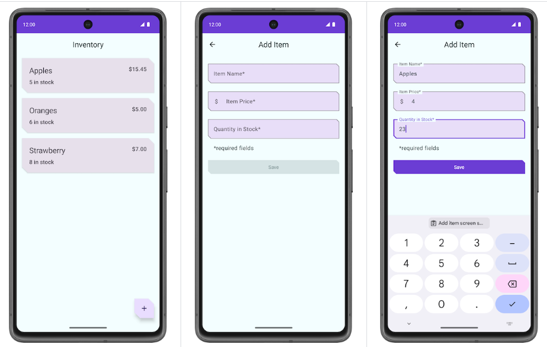

### 项目描述

本项目创建一个 **Inventory** 应用，用于将商品目录中的商品保存到 SQLite 数据库中。该应用实现功能主要有

- 应用会显示商品目录数据库中的商品列表。
- 用户可以选择在商品目录数据库中添加新商品、更新现有商品和删除其中的商品

### 学习目标

- 如何使用 Room 库创建 SQLite 数据库并与之交互？
- 如何创建实体、数据访问对象 (DAO) 和数据库类。
- 如何使用 DAO 将 Kotlin 函数映射到 SQL 查询。