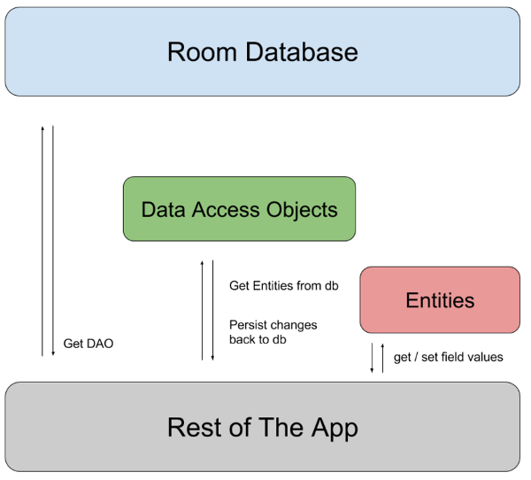
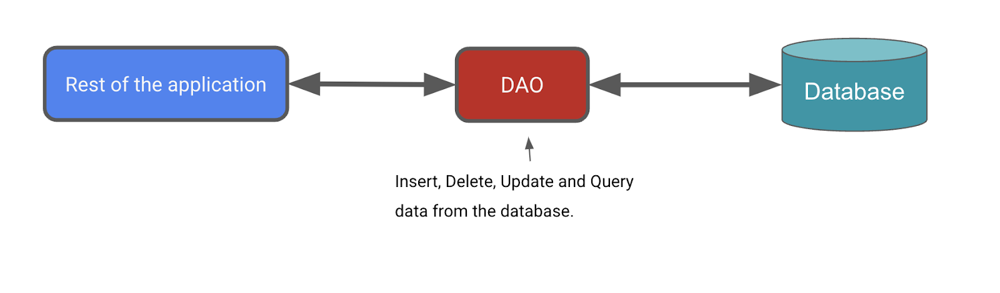

## Room 库

[Room](https://developer.android.google.cn/topic/libraries/architecture/room?hl=zh-cn) 是一个属于 Android Jetpack 的持久性库，简化了 Android 数据库的使用。换句话说，Room 是 SQLite 之上的一个抽象层，提供方便的 API 来设置、配置和查询数据库。

Room 并不直接使用 SQLite，而是负责简化数据库设置和配置以及数据库与应用交互方面的琐碎工作。Room 还提供 SQLite 语句的编译时检查。

Room 依赖项主要有：

```
//Room
implementation("androidx.room:room-runtime:${rootProject.extra["room_version"]}")
ksp("androidx.room:room-compiler:${rootProject.extra["room_version"]}")
implementation("androidx.room:room-ktx:${rootProject.extra["room_version"]}")
```

KSP 是一个功能强大且简单易用的 API，用于解析 Kotlin 注解。

> **注意**：对于 Gradle 文件中的库依赖项，请务必使用 [AndroidX 版本](https://developer.android.google.cn/jetpack/androidx/versions?hl=zh-cn)页面中最新稳定发布版本的版本号。


## Room 组件

[Room](https://developer.android.google.cn/topic/libraries/architecture/room?hl=zh-cn) 的以下三个组件可以使这些工作流变得顺畅。

- [Room 实体](https://developer.android.google.cn/training/data-storage/room/defining-data?hl=zh-cn)表示应用数据库中的表。您可以使用它们更新表中的行所存储的数据，以及创建要插入的新行。
- Room [DAO](https://developer.android.google.cn/training/data-storage/room/accessing-data?hl=zh-cn) 提供了供应用在数据库中检索、更新、插入和删除数据的方法。
- Room [Database 类](https://developer.android.google.cn/reference/kotlin/androidx/room/Database?hl=zh-cn)是一个数据库类，可为您的应用提供与该数据库关联的 DAO 实例。

下图演示了 Room 的各组件如何协同工作以与数据库交互。



### Entity

[Entity](https://developer.android.google.cn/reference/androidx/room/Entity?hl=zh-cn) 类定义了一个表，该类的每个实例都表示数据库表中的一行。Entity 类以映射告知 Room 它打算如何呈现数据库中的信息并与之交互。

`@Entity` 注解用于将某个类标记为数据库 Entity 类。对于每个 Entity 类，该应用都会创建一个数据库表来保存这些项。除非另行说明，否则 Entity 的每个字段在数据库中都表示为一列（如需了解详情，请参阅[实体](https://developer.android.google.cn/reference/androidx/room/Entity?hl=zh-cn)文档）。存储在数据库中的每个实体实例都必须有一个主键。[主键](https://developer.android.google.cn/reference/androidx/room/PrimaryKey?hl=zh-cn)用于唯一标识数据库表中的每个记录/条目。应用分配主键后，便无法再修改主键；只要主键存在于数据库中，它就会表示实体对象。

> **注意**：`@Entity` 注解有多个可能的参数。默认情况下（`@Entity` 没有参数），表名称与类名称相同。使用 `tableName` 参数可自定义表名称。为简单起见，请使用 `item`。`@Entity` 还有几个其他参数，您可以参阅[实体文档](https://developer.android.google.cn/reference/androidx/room/Entity?hl=zh-cn)进行研究。


### DAO

[数据访问对象](https://developer.android.google.cn/reference/androidx/room/Dao?hl=zh-cn) (DAO) 是一种模式，其作用是通过提供抽象接口将持久性层与应用的其余部分分离。这种分离遵循您曾在之前的 Codelab 中接触过的[单一责任原则](https://en.wikipedia.org/wiki/Single-responsibility_principle)。

DAO 的功能在于，让在底层持久性层执行数据库操作所涉及的所有复杂性与应用的其余部分分离。这样，您就可以独立于使用数据的代码更改数据层。



DAO 是一个自定义接口，提供查询/检索、插入、删除和更新数据库的便捷方法。**Room 将在编译时生成该类的实现。**

- `Room` 库提供了便捷注解（例如 `@Insert`、`@Delete` 和 `@Update`），用于定义执行简单插入、删除和更新的方法，而无需您编写 SQL 语句。
- 如果您需要定义更复杂的插入、删除或更新操作，或者需要查询数据库中的数据，请改用 `@Query` 注解。

> <font color="red">数据库操作的执行可能用时较长，因此需要在单独的线程上运行。</font> Room 不允许在主线程上访问数据库。
>
> 所以我们需要使用 suspend 修饰符来告诉 Room 运行数据库操作。


建议在持久性层中使用 `Flow`。将返回值类型设为 `Flow` 后，只要数据库中的数据发生更改，您就会收到通知。`Room` 会为您保持更新此 `Flow`，也就是说，您只需要显式获取一次数据。此设置有助于更新您将在下一个 Codelab 中实现的商品目录。由于返回值类型为 `Flow`，Room 还会在后台线程上运行该查询。您无需将其明确设为 `suspend` 函数并在协程作用域内调用它。

>  **注意**：Room 数据库中的 `Flow` 可以在数据库中的数据更改时发送通知，从而使数据处于最新状态。这样，您就可以观察数据并相应地更新界面。


### DataBase 实例

**[`Database`](https://developer.android.google.cn/reference/androidx/room/Database?hl=zh-cn) 类可为您的应用提供您定义的 DAO 实例。**反过来，应用可以使用 DAO 从数据库中检索数据，作为关联的数据实体对象的实例。此外，应用还可以使用定义的数据实体更新相应表中的行，或者创建新行供插入。

您需要创建一个抽象 `RoomDatabase` 类，并为其添加 `@Database` 注解。此类有一个方法，如果数据库不存在，该方法会返回 `RoomDatabase` 的现有实例。

以下是获取 `RoomDatabase` 实例的一般过程：

- 创建一个扩展 `RoomDatabase` 的 `public abstract` 类。您定义的新抽象类将用作数据库持有者。您定义的类是抽象类，因为 `Room` 会为您创建实现。
- 为该类添加 `@Database` 注解。在参数中，为数据库列出实体并设置版本号。
- 定义一个返回 `ItemDao` 实例的抽象方法或属性，`Room` 会为您生成实现。
- 整个应用只需要一个 `RoomDatabase` 实例，因此请将 `RoomDatabase` 设为单例。
- 使用 `Room` 的 [`Room.databaseBuilder`](https://developer.android.google.cn/reference/androidx/room/Room?hl=zh-cn#databaseBuilder(android.content.Context,java.lang.Class,kotlin.String)) 创建 (`item_database`) 数据库。不过，仅当该数据库不存在时才应创建。否则，请返回现有数据库。


## 其他

### 为什么不能跳过 Database 直接使用 DAO？

Room 使用 Database 类作为数据库的入口点，实现对底层 SQLite 的封装。通过 Database 获取 DAO，实现了 DAO 与具体数据库实现的解耦。开发者无需关心底层如何创建和管理数据库连接，只需通过接口调用即可。

DAO 是接口，Database 是其实现的容器


## 参考资料

- [使用 Room 将数据保存到本地数据库](https://developer.android.google.cn/training/data-storage/room?hl=zh-cn)
- [androidx.room](https://developer.android.google.cn/reference/androidx/room/package-summary?hl=zh-cn)