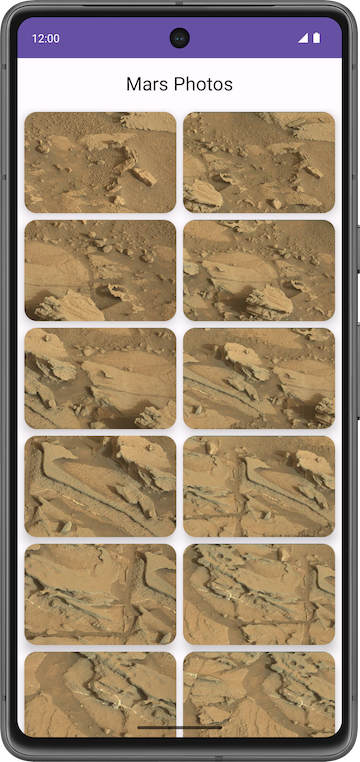

## 项目描述

该[项目](https://developer.android.google.cn/codelabs/basic-android-kotlin-compose-getting-data-internet?hl=zh-cn&continue=https%3A%2F%2Fdeveloper.android.google.cn%2Fcourses%2Fpathways%2Fandroid-basics-compose-unit-5-pathway-1%3Fhl%3Dzh-cn%23codelab-https%3A%2F%2Fdeveloper.android.com%2Fcodelabs%2Fbasic-android-kotlin-compose-getting-data-internet#1)创建名为 **Mars Photos** 的应用，其中显示了火星表面的图片。该应用需要连接到 Web 服务，才能检索并显示火星照片。这些图片是由 NASA 的火星探测器拍摄的真实照片。

