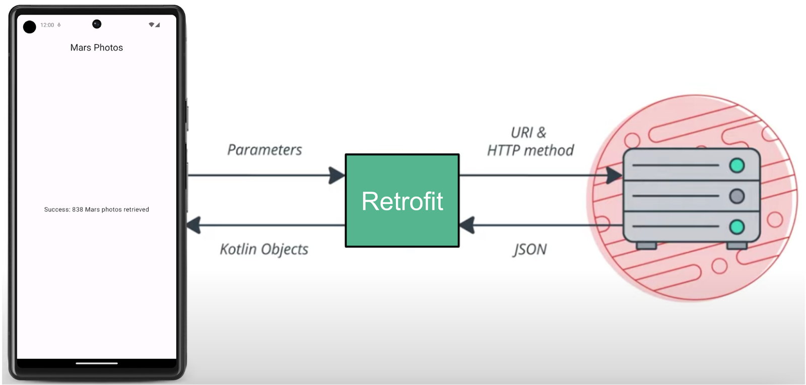

## Retrofit

Retrofit 库与 REST 后端进行通信。



Retrofit 会根据 Web 服务的内容为应用创建网络 API。它从 Web 服务提取数据，并通过独立的转换器库来路由数据。该库知道如何解码数据，并以 `String` 等对象形式返回这些数据。Retrofit 内置对 XML 和 JSON 等常用数据格式的支持。Retrofit 最终会创建一个代码来为您调用和使用此服务，包括关键详细信息（例如在后台线程上运行请求）。


## 相关依赖项

```
// Retrofit 
implementation("com.squareup.retrofit2:retrofit:2.9.0")
// Retrofit with Scalar Converter
implementation("com.squareup.retrofit2:converter-scalars:2.9.0")
```

这两个库协同工作。

- 第一个依赖项用于 Retrofit 2 库本身。Retrofit2 是 Retrofit 库的更新版本。
- 而第二个依赖项则用于 Retrofit 标量转换器。此标量转换器允许 Retrofit 将 JSON 结果作为 `String` 返回。JSON 是一种在客户端和服务器之间存储和传输数据的格式。


## 参考资料

 [Retrofit](https://square.github.io/retrofit/) 文档

[用于 Kotlin 序列化的 Retrofit 2 Converter.Factory](https://github.com/JakeWharton/retrofit2-kotlinx-serialization-converter)