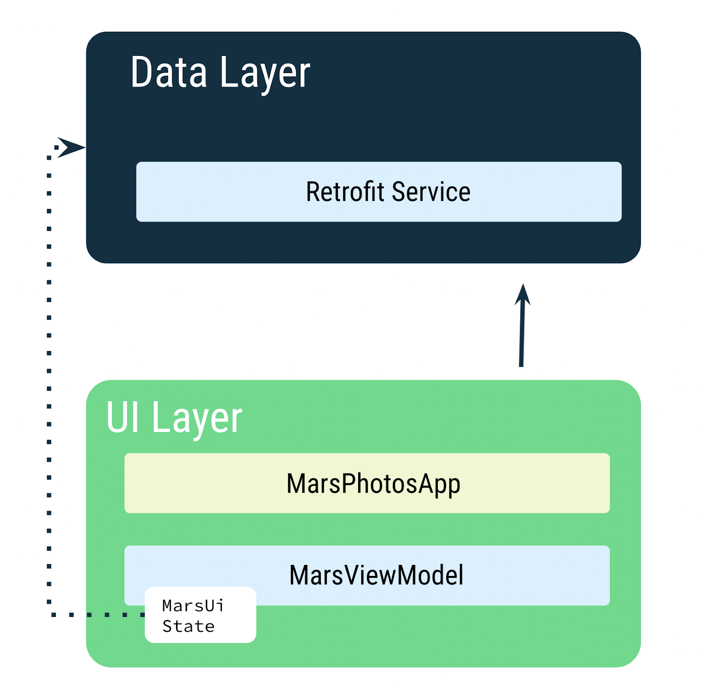
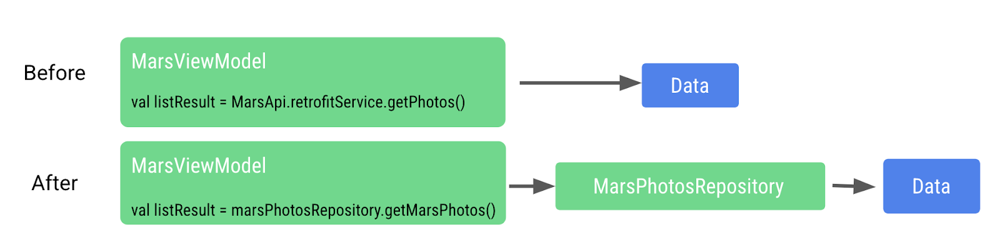

## 应用分析

### 项目结构

项目中的重要文件和文件夹。

`ui\MarsPhotosApp.kt`：

- 此文件包含可组合项 `MarsPhotosApp`，它会在屏幕上显示内容，例如顶部应用栏和 `HomeScreen` 可组合项。上一步中的占位符文本会显示在此可组合项中。
- 在下一个 Codelab 中，此可组合项将显示从火星照片后端服务器接收的数据。

`screens\MarsViewModel.kt`：

- 此文件是 `MarsPhotosApp` 的对应视图模型。
- 此类包含一个名为 `marsUiState` 的 `MutableState` 属性。更新此属性的值会更新屏幕上显示的占位符文本。
- `getMarsPhotos()` 方法会更新占位符响应。您稍后将在此 Codelab 中使用此方法显示从服务器提取的数据。此 Codelab 的目标是使用您从互联网获得的真实数据更新 `ViewModel` 中的 `MutableState`。

`screens\HomeScreen.kt`：

- 此文件包含 `HomeScreen` 和 `ResultScreen` 可组合项。`ResultScreen` 具有一个简单的 `Box` 布局，它会在 `Text` 可组合项中显示 `marsUiState` 的值。

`MainActivity.kt`：

- 此 activity 的唯一任务就是加载 `ViewModel` 并显示 `MarsPhotosApp` 可组合项。


### 数据层

为网络服务创建一个层，与后端服务器进行通信并提取所需数据，使用名为 [Retrofit](https://square.github.io/retrofit/) 的第三方库来完成此任务

`MarsViewModel` 负责发出网络调用以获取火星照片数据。在 `ViewModel` 中，您使用 `MutableState`，以在数据发生更改时更新应用界面。




## 获取互联网数据

### 实现 Retrofit 服务 API

向 **Mars Photos** 项目添加一个数据层，供 `ViewModel` 用来与 Web 服务通信。您将按照以下步骤实现 Retrofit 服务 API。

- 创建一个数据源：`MarsApiService` 类。
- 使用基准网址和转换器工厂创建 Retrofit 对象，以转换字符串。
- 创建一个可说明 Retrofit 如何与网络服务器通信的接口。
- 创建一个 Retrofit 服务，并向应用的其余 API 服务公开实例。

```
/**
 * Build the retrofit object with a base URL
 */
private const val BASE_URL =
    "https://android-kotlin-fun-mars-server.appspot.com"

/**
 * 使用基准网址和转换器工厂创建 Retrofit 对象，以转换字符串
 */
private val retrofit = Retrofit.Builder()
    .addConverterFactory(ScalarsConverterFactory.create())
    .baseUrl(BASE_URL)
    .build()

/**
 * 创建一个可说明 Retrofit 如何与网络服务器通信的接口
 *
 * 调用 getPhotos() 方法时，Retrofit 会将端点 photos 附加到您用于启动请求的基准网址
 */
interface MarsApiService {
    @GET("photos")
    suspend fun getPhotos(): String
}

/**
 * 创建一个单例对象，该对象将保存 MarsApiService 的实例
 */
object MarsApi {
    val retrofitService : MarsApiService by lazy {
        retrofit.create(MarsApiService::class.java)
    }
}
```


### 调用 Retrofit 服务 API

[`viewModelScope`](https://developer.android.google.cn/topic/libraries/architecture/coroutines?hl=zh-cn#viewmodelscope) 是为应用中的每个 `ViewModel` 定义的内置协程作用域。在此作用域内启动的协程会在 `ViewModel` 被清除时自动取消。

您可以使用 `viewModelScope` 启动协程，并在后台发出 Web 服务请求。由于 `viewModelScope` 属于 `ViewModel`，因此，即使应用发生配置更改，请求也会继续发出。

```
fun getMarsPhotos() {
        viewModelScope.launch {
            val listResult = MarsApi.retrofitService.getPhotos()
            marsUiState = listResult
        }

    }
```

在没有添加互联网权限下，该段代码会报错：

```
2025-07-11 23:58:23.446  9957-10013 AndroidRuntime          com.example.marsphotos               E  FATAL EXCEPTION: OkHttp Dispatcher
                                                                                                    Process: com.example.marsphotos, PID: 9957
                                                                                                    java.lang.SecurityException: Permission denied (missing INTERNET permission?)

```


### 添加互联网权限

Android 上的权限旨在保护 Android 用户的隐私。Android 应用必须声明或请求访问敏感用户数据（如联系人、通话记录和某些系统功能，如相机或互联网）的权限。

应用需要 `INTERNET` 权限才能访问互联网。连接到互联网会引起安全问题，因此我们默认应用没有连接互联网。您需要明确声明该应用需要访问互联网。系统会将此声明视为正常权限。如需详细了解 Android 权限及其类型，请参阅 [Android 中的权限](https://developer.android.google.cn/guide/topics/permissions/overview?hl=zh-cn)。

打开 `manifests/AndroidManifest.xml`。将下面这行代码添加到 `<application>` 标签的前面：

```
 <uses-permission android:name="android.permission.INTERNET" />
```


## 处理 JSON 数据

### 添加依赖

在 Kotlin 中，数据序列化工具位于单独的组件 [kotlinx.serialization](https://github.com/Kotlin/kotlinx.serialization) 中。*kotlinx.serialization*kotlinx.serialization 提供了一系列库，用于将 JSON 字符串转换为 Kotlin 对象。*kotlinx.serialization*

添加插件

```
id("org.jetbrains.kotlin.plugin.serialization") version "1.8.10"
```

找到 Retrofit 标量转换器所在的代码行，并将其更改为使用 `kotlinx-serialization-converter`

```
// Retrofit with Scalar Converter
// implementation("com.squareup.retrofit2:converter-scalars:2.9.0")

// Retrofit with Kotlin serialization Converter
implementation("com.jakewharton.retrofit:retrofit2-kotlinx-serialization-converter:1.0.0")
implementation("com.squareup.okhttp3:okhttp:4.11.0")
```


### 相关代码

- Kotlin 序列化转换器库是一个由社区开发的库，适用于 Retrofit：[retrofit2-kotlinx-serialization-converter](https://github.com/JakeWharton/retrofit2-kotlinx-serialization-converter#kotlin-serialization-converter)。
- kotlinx.serialization 可将 JSON 响应中的键与具有相同名称的数据对象中的属性进行匹配。*kotlinx.serialization*
- 如需为键使用不同的属性名称，请使用 `@SerialName` 注解和 JSON 键 `value` 为该属性添加注解。

```
@Serializable
data class MarsPhoto(
    val id: String,

    @SerialName(value = "img_src")
    val img_src: String
)
```


```
 * 创建一个可说明 Retrofit 如何与网络服务器通信的接口
 *
 * 调用 getPhotos() 方法时，Retrofit 会将端点 photos 附加到您用于启动请求的基准网址
 */
interface MarsApiService {
    @GET("photos")
    suspend fun getPhotos(): List<MarsPhoto>
}
```


## 控制反转

### 分离界面层和数据层

仓库将提供数据，而不是由 `ViewModel` 直接发出关于数据的网络请求。`ViewModel` 不再直接引用 `MarsApi`

```
import com.example.marsphotos.model.MarsPhoto
import com.example.marsphotos.network.MarsApi

interface MarsPhotosRepository {
    suspend fun getMarsPhotos(): List<MarsPhoto>
}

class NetworkMarsPhotosRepository() : MarsPhotosRepository {
    override suspend fun getMarsPhotos(): List<MarsPhoto> {
        return MarsApi.retrofitService.getPhotos()
    }
}
```




### 依赖项注入

为了实现依赖项注入，关键是实现一个为 `MarsViewModel` 提供仓库的应用容器。

[容器](https://developer.android.google.cn/training/dependency-injection/manual?hl=zh-cn#dependencies-container)是一个包含应用所需的依赖项的对象。

```
interface AppContainer {
    val marsPhotosRepository: MarsPhotosRepository
}

/**
 * AppContainer provides access to the various dependencies in the app
 */
class DefaultAppContainer : AppContainer {

    private val baseUrl =
        "https://android-kotlin-fun-mars-server.appspot.com"

    private val retrofit: Retrofit = Retrofit.Builder()
        .addConverterFactory(Json.asConverterFactory("application/json".toMediaType()))
        .baseUrl(baseUrl)
        .build()

    private val retrofitService: MarsApiService by lazy {
        retrofit.create(MarsApiService::class.java)
    }

    override val marsPhotosRepository: MarsPhotosRepository by lazy {
        NetworkMarsPhotosRepository(retrofitService)
    }

}
```

容器中的这些依赖项在整个应用中使用，因此它们必须位于所有 activity 都可以使用的通用位置。您可以创建 Application 类的子类并存储对容器的引用。

```
class MarsPhotosApplication : Application() {
    lateinit var container: AppContainer
    override fun onCreate() {
        super.onCreate()
        container = DefaultAppContainer()
    }
}
```


由于 Android 框架不允许在创建时向构造函数中的 `ViewModel` 传递值，因此我们实现了一个 `ViewModelProvider.Factory` 对象来绕过此限制。[工厂模式](https://en.wikipedia.org/wiki/Factory_method_pattern)是用于创建对象的创建模式。`MarsViewModel.Factory` 对象使用应用容器检索 `marsPhotosRepository`，然后在创建 `ViewModel` 对象时将此仓库传递给 `ViewModel`。

```
companion object {
   val Factory: ViewModelProvider.Factory = viewModelFactory {
       initializer {
           val application = (this[APPLICATION_KEY] as MarsPhotosApplication)
           val marsPhotosRepository = application.container.marsPhotosRepository
           MarsViewModel(marsPhotosRepository = marsPhotosRepository)
       }
   }
}
```

打开 `theme/MarsPhotosApp.kt` 文件，在 `MarsPhotosApp()` 函数内，更新 `viewModel()` 以使用工厂。

```
Surface(
            // ...
        ) {
            val marsViewModel: MarsViewModel =
   viewModel(factory = MarsViewModel.Factory)
            // ...
        }
```


## 从互联网获取并显示图片

从网址中显示图片可能听起来非常简单，但实际上却需要完成大量工作才能顺利实现。您必须下载图片、在内部存储（缓存）该图片，并将其从压缩格式解码为 Android 可使用的格式。您可以将图片缓存到内存缓存和/或基于存储空间的缓存中。所有操作都必须在低优先级的后台线程中进行，以便界面保持快速响应。另外，为获得最佳网络和 CPU 性能，您可能需要同时获取和解码多张图片。

我们可以使用 [Coil](https://coil-kt.github.io/coil/) 库来下载、缓冲、解码以及缓存您的图片。如果不使用 Coil，则需要执行更多操作。

Coil 基本上需要有以下两项：

- 需要加载和显示的图片的网址。
- 用于实际显示该图片的 `AsyncImage` 可组合项。

```
/**
 * 显示从网络加载的单张图片
 *
 * 每张照片都没有内边距，并且不同照片的宽高比也各不相同。我们可以添加一个 Card 可组合项来解决这些问题。
 * [AsyncImage] 支持与标准 Image 可组合项相同的实参。
 */
@Composable
fun MarsPhotoCard(photo: MarsPhoto, modifier: Modifier = Modifier) {
    Card(
        modifier = modifier,
        elevation = CardDefaults.cardElevation(defaultElevation = 8.dp)
    ){
        AsyncImage(
            model = ImageRequest.Builder(context = LocalContext.current)
                .data(photo.imgSrc)     // 图片 URL
                .crossfade(true)        // 在请求成功完成时启用淡入淡出动画
                .build(),
            placeholder = painterResource(R.drawable.loading_img),  // 设置加载时要使用的占位符加载图片
            error = painterResource(R.drawable.ic_broken_image),    // 显示加载错误时使用的图片
            contentDescription = stringResource(R.string.mars_photo),
            contentScale = ContentScale.Crop,   // 填充容器
            modifier = Modifier.fillMaxWidth()
        )
    }
}

/**
 * 显示从网络加载的图片列表
 *
 * 当用户滚动网格（LazyColumn 中的 LazyRow）时，列表项的位置会发生变化。
 * 不过，由于屏幕方向发生变化或者添加或移除了项，用户可能会丢失该行中的滚动位置。
 * 项键可以帮助您根据键来保持滚动位置。在本项目中，键是 photo.id。
 */
@Composable
fun PhotosGridScreen(
    photos: List<MarsPhoto>,
    modifier: Modifier = Modifier,
    contentPadding: PaddingValues = PaddingValues(0.dp),
) {
    LazyVerticalGrid(
        columns = GridCells.Adaptive(150.dp),
        modifier = modifier.padding(horizontal = 4.dp),
        contentPadding = contentPadding,
    ) {
        items(items = photos, key = { photo -> photo.id }) { photo ->
            MarsPhotoCard(
                photo,
                modifier = modifier
                    .padding(4.dp)
                    .fillMaxWidth()
                    .aspectRatio(1.5f)  // 设置图片宽高比
            )
        }
    }
}

```


## 参考资料

- [Android 中的依赖项注入](https://developer.android.google.cn/training/dependency-injection?hl=zh-cn)