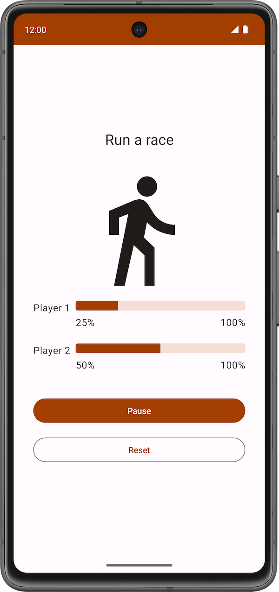

## 项目描述

[Race Tracker 应用](https://developer.android.google.cn/codelabs/basic-android-kotlin-compose-coroutines-android-studio?hl=zh-cn&continue=https%3A%2F%2Fdeveloper.android.google.cn%2Fcourses%2Fpathways%2Fandroid-basics-compose-unit-5-pathway-1%3Fhl%3Dzh-cn%23codelab-https%3A%2F%2Fdeveloper.android.com%2Fcodelabs%2Fbasic-android-kotlin-compose-coroutines-android-studio#1)可模拟两位选手赛跑。应用界面中包含两个按钮：**Start**/**Pause** 和 **Reset**，以及两个用于显示赛跑者进度的进度条。选手 1 和 2 被设置为以不同的速度“奔跑”。比赛开始后，选手 2 的进度是选手 1 的两倍。

