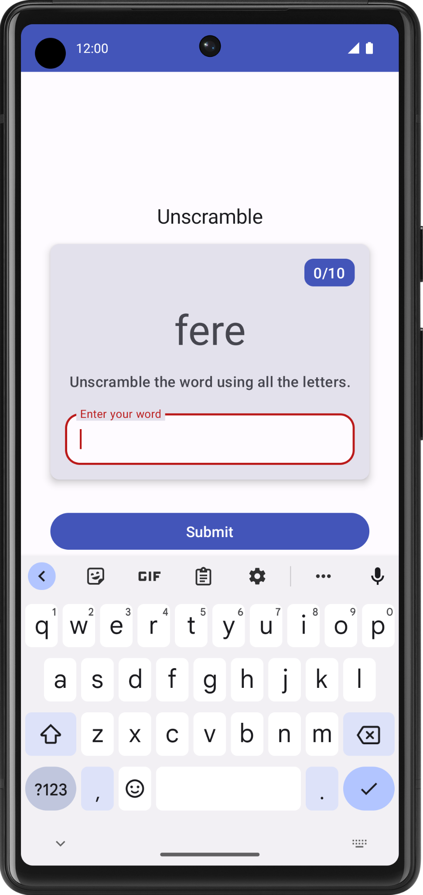

## 项目描述

[Unscramble 应用](https://developer.android.google.cn/codelabs/basic-android-kotlin-compose-viewmodel-and-state?hl=zh-cn&continue=https%3A%2F%2Fdeveloper.android.google.cn%2Fcourses%2Fpathways%2Fandroid-basics-compose-unit-4-pathway-1%3Fhl%3Dzh-cn%23codelab-https%3A%2F%2Fdeveloper.android.com%2Fcodelabs%2Fbasic-android-kotlin-compose-viewmodel-and-state#1)是一款猜乱序词的单人游戏。应用显示一个乱序词，玩家必须根据显示的所有字母猜出这个单词。如果猜出的单词正确，玩家就会得分。否则，玩家可以重新猜，次数不限。此外，应用还提供了一个跳过当前单词的选项。应用会在右上角显示单词数，即当前这一局游戏中猜过的乱序词数量。每一局游戏有 10 个乱序词。

## 参考资料

- [应用架构指南 | Android 开发者](https://developer.android.google.cn/topic/architecture?hl=zh-cn)
- [界面层 | Android 开发者](https://developer.android.google.cn/topic/architecture/ui-layer?hl=zh-cn)
- [使用单向数据流管理状态 | Android 开发者](https://developer.android.google.cn/topic/architecture/ui-layer?hl=zh-cn#udf)
- 学习在线课程：[现代 Android 应用架构](https://developer.android.google.cn/courses/pathways/android-architecture?hl=zh-cn)