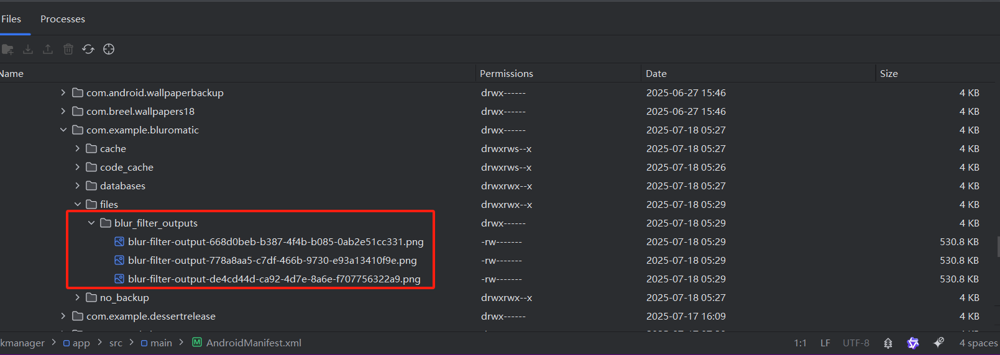
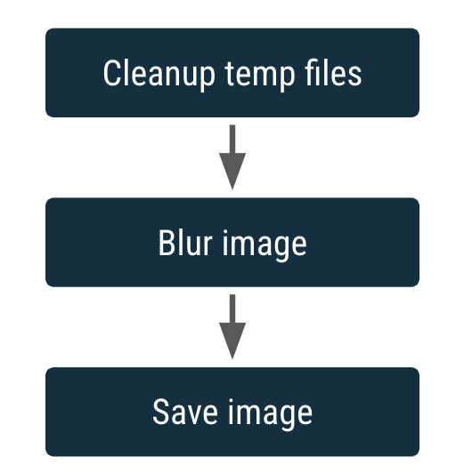
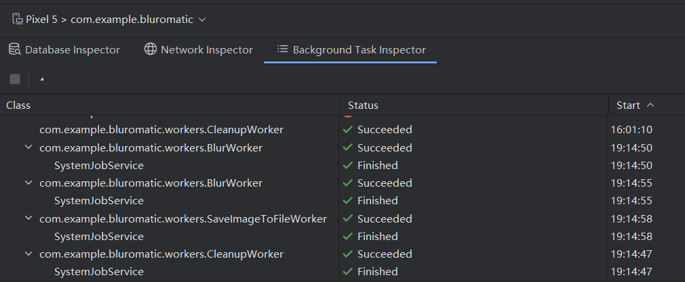

## 项目结构

- `WorkerUtils`：便捷方法，您稍后会使用这些方法显示 `Notifications` 和代码，以便将位图保存到文件中。
- `BlurViewModel`：此视图模型会存储应用的状态并与代码库进行交互。
- `WorkManagerBluromaticRepository`：用于通过 WorkManager 启动后台工作的类。
- `Constants`：一个静态类，其中包含您在学习本 Codelab 期间会用到的一些常量。
- `BluromaticScreen`：包含界面的可组合函数，并与 `BlurViewModel` 交互。可组合函数会显示图片，并包含用于选择所需模糊处理程度的单选按钮。


## 处理后台工作

本项目定义了一个新的 `BlurWorker` 类，其中包含用于模糊处理图片的代码。当您点击 **Start** 按钮时，WorkManager 会创建一个 `WorkRequest` 对象，然后将其加入队列。

### 创建 BlurWorker

将在 `res/drawable` 文件夹中提取一张名为 `android_cupcake.png` 的图片，并在后台对这张图片运行一些函数。这些函数会模糊处理图片。

```kotlin
class BlurWorker(ctx: Context, params: WorkerParameters) : CoroutineWorker(ctx, params) {
    override suspend fun doWork(): Result {
        // 告知用户模糊处理 worker 已启动并对图片进行模糊处理
        makeStatusNotification(
            applicationContext.resources.getString(R.string.blurring_image),
            applicationContext
        )

        // 执行实际图片模糊处理工作
        // 在对 withContext() 的调用内传递 Dispatchers.IO，以便 lambda 函数针对潜在阻塞型 IO 操作在特殊线程池中运行
        return withContext(Dispatchers.IO) {
            // 由于此 worker 的运行速度非常快，添加延迟以模拟运行速度较慢的工作
            delay(DELAY_TIME_MILLIS)

            return@withContext try {
                val picture = BitmapFactory.decodeResource(
                    applicationContext.resources,
                    R.drawable.android_cupcake
                )
                // 模糊图片
                val output = blurBitmap(picture, 1)

                // 将模糊图片保存到文件
                val outputUri = writeBitmapToFile(applicationContext, output)

                // 告知用户模糊处理 worker 已完成并返回模糊处理图片的 Uri
                makeStatusNotification(
                    "Output is $outputUri",
                    applicationContext
                )
                Result.success()
            } catch (throwable: Throwable) {
                Log.e(
                    TAG,
                    applicationContext.resources.getString(R.string.error_applying_blur),
                    throwable
                )
                Result.failure()
            }
        }

    }
}
```

> **注意**：该应用需要启用通知功能。如果未显示通知，请依次转到 **Settings > Apps > Blur-O-Matic > Notifications**，然后启用 **All Blur-O-Matic notifications**。


### [更新 WorkManagerBluromaticRepository](https://developer.android.google.cn/codelabs/basic-android-kotlin-compose-workmanager?hl=zh-cn&continue=https%3A%2F%2Fdeveloper.android.google.cn%2Fcourses%2Fpathways%2Fandroid-basics-compose-unit-7-pathway-1%3Fhl%3Dzh-cn%23codelab-https%3A%2F%2Fdeveloper.android.com%2Fcodelabs%2Fbasic-android-kotlin-compose-workmanager#8)

编辑 `applyBlur` 方法 

```
class WorkManagerBluromaticRepository(context: Context) : BluromaticRepository {
	/**
     * 通过上下文获取全局唯一的 WorkManager 实例
     */
    private val workManager = WorkManager.getInstance(context)
    
     /**
     * Create the WorkRequests to apply the blur and save the resulting image
     *
     * @param blurLevel The amount to blur the image
     */
    override fun applyBlur(blurLevel: Int) {
        // Create WorkRequest to blur the image
        val blurBuilder = OneTimeWorkRequestBuilder<BlurWorker>()

        // Start the work
        workManager.enqueue(blurBuilder.build())
    }
}
```


在 Android Studio 中打开 [**Device Explorer**](https://developer.android.google.cn/studio/debug/device-file-explorer?hl=zh-cn)，然后依次转到 **data > usr > 0 > com.example.bluromatic > files > blur_filter_outputs > <URI> ** 或者  **data > data > com.example.bluromatic > files > blur_filter_outputs > <URI>**，并确认纸杯蛋糕图片实际上已经过模糊处理：




### 输入和输出数据

让用户能够模糊处理他们在屏幕上看到的图片，然后显示经过模糊处理后生成的图片。为此，我们需要提供纸杯蛋糕图片的 URI，并作为 `WorkRequest` 的输入，然后使用 `WorkRequest` 的输出显示最终的模糊处理图片。

<font color="red">输入和输出通过 [`Data`](http://d.android.com/reference/androidx/work/Data?hl=zh-cn) 对象传入和传出 worker</font>。`Data` 对象是轻量化的键值对容器。它们用于存储少量可通过 `WorkRequest` 传入和传出 worker 的数据。

```
 // 创建输入对象
 override fun applyBlur(blurLevel: Int) {
        // Create WorkRequest to blur the image
        val blurBuilder = OneTimeWorkRequestBuilder<BlurWorker>()

        // Set the WorkRequest input
        blurBuilder.setInputData(createInputDataForWorkRequest(blurLevel, imageUri))

        // Start the work
        workManager.enqueue(blurBuilder.build())
    }
    
    
    
    
```

```
// 创建输出对象
class BlurWorker(ctx: Context, params: WorkerParameters) : CoroutineWorker(ctx, params) {

    val resourceUri = inputData.getString(KEY_IMAGE_URI)
    val blurLevel = inputData.getInt(KEY_BLUR_LEVEL, 1)

    override suspend fun doWork(): Result {
        // 告知用户模糊处理 worker 已启动并对图片进行模糊处理
        makeStatusNotification(
            applicationContext.resources.getString(R.string.blurring_image),
            applicationContext
        )

        // 执行实际图片模糊处理工作
        // 在对 withContext() 的调用内传递 Dispatchers.IO，以便 lambda 函数针对潜在阻塞型 IO 操作在特殊线程池中运行
        return withContext(Dispatchers.IO) {
            // 由于此 worker 的运行速度非常快，添加延迟以模拟运行速度较慢的工作
            delay(DELAY_TIME_MILLIS)

            return@withContext try {
                // 确保传入的图片 Uri 不为空
                require(!resourceUri.isNullOrBlank()) {
                    val errorMessage =
                        applicationContext.resources.getString(R.string.invalid_input_uri)
                    Log.e(TAG, errorMessage)
                    errorMessage
                }

                // 从传入的图片 Uri 中获取图片
                val resolver = applicationContext.contentResolver
                val picture = BitmapFactory.decodeStream(
                    resolver.openInputStream(Uri.parse(resourceUri))
                )
                // val picture = BitmapFactory.decodeResource(
                //     applicationContext.resources,
                //     R.drawable.android_cupcake
                // )

                // 模糊图片
                val output = blurBitmap(picture, blurLevel)
                // val output = blurBitmap(picture, 1)

                // 将模糊图片保存到文件
                val outputUri = writeBitmapToFile(applicationContext, output)

                // 告知用户模糊处理 worker 已完成并返回模糊处理图片的 Uri
                val outputData = workDataOf(KEY_IMAGE_URI to outputUri.toString())
                // makeStatusNotification(
                //     "Output is $outputUri",
                //     applicationContext
                // )
                Result.success(outputData)
            } catch (throwable: Throwable) {
                Log.e(
                    TAG,
                    applicationContext.resources.getString(R.string.error_applying_blur),
                    throwable
                )
                Result.failure()
            }
        }

    }

}
```


## 链接工作

WorkManager 使您能够创建按顺序运行或并行运行的单独 `WorkerRequest`。在本部分中，您将创建一个如下所示的工作链：



这些方框表示 `WorkRequest`。链接的另一个特点是它能够接受输入并生成输出。一个 `WorkRequest` 的输出将成为链中下一个 `WorkRequest` 的输入。您已有了用于对图片进行模糊处理的 `CoroutineWorker`，但还需要用于清理临时文件的 `CoroutineWorker` 以及用于永久保存图片的 `CoroutineWorker`。

在创建所有 worker 后，创建工作链

```
override fun applyBlur(blurLevel: Int) {
        // Add WorkRequest to Cleanup temporary images
        var continuation = workManager.beginWith(OneTimeWorkRequest.from(CleanupWorker::class.java))

        // Add WorkRequest to blur the image
        val blurBuilder = OneTimeWorkRequestBuilder<BlurWorker>()
        blurBuilder.setInputData(createInputDataForWorkRequest(blurLevel, imageUri))    // 为 WorkRequest 设置输入数据
        continuation = continuation.then(blurBuilder.build())

        // Start the work
        // workManager.enqueue(blurBuilder.build())

        continuation = continuation.then(blurBuilder.build())

        // Add WorkRequest to save the image to the filesystem
        val save = OneTimeWorkRequestBuilder<SaveImageToFileWorker>()
            .build()
        continuation = continuation.then(save)

        // Start the work
        continuation.enqueue()
    }

```

此代码会生成并运行以下 WorkRequest 链：`CleanupWorker` `WorkRequest`，后跟 `BlurWorker` `WorkRequest`，后跟 `SaveImageToFileWorker` `WorkRequest`。

> **注意**：在此代码中，我们显示的是创建 `OneTimeWorkRequest` 对象的替代方法。调用 `OneTimeWorkRequest.from(CleanupWorker::class.java)` 等同于调用 `OneTimeWorkRequestBuilder<CleanupWorker>().build()`。`OneTimeWorkRequest` 类来自 [AndroidX](https://developer.android.google.cn/jetpack/androidx?hl=zh-cn) Work 库，而 `OneTimeWorkRequestBuilder` 是由 [WorkManager KTX ](https://developer.android.google.cn/kotlin/ktx?hl=zh-cn#workmanager)扩展提供的辅助函数。


## 确保工作具有唯一性

在此应用中，您需要使用 `REPLACE`，因为如果用户决定在当前图片完成之前对其他图片进行模糊处理，您需要停止当前图片并开始对新图片进行模糊处理。您还希望确保，在工作请求已加入队列后，如果用户点击 **Start**，应用便会将之前的工作请求替换为新请求。继续处理上一个请求没有意义，因为应用仍然会用新请求替换它。

在 `data/WorkManagerBluromaticRepository.kt` 文件的 `applyBlur()` 方法内，完成以下步骤：

1. 移除对 `beginWith()` 函数的调用，并添加对 [`beginUniqueWork()`](https://developer.android.google.cn/reference/kotlin/androidx/work/WorkManager?hl=zh-cn#beginUniqueWork(java.lang.String,androidx.work.ExistingWorkPolicy,androidx.work.OneTimeWorkRequest)) 函数的调用。
2. 对于 `beginUniqueWork()` 函数的第一个参数，传入常量 `IMAGE_MANIPULATION_WORK_NAME`。
3. 对于第二个参数 `existingWorkPolicy`，传入 `ExistingWorkPolicy.REPLACE`。
4. 对于第三个参数，为 `CleanupWorker` 创建一个新的 `OneTimeWorkRequest`。

```
  var continuation = workManager
            .beginUniqueWork(
                IMAGE_MANIPULATION_WORK_NAME,   // 唯一标识
                ExistingWorkPolicy.REPLACE,     // 设置任务执行策略
                OneTimeWorkRequest.from(CleanupWorker::class.java)
            )
```


## 根据工作状态标记和更新界面

### 标记 workRequest

```
 val save = OneTimeWorkRequestBuilder<SaveImageToFileWorker>()
            .addTag(TAG_OUTPUT) // 标记工作请求
            .build()
```


### 获取 workInfo

根据标记 `TAG_OUTPUT` 来获取 `SaveImageToFileWorker` 工作请求中的 `WorkInfo` 信息，根据 `BlurUiState` 决定要在界面中显示哪些可组合项。

```
/**
 *  利用 workRequest 的标签 TAG_OUTPUT 获取 WorkInfo
 */
override val outputWorkInfo: Flow<WorkInfo> =
    workManager.getWorkInfosByTagLiveData(TAG_OUTPUT).asFlow().mapNotNull {
        if (it.isNotEmpty()) it.first() else null
    }
```


### 更新 `BlurUiState`

`ViewModel` 使用代码库从 `outputWorkInfo` Flow 发出的 `WorkInfo` 来设置 `blurUiState` 变量的值

```
class BlurViewModel(private val bluromaticRepository: BluromaticRepository) : ViewModel() {

    internal val blurAmount = BlurAmountData.blurAmount

    /**
     * 将 Flow 中的值映射到 BlurUiState 状态，具体取决于工作的状态
     */
    // val blurUiState: StateFlow<BlurUiState> = MutableStateFlow(BlurUiState.Default)
    val blurUiState: StateFlow<BlurUiState> = bluromaticRepository.outputWorkInfo
        .map { info ->
            when {
                info.state.isFinished -> {
                    BlurUiState.Complete(outputUri = "")
                }
                info.state == WorkInfo.State.CANCELLED -> {
                    BlurUiState.Default
                }
                else -> BlurUiState.Loading
            }
        }.stateIn(
            scope = viewModelScope,
            started = SharingStarted.WhileSubscribed(5_000),
            initialValue = BlurUiState.Default
        )
}
```


### 更新界面

在 `ui/BluromaticScreen.kt` 文件中，可以从 `ViewModel` 的 `blurUiState` 变量获取界面状态，并更新界面。

```
@Composable
private fun BlurActions(
    blurUiState: BlurUiState,
    onStartClick: () -> Unit,
    onSeeFileClick: (String) -> Unit,
    onCancelClick: () -> Unit,
    modifier: Modifier = Modifier
) {
    Row(
        modifier = modifier,
        horizontalArrangement = Arrangement.Center
    ) {
        // Button(
        //     onClick = onStartClick,
        //     modifier = Modifier.fillMaxWidth()
        // ) {
        //     Text(stringResource(R.string.start))
        // }
        when (blurUiState) {
            is BlurUiState.Default -> {
                Button(onStartClick) { Text(stringResource(R.string.start)) }
            }
            is BlurUiState.Loading -> {
                // 显示 Cancel Work 按钮和圆形进度指示器
                FilledTonalButton(onCancelClick) { Text(stringResource(R.string.cancel_work)) }
                CircularProgressIndicator(modifier = Modifier.padding(dimensionResource(R.dimen.padding_small)))
            }
            is BlurUiState.Complete -> {
                Button(onStartClick) { Text(stringResource(R.string.start)) }
            }
        }
    }
}
```


### 测试

查看**后台任务检查器**窗口，了解各种状态如何与显示的界面相对应。

`SystemJobService` 是负责管理 worker 执行的组件。



在 worker 运行时，界面会显示 **Cancel Work** 按钮和圆形进度指示器。


## 显示最终输出

创建 `see file` 按钮

```
 is BlurUiState.Complete -> {
                Button(onStartClick) { Text(stringResource(R.string.start)) }
                Spacer(modifier = Modifier.width(dimensionResource(R.dimen.padding_small)))

                // 仅当 BlurUiState 为 Complete 时，See File 按钮才会显示
                FilledTonalButton({ onSeeFileClick(blurUiState.outputUri) })
                { Text(stringResource(R.string.see_file)) }
            }
```

创建“`See File`”点击事件代码

```
BlurActions(
            blurUiState = blurUiState,
            onStartClick = { applyBlur(selectedValue) },
            // 当用户点击 See File 按钮时，其 onClick 处理程序会调用其已分配的函数
            onSeeFileClick = { currentUri ->
                showBlurredImage(context, currentUri) },
            onCancelClick = { cancelWork() },
            modifier = Modifier.fillMaxWidth()
        )
```


## 测试

为 worker 编写测试并使用 WorkManager API 进行测试可能违背常理。在 worker 中完成的工作无法直接访问界面，这严格属于业务逻辑。通常，您需要使用本地单元测试来测试业务逻辑。

WorkManger 需要 Android [Context](https://developer.android.google.cn/reference/android/content/Context?hl=zh-cn) 才能运行。默认情况下，本地单元测试没有 Context。因此，即使没有要测试的直接界面元素，也必须使用界面测试来测试 worker 测试。

导入依赖项

```
	// Espresso
    androidTestImplementation("androidx.test.espresso:espresso-core:3.5.1")
    // Junit
    androidTestImplementation("androidx.test.ext:junit:1.1.5")
    // Work testing
    androidTestImplementation("androidx.work:work-testing:2.8.1")
```

测试 worker 需要不同的工作构建器。WorkManager API 提供两种不同的构建器：

- [TestWorkerBuilder](https://developer.android.google.cn/reference/androidx/work/testing/TestWorkerBuilder?hl=zh-cn)
- [TestListenableWorkerBuilder](https://developer.android.google.cn/reference/androidx/work/testing/TestListenableWorkerBuilder?hl=zh-cn)