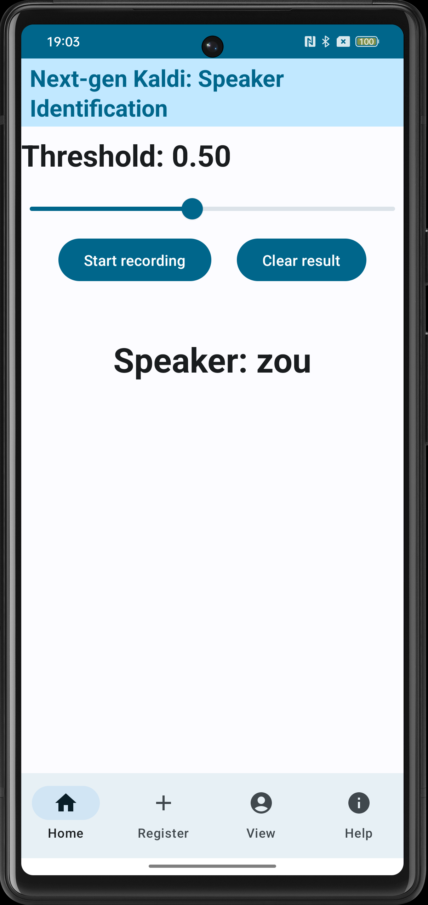

### 项目描述
[SherpaOnnxSpeakerIdentification](https://github.com/k2-fsa/sherpa-onnx/blob/master/android/SherpaOnnxSpeakerIdentification) 是一个基于 SherpaOnnx 的说话人识别应用，支持说话人注册和识别功能。

### 项目使用方法

(1) 说话人注册
点击 **Register 界面** 的录音按钮开始录音。录制特定时长的音频样本，输入说话人名称保存特征向量，特征向量存储在 `SpeakerEmbeddingManager` 中。然后，我们可以在 View 界面看到注册的说话人。

(2) 说话人识别
进入 **Home 界面** 开始实时音频输入。应用实时提取音频特征并匹配已注册的说话人，显示最相似的说话人结果

### 注意事项

说话人数据存储在内存中，由 SpeakerEmbeddingManager 通过 JNI 管理的底层 C++ 对象保存，未持久化。