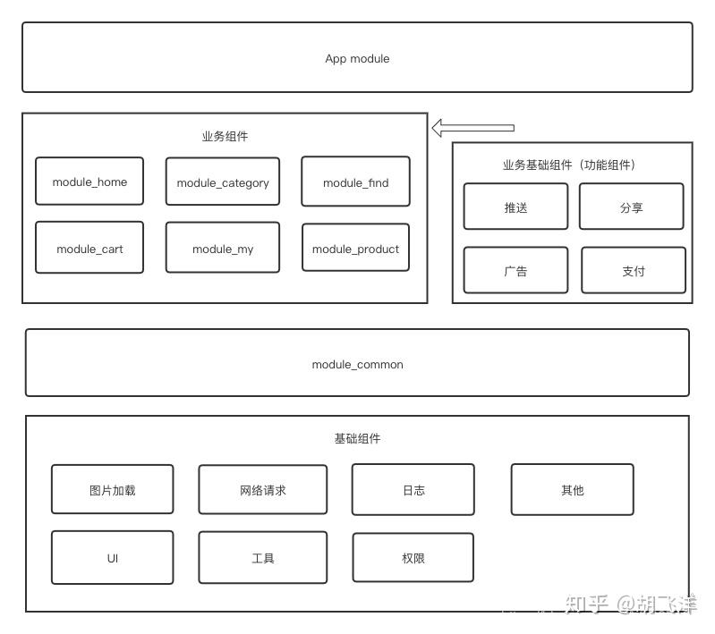

## 一、项目组件化简介

### 1.1 什么是项目组件化？

#### 1.1.1 基本定义

在大型 Android 项目中，**组件化**是一种将庞大单体应用拆分为多个独立、可复用模块的架构方式，核心目标是**解耦、高内聚、独立开发与按需集成**。组件化的优点主要有：

- 加快编译速度
- 提高协作效率
- 功能复用

**核心思想**是将业务功能（如登录、支付、分享）封装成独立组件，每个组件既能单独运行调试，也能作为库集成到主 App 中。组件间通过**接口+路由**通信，避免直接依赖。


#### 1.1.2 核心概念

(1) 模块化（Modularization）

模块化就是将一个 APP 按照功能拆分成不同的模块放在不同的 Module 里面。

但这些模块之间存在复杂的依赖关系。例如，在购物 app 里面，“首页” 点击搜索时 “分类”中的搜索功能。


(2) 组件化 

组件化，去除模块间的耦合，使得每个业务模块可以独立当做App存在，对于其他模块没有
直接的依赖关系。此时业务模块就成为了业务组件。


### 1.2 项目如何切分

#### 模块基本类型

- **app 模块**：主应用模块，负责组装和启动，通常依赖所有功能模块。
- **library 模块**：基础库和功能模块，可独立运行。


#### 组件化架构

项目通常被划分为应用层、业务组件层、业务公共层、基础层 。依赖关系是**单向的、向下的**，形成清晰的架构分层：

```
应用层 (App Module)
    ↑ 按需依赖
业务组件层 (多个 Business Module，互相隔离)
    ↑ 依赖
业务公共层 (可选，多业务共享的 UI/模型/服务接口)
    ↑ 依赖
基础层 (Base/Common Module)
```

> 有的还有功能组件层，一种介于**基础层**和**业务组件层**之间的特殊组件类型。作为支撑业务组件、业务基础组件的基础（BaseActivity/BaseFragment等基础能力），同时依赖所有的基础组件，提供多数业务组件需要的基本功能，并且统一了基础组件的版本号。所以 业务组件、业务基础组件 所需的基础能力只需要依赖common组件即可获得。

**原则**：

- 基础层被所有上层依赖，业务组件之间不互相依赖，仅共同依赖基础层（及可选的业务公共层）。
- 组件间通过路由（如 ARouter）和依赖注入（如 Hilt）通信，或通过业务公共层的接口定义 + 实现下沉解耦。
- 业务公共层中的“公共业务组件”（如广告组件）可被多个业务组件依赖，但业务公共层内部各组件之间也尽量不相互依赖；业务组件只依赖自己需要的公共业务组件。


**(1) 应用层**

主工程就是整个项目的**入口和集成层**，通常只有一个主 App 模块。

- **功能**：作为应用的“外壳”，不包含具体业务逻辑负责，主要负责：应用的启动配置、全局初始化、按需依赖所需的业务组件、处理应用级的主题、签名、渠道打包等。


**(2) 业务组件层**

由多个独立的业务模块组成，是组件化的核心。每个业务组件对应一个独立的工程模块。

- **功能**：实现具体的业务功能。每个组件**可独立开发、编译、测试和运行**（通过配置 `application`/`library`模式切换）。
  
- **特点**：

  - 高内聚、低耦合，组件间禁止直接依赖。

  - 组件间通过路由框架（如 ARouter、WMRouter）和依赖注入进行通信，或通过下一层的“公共导出层”进行数据交互。


**(3) 业务公共层**

在一些更复杂的项目中，可能会在基础层和业务组件层之间，增加一个 “业务公共层”。

- 功能：提供通用的功能或服务，可以被多个业务层组件共享。包括：
  - 多个业务模块公用的 UI 组件（如通用对话框、特定风格的 TabBar）。

  - 多个业务模块公用的 业务模型/接口（如用户信息、商品模型）。

  - 提供业务服务接口的实现（例如，登录服务接口定义在此，实现在具体的“用户组件”中）。


**(4) 基础层**

位于架构最底层，为上层提供通用技术支持和服务，是所有其他组件共享的依赖。

- 功能：
  - 提供基础、通用的工具类、工具库（如网络、图片加载、日志、存储、权限等）。
  - 封装第三方框架（如 Retrofit、OkHttp、Glide 等），便于统一升级和替换。
  - 管理基础实体、常量、基类（如 BaseActivity、BaseFragment、通用自定义 View）。

- 特点：高度复用、**与业务无关**。上层所有业务组件都依赖此层。


#### 基本项目结构

在项目中，建议按照目录来分类整理所有模块。

```
MyApp/                              # 项目根目录
├── app/                            # 【应用层】主壳工程
├── build.gradle
├── settings.gradle
├── gradle.properties
│
├── base/                           # 【基础层】文件夹
│   ├── base_common/               # 核心基础库
│   ├── lib_network/               # 网络通信库
│   ├── lib_image/                 # 图片加载库
│   └── lib_utils/                 # 工具类库
│
├── common/                         # 【业务公共层】文件夹（可选但推荐）
│   ├── common_ui/                  # 公共UI组件
│   ├── common_base/                # 业务相关基类
│   └── common_service/             # 公共业务服务接口定义
│
├── feature/                        # 【功能组件层】文件夹
│   ├── feature_webview/           # WebView能力组件
│   ├── feature_push/              # 推送能力组件
│   └── feature_pay/               # 支付能力组件
│
├── module/                         # 【业务组件层】文件夹
│   ├── module_main/               # 主页组件
│   ├── module_user/               # 用户组件
│   ├── module_order/              # 订单组件
│   └── module_goods/              # 商品组件
│
└── thirdparty/                     # 【第三方隔离层】文件夹（可选）
    ├── sdk_wechat/                # 微信SDK封装
    └── sdk_umeng/                 # 友盟SDK封装
```

模块的包名命名：

```
// 纯工具类，无业务逻辑
com.xiaohongshu.base
├── com.xiaohongshu.base.utils       // 工具类
├── com.xiaohongshu.base.extension    // 扩展函数
├── com.xiaohongshu.base.network      // 网络基础
├── com.xiaohongshu.base.storage      // 存储基础
└── com.xiaohongshu.base.ui          // UI基础组件

// 通用业务组件
com.xiaohongshu.common
├── com.xiaohongshu.common.auth       // 认证通用
├── com.xiaohongshu.common.payment    // 支付通用
├── com.xiaohongshu.common.share      // 分享通用
└── com.xiaohongshu.common.tracking   // 埋点通用
```


 引用 [“终于懂了”系列：Android组件化，全面掌握！ - 知乎](https://zhuanlan.zhihu.com/p/261736134) 的图片




#### 项目的组织方式

- 单工程方案，组件以module形式存在，动态配置组件的工程类型；
- 多工程方案，业务组件以library module形式存在于独立的工程，且只有这一个library module。在集成调试的时候，通过 maven 来引用组件。


### 1.3 核心实现方式

#### 1.3.1 组件间通信

- 使用路由框架（如 **ARouter**、**WMRouter**）解耦模块间页面跳转和通信，避免直接依赖。
- 服务发现与依赖注入: 定义接口下沉到基础层，实现类放在组件内，通过服务发现（如 ARouter 的 `IProvider`）或依赖注入（如 **Dagger/Hilt**）获取实现，实现反向解耦。


#### 1.3.2 组件独立运行调试

业务模块可通过「独立运行」单独调试，无需启动完整主工程。实现方式：在根工程 `gradle.properties` 中通过开关控制，在模块的 `build.gradle` 中动态切换 **application** / **library** 插件，使同一模块既能单独作为 APP 运行，又能作为 library 被主模块依赖。

**1. 根工程 `gradle.properties` 中增加开关：**

```properties
# 是否以独立应用方式运行该模块（true=独立运行，false=作为库被主工程依赖）
# 调试某模块时，仅将该模块对应开关设为 true，其余保持 false
isDebugModule=false
```

**2. 业务模块 `build.gradle` 中按开关切换插件与配置：**

```groovy
// 根据 isDebugModule 动态选择「独立应用」或「依赖库」
if (isDebugModule.toBoolean()) {
    apply plugin: 'com.android.application'   // 独立应用，可单独安装运行
} else {
    apply plugin: 'com.android.library'      // 依赖库，被主工程引用
}

android {
    defaultConfig {
        // 独立运行时必须有 applicationId；集成时由主工程提供，此处不配置
        if (isDebugModule.toBoolean()) {
            applicationId "com.xiaohongshu.module.note"
        }
    }

    sourceSets {
        main {
            // 独立运行使用 debug 目录下的 Manifest（含 Application、Launcher Activity 等）
            // 集成时使用 main 的 Manifest，避免与主工程冲突
            if (isDebugModule.toBoolean()) {
                manifest.srcFile 'src/debug/AndroidManifest.xml'
            } else {
                manifest.srcFile 'src/main/AndroidManifest.xml'
            }
        }
    }
}
```

**说明：** 独立运行前需在模块下新建 `src/debug/AndroidManifest.xml`，声明 `application`、启动 Activity 等；`src/main/AndroidManifest.xml` 仅保留组件内页面/服务等，不声明 application。


[“终于懂了”系列：Android组件化，全面掌握！ - 知乎](https://zhuanlan.zhihu.com/p/261736134)


#### 1.3.3 依赖统一管理

**目的**：统一各模块的依赖版本，避免多模块中同一库版本不一致导致的冲突。

**常见方案**：使用 `gradle/libs.versions.toml` 声明版本与依赖，Gradle 7+ 原生支持；无额外编译、有代码提示、便于升级。


#### 1.3.4 配置统一管理

抽离并统一管理 build.gradle 。

> 更多实现细节可参考 [Android组件化开发：手把手教你搭建组件化项目-CSDN](https://blog.csdn.net/qq_58451437/article/details/134340624)。


#### 1.3.5 资源命名隔离

在模块的 `build.gradle`中添加资源前缀，避免合并时资源冲突：

```kotlin
android {
    resourcePrefix "module_home_"
}
```


