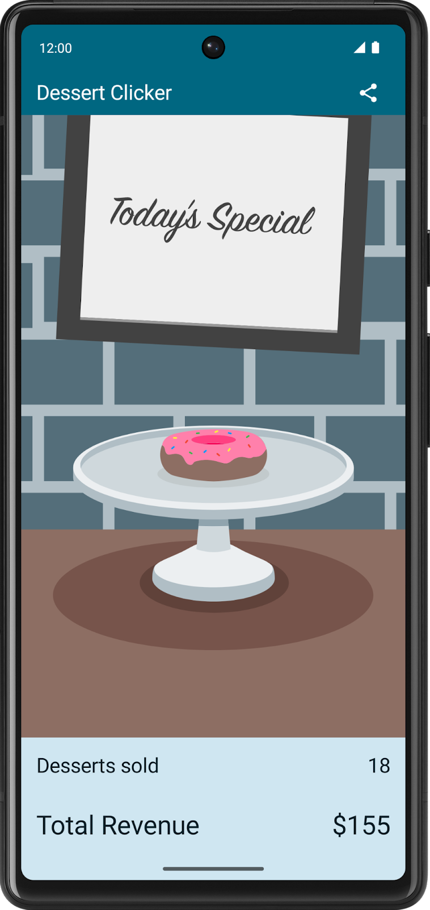

## 项目描述

[本项目](https://developer.android.google.cn/codelabs/basic-android-kotlin-compose-activity-lifecycle?hl=zh-cn&continue=https%3A%2F%2Fdeveloper.android.google.cn%2Fcourses%2Fpathways%2Fandroid-basics-compose-unit-4-pathway-1%3Fhl%3Dzh-cn%23codelab-https%3A%2F%2Fdeveloper.android.com%2Fcodelabs%2Fbasic-android-kotlin-compose-activity-lifecycle#1)创建一款名为 Dessert Clicker 的起始应用，用于研究 Activity 的生命周期。

每当用户点按屏幕上的甜点时，该应用就会为用户“购买”相应甜点。应用会在布局中更新以下值：

- “已购买”甜品的数量

- “已购买”甜品的总收入

  

