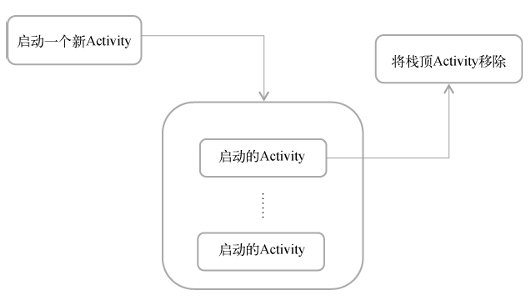

## 一、Activity 组件概述

### 1.1 什么是 Activity 组件

Activity是最容易吸引用户的地方，它是一种可以包含用户界面的组件，主要用于和用户进行交互。

Android应用程序的门面，凡是在应用中你看得到的东西，都是放在Activity中的。

Activity 是 Android 应用的一个基本组件，代表应用中的一个屏幕。每个 Activity 都包含用户界面和用户交互的逻辑。在不同的Activity之间进行切换形成应用的不同界面。


### Activity 继承结构

AppCompatActivity 是 AndroidX 中提供的一种向下兼容的 Activity，可以使 Activity 在不同系统版本中的功能保持一致性。

Activity 类是 Android 系统提供的一个基类，提供基本特性


## 二、Activity 的生命周期

### 返回栈

Android中的Activity是可以层叠的。我们每启动一个新的Activity，就会覆盖在原Activity之上，然后点击Back键会销毁最上面的Activity，下面的一个Activity就会重新显示出来。Android是使用任务（task）来管理Activity的，一个任务就是一组存放在栈里的Activity 的集合，这个栈也被称作返回栈（back stack）。

栈是一种后进先出的数据结构，在默认情况 下，每当我们启动了一个新的Activity，它就会在返回栈中入栈，并处于栈顶的位置。而每当我 们按下Back键或调用finish()方法去销毁一个Activity时，处于栈顶的Activity就会出栈，前 一个入栈的Activity就会重新处于栈顶的位置。**系统总是会显示处于栈顶的Activity给用户**。




### Activity 的生命周期状态

**(1) 完整生存期 (Entire Lifetime)**

从 `onCreate()`调用开始，到 `onDestroy()`调用结束。

- `onCreate(Bundle savedInstanceState)`：必须实现。如果 Activity 是重新创建的（例如配置变更后），会收到之前保存的状态 Bundle。执行的相关工作有：
  - **必须实现的初始化**：调用 `setContentView()`来绑定布局。
  - **视图初始化**：通过 `findViewById`或 View Binding/View Binding 获取布局中的视图控件。
  - **数据初始化**：初始化 Activity 所需的**关键数据成员**（但非UI数据）。
  - **配置持久化组件**：初始化 ViewModel。如果 `savedInstanceState`不为空，从中恢复 Activity 级别的临时UI状态（如文本框内容、列表滚动位置）。更复杂的数据恢复应交给 ViewModel。
  - **设置监听器**：为按钮等控件设置点击等事件的监听器。
  - **导航参数处理**：从 `Intent`的 `extras`中获取启动参数。
- `onDestroy()`：Activity 被最终销毁前调用。原因可能是用户主动关闭（按返回键）或系统为回收内存而销毁。执行的相关工作有
  - **资源清理**：确保释放所有可能造成内存泄漏的引用。例如，取消在 `onCreate`中注册的、生命周期与 Activity 绑定的回调或监听器（特别是那些持有 Context 引用的）。
  - **停止后台任务**：如果启动了任何生命周期与 Activity 绑定的线程、AsyncTask 或协程，确保在此处取消它们。
  - **解绑服务**：如果绑定了服务，应在此解绑。

**注意**：系统为回收内存而调用此方法时，不应依赖其被及时调用。**关键资源的释放（如相机、传感器）应在 `onPause()`或 `onStop()`中提前进行**。


**(2) 可见生存期 (Visible Lifetime)**

从 `onStart()`调用开始，到 `onStop()`调用结束。在此期间，Activity 对用户**可见**（可能部分被遮挡，但未完全离开屏幕）。

- `onStart()`：Activity 对用户变得可见，但还无法交互。常用于启动或恢复那些需要在界面可见时运行的操作，相关操作如下：

  - **注册与UI相关的监听器**：注册那些需要**在界面可见时更新UI**的组件。例如： 监听网络状态变化以更新UI。 注册一个 `BroadcastReceiver`来接收影响UI显示的系统广播（如屏幕锁屏/解锁）。 开始执行那些需要在用户可见时运行的**动画**。
  - **恢复UI数据**：从 ViewModel 或数据层加载数据，并应用到UI上。对于 `LiveData`的观察，通常应在 `onCreate`中设置，但 `observe`的调用是安全的，因为 `LiveData`只在 Activity 处于活跃状态（`onStart`到 `onStop`）时通知观察者。

- `onStop()`：Activity 对用户完全不可见（被其他 Activity 完全覆盖或应用进入后台）。在此应暂停或停止在 onStart中启动的、无需在不可见时运行的操作，以节省资源。相关操作如下：

  - **注销监听器**：注销在 `onStart()`中注册的、不需要在界面不可见时运行的监听器（特别是 `BroadcastReceiver`）。这是防止内存泄漏和节省电量的关键步骤。
  - **暂停或保存UI相关操作**：暂停在 `onStart()`中开始的动画。
  - **释放UI相关资源**：如果持有一些较大的资源（如位图缓存），且它们只在UI可见时需要用，可以考虑在此释放。
  - **持久化临时UI数据**：如果需要保存用户在当前界面输入的大量临时数据（如填写了一半的表单），可以在此处将数据保存到 `ViewModel`或本地数据库/`SharedPreferences`中。

  

**(3) 前台生存期 (Foreground Lifetime)**

从 `onResume()`调用开始，到 `onPause()`调用结束。在此期间，Activity 位于屏幕最顶层，**拥有焦点，可与用户交互**。

- `onResume()`：Activity 即将开始与用户交互。在此应启动需要在 Activity 位于前台并交互时运行的核心组件（如相机预览、传感器监听）。此方法中应执行**轻量、快速**的操作，因为它是Activity变为可交互前的最后一步，耗时操作会延迟用户交互。

  - **获取独占资源**：申请或重新获取**独占性系统资源**，这些资源在同一时刻只能被一个组件使用。最典型的例子是**相机**的 `lock()`或初始化预览。

  - **启动高频率更新**：启动或恢复需要**高频、实时更新**的组件，例如： 传感器的监听（如加速度计、陀螺仪）。 位置更新（GPS）。 相机预览流的处理。

  - **恢复交互状态**：如果有在 `onPause()`中暂停的游戏主循环、音频/视频播放，应在此处恢复。

- `onPause()`：当系统准备启动或恢复另一个 Activity 时调用。此时 Activity 可能部分可见但失去焦点。在此必须执行快速、轻量的操作，因为下一个 Activity 必须等待此方法返回才会继续其生命周期。不应执行耗时操作。

  - **必须释放独占资源**：**这是最重要的职责**。必须立即释放或断开在 `onResume()`中申请的独占资源，以便其他组件（如下一个要显示的Activity）可以立即使用它们。例如： 释放相机 (`unlock()`, `release()`)。 断开传感器监听。 暂停高精度的位置更新。
  - **暂停高频率操作**：暂停在 `onResume()`中开始的高频更新、游戏循环或媒体播放。
  - **提交轻量级持久化操作**：可以在此处保存用户在当前Activity中做出的、需要立即保存的变更（例如，将文档的“草稿”状态保存到数据库）。**但必须是极快的操作**，因为系统会等待此方法返回才会进入下一个Activity的生命周期。


### Activity 的生存期

Activity 类中定义了 7 个回调方法，覆盖了 Activity 生命周期的每一个环节。Android 会在 activity 从一种状态切换为另一种状态时调用这些回调，而您可以在自己的 activity 中替换这些方法，通过执行任务来响应这些生命周期状态变化。下图显示了生命周期状态以及可用的可替换回调。


> `onRestart()` 方法上的星号表示，每次状态在 **Created** 和 **Started** 之间转换时，系统都不会调用此方法。仅当调用 `onStop()` 并且随后重启 activity 时，系统才会调用此方法。

在应用启动并且系统调用 `onStart()` 后，该应用将在屏幕上变得可见。当系统调用 `onResume()` 时，应用会获得用户焦点，即用户可以与应用交互。应用在屏幕上完全显示并且具有用户焦点的这部分生命周期称为[前台生命周期](https://developer.android.google.cn/reference/android/app/Activity?hl=zh-cn#activity-lifecycle)。当应用进入后台后，焦点在 `onPause()` 后便会丢失，并且在 `onStop()` 后，该应用将不再可见。

**区分焦点与可见性之间的差异很重要**。某个 activity 有可能在屏幕上部分可见，但没有用户焦点。

在此用例中，系统没有调用 `onStop()`，因为相应 activity 仍然部分可见。但是，该 activity 没有用户焦点，并且用户无法与之交互；位于前台的“共享”activity 具有用户焦点。为什么这种区别至关重要？单纯的 `onPause()` 导致的中断通常仅持续很短的时间，然后用户就会返回您的 activity，或者导航到另一个 activity 或应用。通常，您需要持续更新界面，使应用的其余部分不会卡顿。在 `onPause()` 中运行的任何代码都会阻止其他内容显示，因此请使 `onPause()` 中的代码保持轻量级。例如，当有来电时，`onPause()` 中的代码可能会延迟来电通知。

`onResume()` 和 `onPause()` 都必须处理焦点。当相应 activity 获得焦点时，系统会调用 `onResume()` 方法；当该 activity 失去焦点时，系统会调用 `onPause()`。


### 回调方法

activity 生命周期中的每种状态都有一个对应的回调方法，您可以在 `Activity` 类中替换此类方法。核心的生命周期方法集合包括：[`onCreate()`](https://developer.android.google.cn/reference/android/app/Activity.html?hl=zh-cn#onCreate(android.os.Bundle))、[`onRestart()`](https://developer.android.google.cn/reference/android/app/Activity.html?hl=zh-cn#onRestart())、[`onStart()`](https://developer.android.google.cn/reference/android/app/Activity.html?hl=zh-cn#onStart())、[`onResume()`](https://developer.android.google.cn/reference/android/app/Activity.html?hl=zh-cn#onResume())、[`onPause()`](https://developer.android.google.cn/reference/android/app/Activity.html?hl=zh-cn#onPause())、[`onStop()`](https://developer.android.google.cn/reference/android/app/Activity.html?hl=zh-cn#onStop())、[`onDestroy()`](https://developer.android.google.cn/reference/android/app/Activity.html?hl=zh-cn#onDestroy())。

`onCreate()` 和 `onDestroy()` 在单个 activity 实例的生命周期内只会调用一次：`onCreate()` 用于首次初始化应用，`onDestroy()` 用于作废、关闭或销毁 activity 可能一直在使用的对象，使其不会继续使用资源（如内存）。

- `onStart()`：系统会在调用 `onCreate()` 之后立即调用 `onStart()` 生命周期方法。`onStart()` 运行后，您的 activity 会显示在屏幕上。与为初始化 activity 而仅调用一次的 `onCreate()` 不同，`onStart()` 可在 activity 的生命周期内由系统多次调用。
- `onRestart()` 只有在 activity 已经创建之后才会被系统调用，并且会在系统调用 `onStop()` 时最终进入 **Created** 状态，但是会返回 **Started** 状态，而不是进入 **Destroyed** 状态。`onRestart()` 方法用于放置仅在 activity **不**是首次启动时才需要调用的代码。

如果您的代码手动调用 activity 的 [`finish()`](https://developer.android.google.cn/reference/android/app/Activity.html?hl=zh-cn#finish()) 方法，或者用户强制退出应用，Android OS 可能会关闭该 activity。


### 配置变更

**配置变更会影响 activity 生命周期。**

当设备的状态发生了根本性改变，**以至于系统解决改变的最简单方式就是完全关闭并重建 activity 时，就会发生配置变更。**例如，如果用户更改了设备语言，整个布局可能就需要更改为适应不同的文本方向和字符串长度。如果用户将设备插入基座或添加物理键盘，应用布局可能需要利用不同的显示大小或布局。如果设备屏幕方向发生变化，比如设备从竖屏旋转为横屏或反过来，布局可能需要改为适应新的屏幕方向。让我们看看应用在这种情况下的行为。

屏幕旋转是导致 activity 关闭并重启的一种配置变更类型。当设备旋转，而相应 activity 被关闭并重新创建时，该 activity 会使用默认值重新启动 - 甜点图片、已售甜点的数量和总收入会重置为零。为了避免重置，使用重组。

> 如需保存需要在配置更改后继续存在的值（让 Compose 在配置更改期间保留状态），您必须使用 `rememberSaveable` 或者  [`ViewModel`](https://developer.android.google.cn/topic/libraries/architecture/viewmodel?hl=zh-cn)。


## Activity 的启动模式

Activity 的启动模式主要有如下 4 种：

1. **Stantard 标准模式**: 默认的启动模式。每次启动一个Activity都会重新创建一个新的实例入栈，不管这个实例是否存在。
2. **SingleTop 栈顶复用模式**： 如果新 Activity 已经位于任务栈的栈顶，那么此 Activity 不会被重新创建，而是复用栈顶的实例，同时会回调该实例的 `onNewIntent()`方法。如果新 Activity 不在栈顶，则会创建新的 Activity 实例。**特点**：防止快速重复点击导致栈顶出现多个相同页面。
3. **SingleTask 栈内复用模式**：系统会先检查任务栈中是否存在该 Activity 的实例。如果存在，则直接将该实例上方的所有 Activity 出栈，使其成为栈顶，并回调 `onNewIntent()`；如果不存在，则创建新的实例。**特点**：一个任务栈中只允许存在一个该 Activity 的实例，通常用于应用的主页（MainActivity）。
4. **SingleInstance 单实例模式**：这是最特殊的模式。具有此模式的 Activity 会单独占用一个任务栈，并且该栈中只有它一个 Activity。后续请求该 Activity 时，会直接复用这个栈中的实例。**特点**：全局唯一，常用于需要与系统解耦的独立页面（如闹钟、来电界面、Launch、锁屏键的应用），在普通应用中通常不会用到。

> **“Single”**：意味着“同一个 Activity 实例，在当前情况下是唯一的，不会被重复创建”。

注意：当 Activity 使用 `SingleTop`或 `SingleTask`模式被复用时，`onCreate()`不会执行，并且`getIntent()`获取的还是旧的 Intent 数据。因此，<font color="red">**必须重写 `onNewIntent()`方法，在其中调用 `setIntent()`更新数据并重新初始化**</font>。

```java
public class DetailActivity extends AppCompatActivity {
    private TextView mDataTextView;
    private String mData;

    @Override
    protected void onCreate(Bundle savedInstanceState) {
        super.onCreate(savedInstanceState);
        setContentView(R.layout.activity_detail);
        
        mDataTextView = findViewById(R.id.tv_data);
        
        // 首次创建时，从Intent获取数据来初始化
        // getIntent() 用于获取启动当前 Activity 的那个 Intent 对象
        processIntentData(getIntent());
    }

    // 处理Intent数据的公共方法
    private void processIntentData(Intent intent) {
        if (intent != null) {
            mData = intent.getStringExtra("data_key");
            updateUI();
        }
    }

    // 更新UI
    private void updateUI() {
        if (mData != null) {
            mDataTextView.setText("当前数据: " + mData);
        } else {
            mDataTextView.setText("暂无数据");
        }
    }

    @Override
    protected void onNewIntent(Intent intent) {
        super.onNewIntent(intent);
        
        // 关键：必须调用setIntent更新Activity持有的Intent
        setIntent(intent);
        
        // 处理新的Intent数据
        processIntentData(intent);
    }
}
```


 启动模式的使用方法

- **静态配置（在 Manifest.xml 中声明）**: 直接在 AndroidManifest.xml 文件中为 Activity 设置 `android:launchMode`属性。这个无法指定 `FLAG_ACTIVITY_CLEAR_TOP`

  ```xml
  <activity
      android:name=".activity.CourseDetailActivity"
      android:launchMode="singleTop" <!-- 设置启动模式 -->
      android:screenOrientation="portrait" />
  ```

- **动态设置（通过 Intent 的 Flags）**: 在代码中启动 Activity 时，通过 `Intent.addFlags()`方法动态指定启动行为。这种方式优先级**高于**静态配置。但这个无法指定 `singleInstance` 模式

  ```java
  Intent intent = new Intent();
  intent.setClass(context, MainActivity.class);
  intent.addFlags(Intent.FLAG_ACTIVITY_NEW_TASK); // 动态设置标记位
  context.startActivity(intent);
  ```


## Activity 最佳实践

1. 创建 BaseActivity， 成为ActivityTest项目中所有Activity的父类。这样做的好处有可以知晓当前是在哪一个 Activity。

2. 创建 ActivityCollector， 使用专门的集合对所有的 Activity 进行管理。这样可以随时随地地退出程序。
3. 启动 Activity 的最佳写法，即将启动Activity 的方法放在被启动的 Activity 里面。


#### 分层释放资源


**因此，最佳实践是分层释放**：

- **`onPause()`**：**必须**释放**独占、紧俏的系统资源**（相机、麦克风、高精度传感器）。这一目的在于保证系统流程，让下个 Activity 快速启动。同时遵守独占资源访问规则，避免阻塞系统和其他应用。
- **`onStop()`**：释放或暂停**与UI可见性相关、但不独占的资源**（动画、GPS监听、普通广播接收器）。这一目的在于维持跟 Acitivity 可见性相关的资源，节省电量、CPU和网络资源。
- **`onDestroy()`**：进行最终的、兜底性的清理（解除可能造成内存泄漏的长期引用）。


onPause()到 onStop()有时间差：当启动一个透明主题（如对话框样式）的新 Activity 时，旧 Activity 会调用 onPause()（因为它失去焦点），但不会调用 onStop()（因为它仍然部分可见）。如果只在 onStop()中释放相机，那么这个透明的 Activity 将无法使用相机。


onDestroy()的调用是不可靠且不可预测的。

- 可能永远不会被调用：用户通常通过返回键触发 finish()导致 onDestroy()，但如果用户直接按 Home 键，Activity 只会走到 onStop()。它可能长期留在后台，直到系统需要内存时直接杀死进程，而不会调用任何生命周期方法。
- 调用时机过晚：如果依赖 onDestroy()来释放相机，那么在 Activity 进入后台（onPause）到最终被销毁（可能很久以后）的整个期间，相机都被无用地占用着，阻碍了其他应用使用。