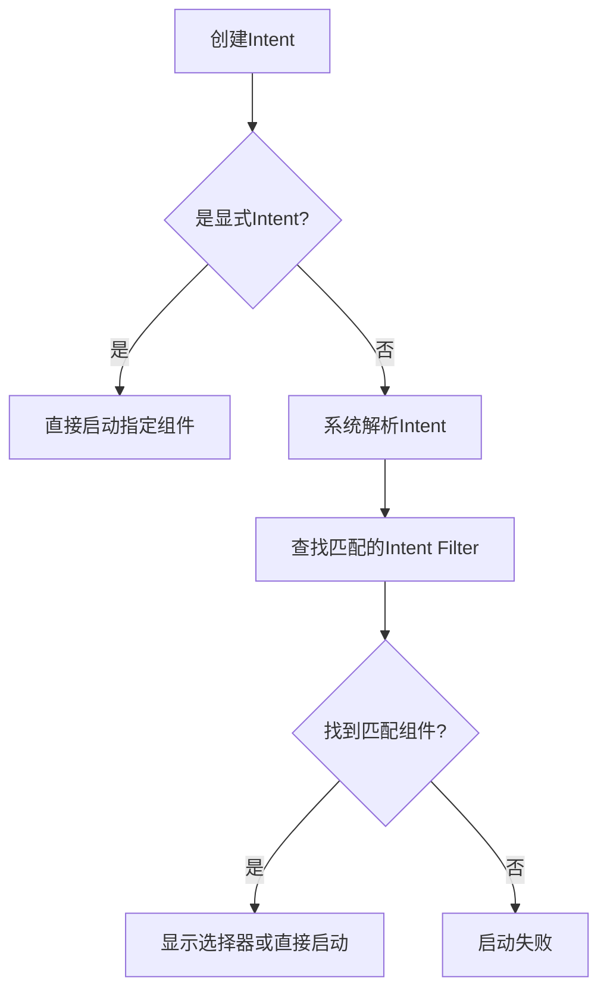
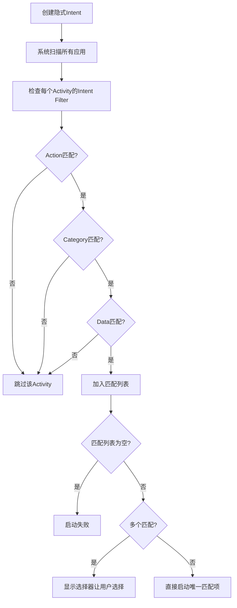

## 一、Intent 核心机制详解

### 1.1 Intent 基本概念

- 显示 Intent 明确指定应用程序的组件，系统无需解析Intent，启动应用内组件。

- 隐式Intent 不指定具体组件，而是描述要执行的操作，让系统选择合适的组件处理。


### 1.2 Intent 解析过程




### 1.3 选择器机制

在使用隐式Intent时， 如果有多个匹配，使用选择器让用户选择最合适的应用。

```
// 显示选择器让用户选择
Intent intent = new Intent(Intent.ACTION_VIEW);
intent.setData(Uri.parse("https://www.example.com"));

Intent chooser = Intent.createChooser(intent, "选择浏览器");
startActivity(chooser);
```

注意，不同的手机操作系统会修改这个选择器。选择器也有可能会失败。


## 二、显示 Intent 启动方式

### 2.1 基本使用方式

```java
// 启动应用内Activity
Intent intent = new Intent(MainActivity.this, TargetActivity.class);
intent.putExtra("key", "value");
startActivity(intent);
```


## 三、隐式 Intent 启动方式

隐式 Intent 不仅可以用于启动程序内的 Activity ，还可以用于启动程序外的 Activity。

### 3.1 权限配置

从Android 10（API 29）开始，Google引入了**重大隐私和安全变更**，这直接影响了Intent查询的结果。

| Android版本         | 默认行为                       |
| :------------------ | :----------------------------- |
| **Android 9及以下** | 可查询所有应用                 |
| **Android 10+**     | 只能查询自己应用和少数系统应用 |

在 Android 10+ 中，**包可见性过滤 (Package Visibility Filtering)**

```xml
// Android 10+ 需要显式声明要查询的应用
// 在AndroidManifest.xml中添加：

    <queries>
        <!-- 方式1：声明Intent类型 -->
        <intent>
            <action android:name="android.intent.action.VIEW" />
            <data android:scheme="https" />
        </intent>
        
        <!-- 方式2：声明具体包名 -->
        <package android:name="com.heytap.browser" />
        <package android:name="com.android.chrome" />
        <package android:name="com.android.browser" />
    </queries>
```


### 3.1 Intent Filter 配置

通过在 `<intent-filter>`中声明组件能响应的操作类型，系统可以识别哪些Activity能够处理特定的Intent：

```xml
<activity android:name=".WebViewActivity">
    <intent-filter>
        <action android:name="android.intent.action.VIEW" />
        <category android:name="android.intent.category.DEFAULT" />
        <category android:name="android.intent.category.BROWSABLE" />
        <data android:scheme="http" />
        <data android:scheme="https" />
    </intent-filter>
</activity>
```

**配置说明**：

- **Action**：定义组件能执行的核心操作（如VIEW查看、SEND发送、CALL拨打电话等）
- **Category**：指定组件的附加特性（DEFAULT为必须项，BROWSABLE表示可通过浏览器安全启动）
- **Data**：定义组件能处理的数据格式（协议类型、主机名、MIME类型等）


### 3.2 Intent 匹配规则

每个Intent中只能指定一个action，但可以指定多个category。系统按照以下规则进行匹配：

1. **Action匹配**：Intent的action必须与Intent Filter中声明的某个action完全匹配
2. **Category匹配**：Intent中的所有category都必须在Intent Filter中有对应声明
3. **Data匹配**：Intent 的data必须与Intent Filter中data规则一致（协议、主机、路径等）

具体匹配流程示例：




**隐式 Intent 必须匹配 `DEFAULT` category**

当不指定 category 时，系统不会默认指定 `DEFAULT`。

**如果 Intent Filter 指定了 data，但 Intent 里面没有 data，这个 Intent 将无法匹配到该 Activity**。只有当`<data>`标签中指定的内容和Intent中携带的Data完全一致时，当前Activity才能够响应该Intent。


### 3.3 启动方式

每个Intent中只能指定一个action，但能指定多个category。

通过 `Intent.setData()` 方法将 Uri 设置给 Intent 对象，可以让系统知道要操作的具体资源是什么，从而选择合适的应用来处理该资源。

```java
// 创建隐式Intent：查看网页
Intent intent = new Intent(Intent.ACTION_VIEW);
intent.setData(Uri.parse("https://www.example.com"));	

// 添加可选category（如果Intent Filter中有声明）
intent.addCategory(Intent.CATEGORY_BROWSABLE);

// 安全启动：检查是否有应用能处理此Intent
if (intent.resolveActivity(getPackageManager()) != null) {
    // 有应用可处理，显示选择器
    Intent chooser = Intent.createChooser(intent, "选择浏览器");
    startActivity(chooser);
} else {
    // 无应用可处理，提供降级方案
    Toast.makeText(this, "没有找到可以处理此链接的应用", Toast.LENGTH_SHORT).show();
    
    // 可选：引导用户下载相关应用
    openAppStoreForBrowser();
}
```


## 四、数据传递方式

### 4.1 向下一个**Activity**传递数据

在启动Activity时传递数据的思路很简单，Intent中提供了一系列 `putExtra()` 方法的重载，可以把我们想要传递的数据暂存在 Intent 中，在启动另一个 Activity 后，只需要把这些数据从 Intent 中取出就可以了。

#### 4.1.1 发送方发送数据

```java
Intent intent = new Intent(this, TargetActivity.class);
intent.putExtra("string_data", "Hello");
intent.putExtra("int_data", 100);
intent.putExtra("boolean_data", true);

// 传递数组
intent.putExtra("array_data", new String[]{"A", "B", "C"});

// 传递Bundle
Bundle bundle = new Bundle();
bundle.putString("bundle_key", "bundle_value");
intent.putExtras(bundle);

startActivity(intent);
```


#### 4.1.2 接收方接收数据

```java
Intent intent = getIntent();
String stringData = intent.getStringExtra("string_data");
int intData = intent.getIntExtra("int_data", 0);
boolean booleanData = intent.getBooleanExtra("boolean_data", false);
String[] arrayData = intent.getStringArrayExtra("array_data");
```


### 4.2 返回数据给上一个 Activity

实际上，Activity类中有一个用于启动Activity的方法  `startActivityForResult()` ，但它期望在Activity销毁的时候能够返回一个结果给上一个Activity。

另外，Android推荐使用更现代化的API来处理Activity间的结果回调，即 `ActivityResultLauncher()`

#### 4.2.1 发送方启动Activity并期待返回结果

`startActivityForResult()`方法接收两个参数：

- Intent。
- 请求码：标识不同的启动请求，用于在之后的回调中判断数据的来源。

```java
// 发送方
private static final int REQUEST_CODE = 1001;

Intent intent = new Intent(this, ResultActivity.class);
intent.putExtra("request_data", "需要处理的数据");
startActivityForResult(intent, REQUEST_CODE);
```


#### 4.2.2 接收方返回结果

接收方需要构建一个专门用于传递数据的Intent，这个Intent不指定任何"意图"，仅用于封装返回数据。然后调用 `setResult()`方法将数据返回给上一个Activity。

`setResult()`方法接收两个参数：

- 第一个参数用于返回处理结果状态（通常使用 `RESULT_OK`表示成功，`RESULT_CANCELED`表示取消）；
- 第二个参数携带包含返回数据的Intent。

```java
// 创建空的Intent用于封装返回数据
Intent resultIntent = new Intent();
resultIntent.putExtra("result_data", "处理后的数据");

// 使用 setResult()设置返回状态和数据
setResult(RESULT_OK, resultIntent);

// 调用 finish()关闭当前Activity，触发回调
finish();
```


#### 4.2.3 发送方处理结果

由于使用 `startActivityForResult()`方法启动Activity，在目标Activity被销毁后会回调发送方的 `onActivityResult()`方法。其具体参数有：

- **requestCode**：匹配对应的启动请求，避免数据混淆
- **resultCode**：判断操作结果（成功、取消或其他状态）
- **data Intent**：提取具体的返回数据

由于一个Activity 可能启动多个不同的Activity，每个Activity返回的数据都会回调到同一个 `onActivityResult()`方法中，因此需要通过检查 `requestCode`的值来判断数据来源。确定数据来自目标Activity后，再通过 `resultCode`判断处理结果是否成功，最后从Intent中提取数据。

```java
// 发送方处理回调
@Override
protected void onActivityResult(int requestCode, int resultCode, Intent data) {
    super.onActivityResult(requestCode, resultCode, data);
    
    // 根据请求码判断数据来源
    if (requestCode == REQUEST_CODE) {
        // 根据结果码判断处理状态
        if (resultCode == RESULT_OK) {
             // 处理成功返回的数据
            String result = data.getStringExtra("result_data");
        }else if (resultCode == RESULT_CANCELED) {
            // 处理用户取消操作
            Toast.makeText(this, "用户取消了操作", Toast.LENGTH_SHORT).show();
        }
    }
}
```


## 五、最佳实践

### 5.1 数据传递限制

- **大小限制**：Intent传递数据有大小限制（通常约1MB）
- **类型安全**：确保数据类型匹配，避免类型转换异常
- **空值处理**：总是为获取的数据提供默认值


### 5.2 性能优化

- 避免在Intent中传递过大对象
- 使用Bundle传递多个相关数据
- 对于复杂数据考虑使用全局变量或数据库


