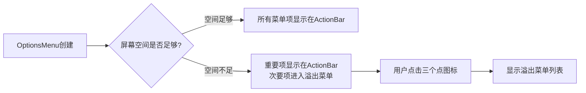
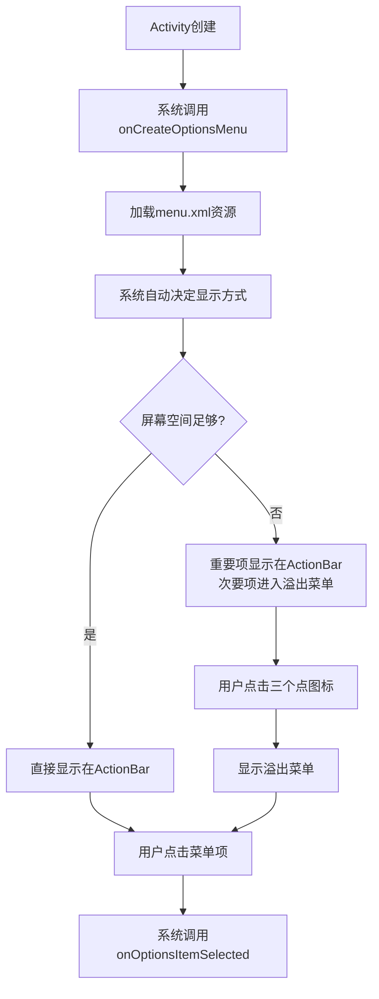
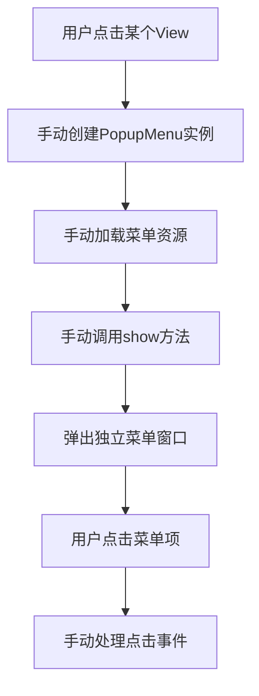

## 一、默认菜单系统

### 选项菜单 OptionsMenu

OptionsMenu 是 Android 应用的标准菜单系统，是菜单功能的**总称和基础**。

**特点**：

- 系统级别的菜单管理
- 通过 `onCreateOptionsMenu()`创建
- 通过 `onOptionsItemSelected()`处理点击
- 是溢出菜单的**数据来源**


### 溢出菜单 — 显示方式

溢出菜单  是 OptionsMenu 在**屏幕空间不足时**的显示方式。

其工作原理为：



## 工作流程




## 二、自定义菜单

### 弹出菜单 PopupMenu - 独立个体

PopupMenu 是一个独立的 UI 组件，可以**在任何地方创建弹出菜单**。


### 工作流程



例如，

```java
    private void setupClickListeners() {
        // 菜单按钮点击事件
        btnMenu.setOnClickListener(this::showPopupMenu);
    }

    /**
     * 显示弹出菜单（替代选项菜单）
     */
    private void showPopupMenu(View view) {
        PopupMenu popupMenu = new PopupMenu(this, view);
        popupMenu.getMenuInflater().inflate(R.menu.main_menu, popupMenu.getMenu());

        popupMenu.setOnMenuItemClickListener(new PopupMenu.OnMenuItemClickListener() {
            @Override
            public boolean onMenuItemClick(MenuItem item) {
                return onOptionsItemSelected(item);
            }
        });

        popupMenu.show();
    }
```


## 总结

| 特性         | OptionsMenu             | 溢出菜单                  | PopupMenu          |
| :----------- | :---------------------- | :------------------------ | :----------------- |
| **本质**     | 菜单系统**总称**        | OptionsMenu的**显示模式** | 独立**UI组件**     |
| **创建方式** | `onCreateOptionsMenu()` | 系统自动处理              | `new PopupMenu()`  |
| **显示控制** | 系统管理                | `showAsAction`属性        | 手动`show()`       |
| **位置**     | 固定在ActionBar         | ActionBar右侧三个点       | 任意View关联       |
| **数据源**   | 菜单资源文件            | 来自OptionsMenu           | 菜单资源或动态添加 |