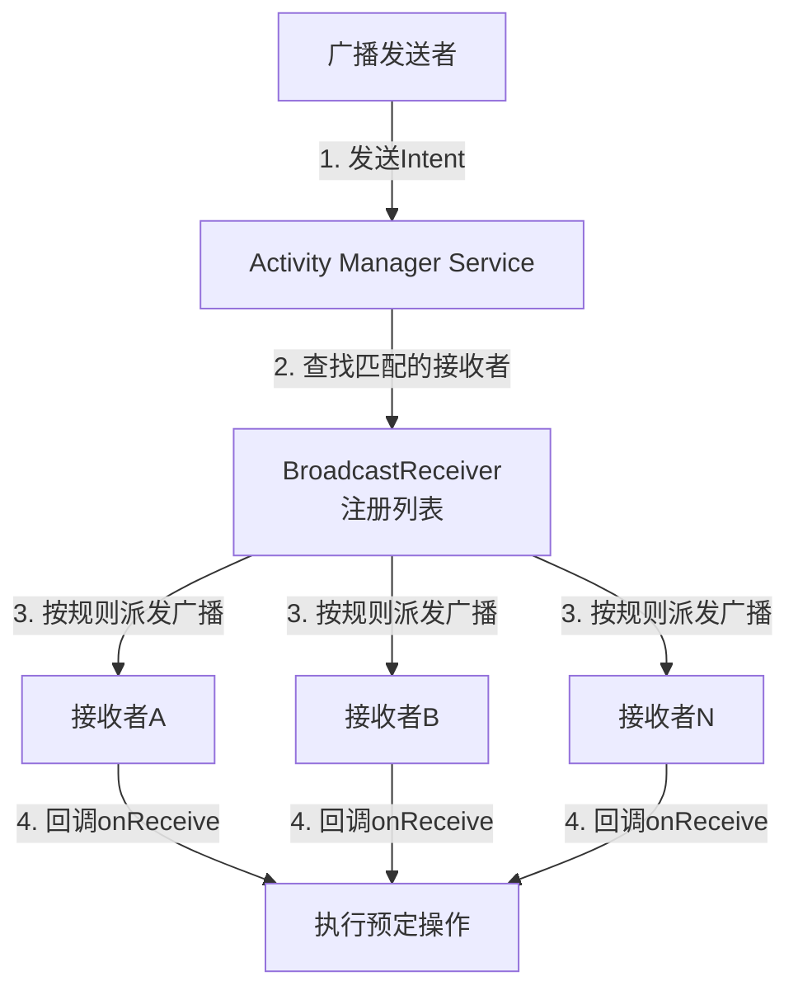

## 一、广播机制简介

### 1.1 什么是 Android 的广播机制

Android 的广播机制是其应用开发中一项非常核心的组件间通信方式，它基于**发布-订阅模式**，允许应用组件之间进行松耦合的通信。无论是系统事件（如网络变化、电量不足）还是应用内部的自定义消息，广播都能大显身手。


### 1.2 广播机制的特点

这是因为**Android中的每个应用程序都可以对自己感兴趣的广播进行注册**，这样该程序就只会收到自己所关心的广播内容，这些广播可能是来自于系统的，也可能是来自于其他应用程序的。

Android提供了一套完整的API，允许应用程序自 由地发送和接收广播。

- 用于发送广播机制的 Intent
- 接受广播的 BroadcastReceiver


### 1.3 广播类型

Android 广播主要可以从两个维度进行划分：

| 类型           | 描述     | 特点与用途                                                   | 使用场景                                                     |
| :------------- | :------- | :----------------------------------------------------------- | ------------------------------------------------------------ |
| **按发送范围** | 全局广播 | 可被系统内任何应用接收，适用于系统事件或跨应用通信。         |                                                              |
|                | 本地广播 | 仅限应用内部使用，更安全、高效，推荐用于应用内组件通信。     | 应用内部不同组件（如Activity和Service）之间的通信。          |
| **按传递方式** | 普通广播 | 异步执行，所有符合条件的接收者几乎同时收到，无法中断或传递结果。 | 应用内通知某个事件发生（如数据更新完成）。                   |
|                | 有序广播 | 同步执行，接收者按优先级依次处理，前者可中断广播或修改结果   | 系统需要确保某个功能优先执行（如低电量处理，杀毒软件先扫描）。 |


#### 1.3.1 全局广播和本地广播

- 


#### 1.3.2 普通广播和有序广播


#### 1.3.3 隐式广播和显式广播

根据目标指定方式，广播可以划分为：

- **隐式广播**：指的是广播的发送者没有指定特定的目标应用包名，任何声明了相应 `Intent-Filter`的应用都可以接收。大多数系统广播都属于隐式广播。

- **显式广播**：指的是广播的发送者指定特定的目标应用包名。我们可以使用 setPackage() 方法来指定这条广播是发送给哪个应用程序的。

> **显式广播（指定目标）+ **全局广播（跨应用)：通过 `Intent.setPackage("com.other.app")`将广播精准发送给另一个特定应用。
>
> 显式广播（指定目标）+ 本地广播（应用内）：使用 `LocalBroadcastManager`发送广播，其本质就是显式地发给应用内的接收器。

**Android 8.0+ 的重要限制**：由于隐式广播可能导致大量应用被唤醒，严重消耗资源，从Android 8.0开始，**大多数隐式广播无法在清单文件中静态注册接收**（少数系统广播除外）。必须使用**动态注册**，或者将其转换为**显式广播**（通过 `Intent.setPackage()`或 `Intent.setComponent()`指定目标）来发送。


## 二、广播机制的工作原理

### 2.1 领域模型

广播机制的核心参与者包括

- **广播发送者**
- **广播接收者** 
- 作为中介的**系统组件**（主要是 Activity Manager Service, AMS）


### 2.2 工作流程

Android 广播机制采用的是**发布-订阅模式**，工作流程如下图所示，可以概括为以下几个步骤：

1. **注册接收者**：广播接收者通过动态或静态方式在系统中注册，告知系统自己关心哪些广播。
2. **发送广播**：发送者创建一个 Intent 对象来封装广播信息，然后通过 `sendBroadcast()`等方法将广播发送出去。
3. **系统匹配与派发**：AMS 接收到广播后，会根据 Intent 中的信息（如 Action）在已注册的接收者列表中寻找匹配项。对于有序广播，还会根据优先级决定传递顺序。
4. **接收并处理**：系统回调匹配的广播接收器的 `onReceive()`方法，从而执行预定的操作。




### 2.3 广播 Action

**Action** 是决定广播接收器（`BroadcastReceiver`）响应何种广播的**核心标识符**，无论是系统广播还是应用内部的自定义广播，都遵循这个规则。

| 特性              | 系统广播                                         | 自定义广播                                       |
| :---------------- | :----------------------------------------------- | :----------------------------------------------- |
| **Action 定义者** | **Android 系统**                                 | **应用开发者**                                   |
| **Action 示例**   | `android.intent.action.BOOT_COMPLETED`(开机完成) | `com.example.myapp.DATA_REFRESHED`(数据已刷新)   |
| **发送方**        | 系统服务（如电池管理、网络服务）                 | 应用内部的代码（通过 `sendBroadcast()`发送）     |
| **主要用途**      | 通知系统级事件（如电量变化、网络连接、来电）     | 实现应用内部组件间的通信（如通知Activity更新UI） |


- 自定义广播的 Action 字符串应使用**应用包名作为前缀**（如`"com.yourcompany.yourapp.ACTION_NAME"`），以保证唯一性

- 如果你想查看完整的系统广播列表，可以到如下的路径中去查看：

  ```
  <Android SDK>/platforms/<任意android api版本>/data/broadcast_actions.txt
  ```

  


## 三、广播使用方法

### 3.1 接受广播

Android内置了很多系统级别的广播，我们可以在应用程序中通过监听这些广播来得到各种系统的状态信息。比如手机开机完成后会发出一条广播，电池的电量发生变化会发出一条广播，系统时间发生改变也会发出一条广播，等等。

#### 3.1.1 自定义广播接收器类

创建一个继承自 `BroadcastReceiver`的类，并重写 `onReceive`方法

```java
private class MyBroadcastReceiver extends BroadcastReceiver {
    
        @Override
        public void onReceive(Context context, Intent intent) {
            // 当收到匹配的广播时，会回调此方法
            if (intent.getAction() != null && intent.getAction().equals(MyConstants.ACTION_MY_CUSTOM_BROADCAST)) {
                String message = intent.getStringExtra("message");
                Toast.makeText(context, "收到广播：" + message, Toast.LENGTH_SHORT).show();
            }
        }
    }
```

**重要提示**：`onReceive`方法运行在**主线程**，因此**严禁在其中执行耗时操作**（如网络请求或大量数据库读写），否则可能导致应用无响应（ANR）。耗时任务应交给 `Service`或 `JobScheduler`处理


#### 3.1.1 注册广播

如果想要接收广播，我们可以根据自己感兴趣的广播，自由地注册 BroadcastReceiver，这样当有相应的广播发出时，相应的 BroadcastReceiver 就能够收到该广播，并可以在内部进行逻辑处理。注册 BroadcastReceiver的方式一般有两种：

| 注册方式     | 优点                         | 缺点                        | 示例                                                 |
| :----------- | :--------------------------- | :-------------------------- | :--------------------------------------------------- |
| **动态注册** | 灵活，生命周期与注册组件绑定 | 组件销毁后无法接收          | 在 Activity 的 `onCreate`中注册，`onDestroy`中注销。 |
| **静态注册** | 应用未启动也能接收特定广播   | 不够灵活，Android 8.0+ 受限 | 在 `AndroidManifest.xml`中声明                       |

**(1) 动态注册**

动态注册是在代码中进行注册的，**推荐用于应用内通信**。 这种方式的生命周期与注册它的组件（如Activity）绑定，更灵活，也更安全。

> 注意，动态注册的 BroadcastReceiver 一定要取消注册才行。

  ```java
public class MainActivity extends AppCompatActivity {
    private MyBroadcastReceiver mReceiver;

    @Override
    protected void onCreate(Bundle savedInstanceState) {
        super.onCreate(savedInstanceState);
        setContentView(R.layout.activity_main);

        // 1. 创建广播接收器实例
        mReceiver = new MyBroadcastReceiver();

        // 2. 创建IntentFilter，并添加要监听的Action
        IntentFilter filter = new IntentFilter();
        filter.addAction(MyConstants.ACTION_MY_CUSTOM_BROADCAST);

        // 3. 注册接收器
        if (Build.VERSION.SDK_INT >= Build.VERSION_CODES.TIRAMISU) {
            registerReceiver(mReceiver, filter, Context.RECEIVER_NOT_EXPORTED);
        } else {
            registerReceiver(mReceiver, filter);
        }
    }

    @Override
    protected void onDestroy() {
        super.onDestroy();
        // 4. 在组件销毁时注销接收器，防止内存泄漏
        unregisterReceiver(mReceiver);
    }
}
  ```

**(2) 静态注册**

这种方式可以让你的应用在未启动时也能接收广播，但Android 8.0（API 26）之后对隐式广播（不指定包名的广播）有严格限制，通常不推荐用于自定义广播。  

静态注册是通过在 AndroidManifest.xml 中注册来实现的。

  ```java
  <receiver 
      android:name=".MyBroadcastReceiver"
      android:enabled="true"
      android:exported="true">
      <intent-filter>
          <action android:name="android.intent.action.BOOT_COMPLETED" />
          <action android:name="android.net.conn.CONNECTIVITY_CHANGE" />
      </intent-filter>
  </receiver>
  ```

  

### 3.2 发送广播

发送广播很简单，主要是构造一个 Intent 并指定相应的 Action。发送广播主要有两种类型：

- 发送普通广播
- 发送有序广播


#### 3.2.1 发送普通广播

使用 `sendBroadcast()`方法

```java
Intent intent = new Intent("com.example.MY_CUSTOM_ACTION");
intent.putExtra("key", "需要传递的数据");
// intent.setPackage(getPackageName());    // 指定接收的包名
sendBroadcast(intent);
```


#### 3.2.2 发送有序广播

有序广播的核心在于其**顺序传递**和**可控性**。系统会确保广播消息按照严格的路径传递，并允许在关键节点进行干预。

1. **系统排序与传递**：当发送一个有序广播后，系统会收集所有匹配该广播的`BroadcastReceiver`（包括静态在`AndroidManifest.xml`中注册和动态在代码中注册的接收器）。系统根据`android:priority`属性值（数值越大，优先级越高）对所有接收器进行排序。随后，广播按照优先级从高到低的顺序依次传递给每个接收器。
2. **接收器处理与干预**：每个接收器在`onReceive`方法中处理广播。此时，接收器拥有三个关键能力：
   - **继续传播**：处理完成后，不中断流程，广播将继续传递给下一个优先级较低的接收器。
   - **终止传播**：若当前接收器认为无需后续处理，可调用`abortBroadcast()`方法，彻底终止广播的传递链，后续所有接收器都将无法收到此广播。
   - **修改数据**：通过`setResultExtras()`方法将处理结果或新数据存入一个`Bundle`中，下一个接收器可以通过`getResultExtras(true)`方法获取这些数据，从而实现接收器之间的数据协作。
3. **最终回调**：在整个广播链处理完毕后，如果发送广播时通过`sendOrderedBroadcast`方法设置了最终的`BroadcastReceiver.PendingResult`回调，系统会执行该回调以进行最终处理

> 注意，在 OPPO 手机上，我测试的时候，发现反而是值越小优先级越高，暂不清楚原因

**(1) 发送方式**

使用 `sendOrderedBroadcast()`方法。接收者可以在 `onReceive`中调用 `abortBroadcast()`来中止传递，或者使用 `setResultExtras()`来传递数据给下一个接收者

```java
sendOrderedBroadcast(intent, null);
```


**(2) 设置优先级**

在 AndroidManifest.xml 中为 receiver 设置 android:priority 属性：

```
<receiver android:name=".MyReceiver">
    <intent-filter android:priority="100">
        <action android:name="com.example.MY_ACTION"/>
    </intent-filter>
</receiver>
```

或者 或者在代码中动态注册时指定：

```
IntentFilter filter = new IntentFilter("com.example.MY_ACTION");
filter.setPriority(100);
registerReceiver(receiver, filter);
```

在 通过 `android:priority` 属性给 BroadcastReceiver 设置了优先级，优先级比较高的BroadcastReceiver 就可以先收到广播


**(3) 接收和处理**

```java
public class MyReceiver extends BroadcastReceiver {
    @Override
    public void onReceive(Context context, Intent intent) {
        // 处理广播数据
        Bundle extras = getResultExtras(true);
        
        // 可以终止广播继续传播
        abortBroadcast();
    }
}
```


### 3.3 本地广播

前两节将的是全局广播的使用方式。**全局广播**使用 `sendBroadcast()`发送，可以被系统内任何应用接收（如果它们注册了对应的接收器）。存在一定的安全风险，因为数据可能被其他应用获取。

**本地广播**使用 `LocalBroadcastManager`发送，**仅限应用内部**接收。更安全、更高效，是应用内组件通信的推荐方式。

```
// 发送本地广播
LocalBroadcastManager.getInstance(this).sendBroadcast(intent);

// 注册本地广播接收器
LocalBroadcastManager.getInstance(this).registerReceiver(mReceiver, filter);
```


## 四、最佳实践

1. **优先使用本地广播**：对于应用内部的通信，强烈推荐使用 `LocalBroadcastManager`。它更安全（避免数据泄露给其他应用）、更高效（进程内通信）。
2. **注意 Android 版本差异**：从 Android 8.0 开始，系统对静态注册的广播接收者增加了限制。对于大多数自定义广播，建议使用动态注册，或者在使用静态注册时明确指定目标应用的包名。
3. **防止内存泄漏**：动态注册的 `BroadcastReceiver`**必须**在适当的生命周期方法（如 `onDestroy`）中调用 `unregisterReceiver()`进行注销。
4. **确保广播唯一性**：自定义广播的 Action 字符串应使用**应用包名作为前缀**（如 `"com.yourcompany.yourapp.ACTION_NAME"`），以避免与其他应用的广播冲突。


## 五、问题

### 5.1 为什么隐式广播不允许使用静态注册的方式来接收

最初，在 Android 系统中，应用确实可以通过在 `AndroidManifest.xml`文件中**静态注册**广播接收器 (`BroadcastReceiver`)，来监听各种系统事件，即使应用本身并未启动。这为实现诸如开机自启动等功能提供了便利。然而，由于**安全和性能考量**（防止恶意应用滥用广播在后台频繁唤醒，消耗电量和系统资源 ），Google 自 **Android 8.0（API 级别 26）** 起，对静态注册广播接收器施加了严格限制。

新规的核心内容是：**绝大多数隐式广播不再允许通过静态注册方式接收** 

- **隐式广播**：指的是广播的发送者没有指定特定的目标应用包名，任何声明了相应 `Intent-Filter`的应用都可以接收。大多数系统广播都属于隐式广播。
- **受影响的范围**：这意味着，在 Android 8.0 及更高版本的设备上，如果您在 `AndroidManifest.xml`中静态注册了如 `android.net.conn.CONNECTIVITY_CHANGE`（网络变化）、`android.intent.action.BATTERY_LOW`（电量低）等常见的系统广播，接收器将**无法生效** 

尽管有了严格限制，但系统仍允许一小部分**特殊的、关键的**系统广播继续支持静态注册，以确保某些核心功能可以正常工作 。例如，`android.intent.action.BOOT_COMPLETED`（系统启动完成）。

这些特殊的系统广播可以查看 [Implicit broadcast exceptions  | Background work  | Android Developers](https://developer.android.google.cn/develop/background-work/background-tasks/broadcasts/broadcast-exceptions)


## 参考资料

[吃透 Android BroadcastReceiver：从通信到避坑实战指南-CSDN博客](https://blog.csdn.net/toungboy/article/details/154702395)


## 最佳实践

### 实现强制下线

强制下线应该算是一个比较常见的功能，比如如果你的QQ号在别处登录了，就会将你强制挤下线。其实实现强制下线功能的思路比较简单，只需要在界面上弹出一个对话框，让用户无法进行任何其他操作，必须点击对话框中的“确定”按钮，然后回到登录界面即可。可是这样就会存 在一个问题：当用户被通知需要强制下线时，可能正处于任何一个界面，难道要在每个界面上 都编写一个弹出对话框的逻辑？如果你真的这么想，那思路就偏远了。我们完全可以借助本章所学的广播知识，非常轻松地实现这一功能。


- 创建 BaseActivity ，成为项目中所有Activity的父类，知晓当前是在哪一个 Activity

- 单例类ActivityCollector作为Activity的集合，对所有的 Activity 进行管理， 可以随时随地退出程序

- 将LoginActivity的继承结构改成继承自BaseActivity

- 创建一个BroadcastReceiver来接收这条强制下线广播。由于BroadcastReceiver中需要弹出一个对话框来阻塞用

  户的正常操作，但如果创建的是一个静态注册的BroadcastReceiver，是没有办法在

  onReceive()方法里弹出对话框这样的UI控件的，而我们显然也不可能在每个Activity中都注

  册一个动态的BroadcastReceiver。只需要在BaseActivity中动态注册一个

  BroadcastReceiver就可以了，因为所有的Activity都继承自BaseActivity。

