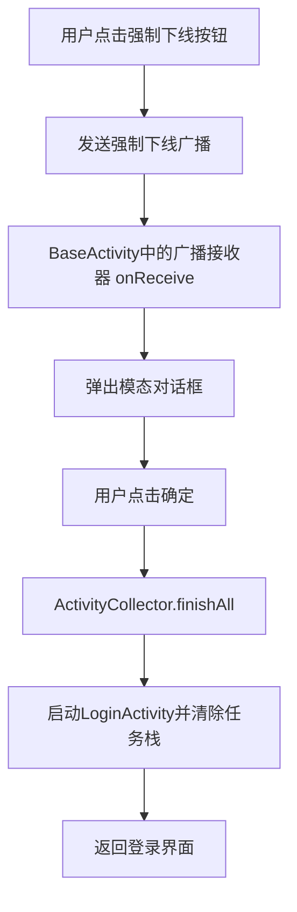

### 核心实现思路

强制下线功能的核心在于：**当需要强制下线时（如账号在别处登录），系统能安全地关闭所有当前界面，并返回登录页**。这需要解决三个问题：

1. **如何一次性关闭所有打开的界面？** -> 通过一个中央管理器记录所有活跃的 `Activity`。
2. **如何保证在任何界面都能收到下线指令？** -> 通过一个所有 `Activity`的基类来统一注册和接收广播。
3. **如何安全地弹出对话框并引导用户？** -> 在广播接收器中弹出不可取消的对话框，处理跳转逻辑。




### 关键组件

实现此功能主要需要以下几个核心组件：

| 文件                | 职责描述                                                     |
| :------------------ | :----------------------------------------------------------- |
| `ActivityCollector` | **活动管理器**：一个单例类，用于存储所有当前打开的Activity，并提供一次性关闭所有Activity的方法。 |
| `BaseActivity`      | **活动基类**：所有Activity的父类。在此类中动态注册广播接收器，并自动将Activity纳入管理器。 |
| `LoginActivity`     | **登录界面**：用户重新登录的入口。                           |
| `MainActivity`      | **主界面**：包含一个用于**模拟触发强制下线**的按钮。         |


### 项目结构

```
force-offline-java-view/
├── app/src/main/java/com/example/broadcast/forceoffline/
│   ├── base/
│   │   └── BaseActivity.java                 # 所有Activity的基类，统一处理强制离线广播
│   ├── manager/
│   │   └── ActivityCollector.java            # Activity管理器，统一管理所有Activity
│   ├── receiver/
│   │   └── ForceOfflineReceiver.java         # 强制离线广播接收器
│   ├── ui/
│   │   ├── LoginActivity.java                # 登录界面
│   │   └── MainActivity.java                 # 主界面（演示强制离线功能）
│   └── utils/
│       └── Constants.java                    # 常量定义
├── app/src/main/res/
│   ├── layout/
│   │   ├── activity_login.xml                # 登录界面布局
│   │   └── activity_main.xml                 # 主界面布局
│   ├── values/
│   │   ├── strings.xml                       # 字符串资源
│   │   └── colors.xml                        # 颜色资源
│   └── menu/
│       └── main_menu.xml                     # 菜单资源文件
├── app/src/main/AndroidManifest.xml           # 应用配置文件
└── app/build.gradle                          # 项目依赖配置
```