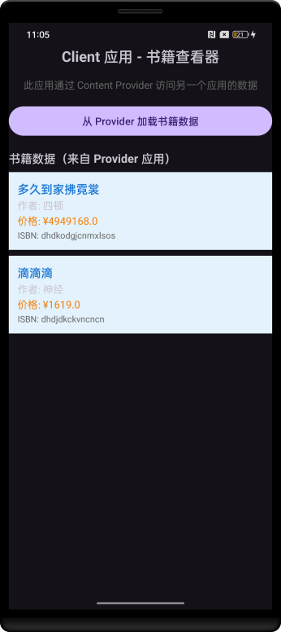

## 一、项目概述

### 1.1 核心实现思路

本项目采用**多应用模块化架构**，通过 Content Provider 机制实现跨应用数据共享。

1. **职责分离**：Provider 应用专注数据存储和管理，Client 应用专注数据消费和展示
2. **契约驱动**：通过共享库定义统一的数据接口规范，确保两端一致性
3. **安全控制**：基于权限机制保护数据访问安全，防止未授权访问
4. **松耦合设计**：应用间通过标准 Content Provider 接口通信，降低依赖


### 1.2 关键组件

| 所在模块       | 组件              | 类型             | 职责描述                           |
| :------------- | :---------------- | :--------------- | :--------------------------------- |
| shared-library | `BookContract`    | 数据契约类       | 定义统一的URI、表结构、权限常量    |
| provider-app   | `BookDbHelper`    | 数据库帮助类     | 管理SQLite数据库创建和升级         |
| provider-app   | `BookProvider`    | Content Provider | 实现数据访问接口，处理跨进程请求   |
| provider-app   | `MainActivity`    | Activity         | 提供数据管理界面，测试Provider功能 |
| provider-app   | `UriMatcher`      | 系统组件         | URI路由匹配，区分操作类型          |
| client-app     | `MainActivity`    | Activity         | 消费远程数据，演示跨应用访问       |
| client-app     | `ContentResolver` | 系统组件         | Client端数据访问入口               |


### 1.3 项目结构

```
content-provider-custom-java-view/
├──📱 shared-library/                          # 共享契约模块
│   ├── src/main/java/com/example/contentprovider/shared/
│   │   └── BookContract.java                  # 数据契约核心类
│   └── build.gradle.kts
├──📱 provider-app/                           # 数据提供者应用
│   ├── src/main/java/com/example/contentprovider/provider/
│   │   ├── BookDbHelper.java                 # SQLite数据库管理
│   │   ├── BookProvider.java                 # ContentProvider实现
│   │   └── ProviderMainActivity.java         # 数据管理界面
│   ├── src/main/res/layout/
│   │   ├── activity_provider_main.xml        # 主界面布局
│   │   └── item_book.xml                     # 书籍项布局
│   ├── src/main/AndroidManifest.xml
│   └── build.gradle.kts
├──📱 client-app/                            # 数据消费者应用  
│   ├── src/main/java/com/example/contentprovider/client/
│   │   └── ClientMainActivity.java          # 数据消费界面
│   ├── src/main/res/layout/
│   │   ├── activity_client_main.xml         # 客户端主界面
│   │   └── item_book_client.xml             # 客户端书籍项布局
│   ├── src/main/AndroidManifest.xml
│   └── build.gradle.kts
└──📄 settings.gradle.kts                   # 多模块配置
```


## 二、功能模块详解

### 2.1 权限配置

#### 2.1.1 Provider 应用的 AndroidManifest.xml

```xml
    <!-- 定义权限 -->
    <permission
        android:name="com.example.contentprovider.provider.READ_BOOKS"
        android:protectionLevel="dangerous"
        android:label="@string/read_books_label"
        android:description="@string/read_books_description" />
    <permission
        android:name="com.example.contentprovider.provider.WRITE_BOOKS"
        android:protectionLevel="dangerous"
        android:label="@string/write_books_label"
        android:description="@string/write_books_description" />

    <!-- 声明Content Provider -->
    <provider
        android:name=".BookProvider"
        android:authorities="com.example.contentprovider.provider"
        android:exported="true"
        android:readPermission="com.example.contentprovider.provider.READ_BOOKS" />
```

#### 2.1.2 Client应用的AndroidManifest.xml

```xml
    <!-- 声明使用权限 -->
    <uses-permission android:name="com.example.contentprovider.provider.READ_BOOKS" />

    <!-- 添加查询指定应用的权限 -->
    <queries>
        <package android:name="com.example.contentprovider.provider" />
    </queries>
```


### 2.2 数据契约类

数据契约类义了 Provider 和 Client 应用之间通信的接口，包括表定义、列定义、MIME 类型定义、Content URI 定义、权限定义。如果以后需要添加更多表（如作者表、分类表），可以创建新的 Entry 类


## 三、项目效果

点击加载按钮后，clinet-app 会使用 provider-app 自定义的 contentprovider，加载信息并显示在应用界面。运行效果如下图所示。




## 四、问题

### 4.1 Provider找不到

#### 4.1.1 应用背景

在 OPPO 手机上面测试自定义 content provider 的案例。


#### 4.1.2 问题描述

client-app 一直报错找不到我在 provider-app 中自定义的 `BookProvider`。


#### 4.1.3 原因分析

(1) 检查应用安装状态

```shell
$ adb shell pm list packages | findstr contentprovider
package:com.example.contentprovider.provider
package:com.example.contentprovider.client
```

(2) 检查 provider-app 应用详细信息

 provider-app 应用的包名为 `com.example.contentprovider.provider`

```shell
$ adb shell dumpsys package com.example.contentprovider.provider
...
Registered ContentProviders:
  com.example.contentprovider.provider/.BookProvider:
    Provider{4571c4b com.example.contentprovider.provider/.BookProvider}
  com.example.contentprovider.provider/androidx.startup.InitializationProvider:
    Provider{b81628 com.example.contentprovider.provider/androidx.startup.InitializationProvider}

ContentProvider Authorities:
  [com.example.contentprovider.provider.androidx-startup]:
    Provider{b81628 com.example.contentprovider.provider/androidx.startup.InitializationProvider}
      applicationInfo=ApplicationInfo{11cf41 com.example.contentprovider.provider}
  [com.example.contentprovider.provider]:
    Provider{4571c4b com.example.contentprovider.provider/.BookProvider}
      applicationInfo=ApplicationInfo{2013ce6 com.example.contentprovider.provider}

Key Set Manager:
  [com.example.contentprovider.provider]
      Signing KeySets: 299
...
```

可以看到 `Registered ContentProviders:` 中包含了  `com.example.contentprovider.provider/.BookProvider`，这说明已经成功注册了。

(3) 检查 Content Provider 是否已正确注册

```shell
 $ adb shell pm list providers | findstr contentprovider
 
 $ adb shell dumpsys package com.example.contentprovider.provider | findstr -i provider
```


(4) 检查 client-app 应用详细信息

```shell
$ adb shell dumpsys package com.example.contentprovider.client
Permissions:
  Permission [com.example.contentprovider.client.DYNAMIC_RECEIVER_NOT_EXPORTED_PERMISSION] (a36961):
    sourcePackage=com.example.contentprovider.client
    uid=10018 gids=[] type=0 prot=signature
    perm=PermissionInfo{1b59c86 com.example.contentprovider.client.DYNAMIC_RECEIVER_NOT_EXPORTED_PERMISSION}

Packages:
  Package [com.example.contentprovider.client] (8cc3a9d):
     requested permissions:
      com.example.contentprovider.provider.READ_BOOKS
      com.example.contentprovider.provider.WRITE_BOOKS
      com.example.contentprovider.client.DYNAMIC_RECEIVER_NOT_EXPORTED_PERMISSION
    install permissions:
      com.example.contentprovider.provider.WRITE_BOOKS: granted=false
      com.example.contentprovider.client.DYNAMIC_RECEIVER_NOT_EXPORTED_PERMISSION: granted=true
      com.example.contentprovider.provider.READ_BOOKS: granted=false
    
```


**Android 11（API 30）+ 引入的「包可见性」限制**，用来控制应用间的相互发现。在 Android 11 及更高版本，Google 加强了隐私保护：

- 应用默认**无法知道**设备上安装了哪些其他应用
- 不能随意查询其他应用的信息
- 特别是通过包名、Intent 等


#### 4.1.4 解决方案

在 AndroidManifest.xml 中添加如下代码：

```
<queries>
    <package android:name="com.example.contentprovider.provider" />
</queries>
```


### 4.2 没有自动授予自定义权限

#### 4.1.1 应用背景

在 OPPO 手机上面测试自定义 content provider 的案例。

```
	<!-- 定义权限 -->
    <permission
        android:name="com.example.contentprovider.provider.READ_BOOKS"
        android:protectionLevel="normal" />
    <permission
        android:name="com.example.contentprovider.provider.WRITE_BOOKS"
        android:protectionLevel="normal" />
```


```
     <!-- 声明使用 Provider 应用的权限 -->
    <uses-permission android:name="com.example.contentprovider.provider.READ_BOOKS" />
    <uses-permission android:name="com.example.contentprovider.provider.WRITE_BOOKS" />
```


#### 4.1.2 问题描述

client-app 无法申请权限。


#### 4.1.3 原因分析

(1) 检查应用安装状态

```shell
$ adb shell pm list packages | findstr contentprovider
package:com.example.contentprovider.provider
package:com.example.contentprovider.client
```

(2) 检查 provider-app 自定义权限

 provider-app 应用的包名为 `com.example.contentprovider.provider`

```shell
$ adb shell dumpsys package com.example.contentprovider.provider
...
Permissions:
  Permission [com.example.contentprovider.provider.WRITE_BOOKS] (d819c87):
    sourcePackage=com.example.contentprovider.provider
    uid=10017 gids=[] type=0 prot=normal
    perm=PermissionInfo{e257d78 com.example.contentprovider.provider.WRITE_BOOKS}

Permissions:
  Permission [com.example.contentprovider.provider.READ_BOOKS] (54af7b4):
    sourcePackage=com.example.contentprovider.provider
    uid=10017 gids=[] type=0 prot=normal
    perm=PermissionInfo{4a6bcb6 com.example.contentprovider.provider.READ_BOOKS}

Permissions:
  Permission [com.example.contentprovider.provider.DYNAMIC_RECEIVER_NOT_EXPORTED_PERMISSION] (19c7fdd):
    sourcePackage=com.example.contentprovider.provider
    uid=10017 gids=[] type=0 prot=signature
    perm=PermissionInfo{f0f924 com.example.contentprovider.provider.DYNAMIC_RECEIVER_NOT_EXPORTED_PERMISSION}

Packages:
  Package [com.example.contentprovider.provider] (af93227):
    userId=10017
    pkg=Package{8cc1489 com.example.contentprovider.provider}
    codePath=/data/app/~~4Rn1Yjsbg816SnMMfsGvDQ==/com.example.contentprovider.provider-KnkTrckSelJ_nZxNOHHrEQ==
    resourcePath=/data/app/~~4Rn1Yjsbg816SnMMfsGvDQ==/com.example.contentprovider.provider-KnkTrckSelJ_nZxNOHHrEQ==
    legacyNativeLibraryDir=/data/app/~~4Rn1Yjsbg816SnMMfsGvDQ==/com.example.contentprovider.provider-KnkTrckSelJ_nZxNOHHrEQ==/lib
    extractNativeLibs=false
	declared permissions:
      com.example.contentprovider.provider.READ_BOOKS: prot=normal, INSTALLED
      com.example.contentprovider.provider.WRITE_BOOKS: prot=normal, INSTALLED
      com.example.contentprovider.provider.DYNAMIC_RECEIVER_NOT_EXPORTED_PERMISSION: prot=signature, INSTALLED
   requested permissions:
      com.example.contentprovider.provider.DYNAMIC_RECEIVER_NOT_EXPORTED_PERMISSION
   install permissions:
      com.example.contentprovider.provider.DYNAMIC_RECEIVER_NOT_EXPORTED_PERMISSION: granted=true
...
```

`Packages:` 块包含了如下信息：

- declared permissions - 声明的权限： 在 `AndroidManifest.xml`中用 `<permission>`标签声明,  你的应用**定义**了这些权限
- requested permissions - 请求的权限:  在 `AndroidManifest.xml`中用 `<uses-permission>`请求, 你的应用**自己需要**这些权限
- install permissions - 安装时授予的权限:  安装时系统自动处理的权限

这表明权限已在**应用层面声明成功**。

然后，Permission [...]块是系统**内部权限对象**的详细信息。`Permission [com.example.contentprovider.provider.WRITE_BOOKS]` 说明权限已在**系统层面创建成功**


(3) 检查 client-app 应用权限申请

```shell
$ adb shell dumpsys package com.example.contentprovider.client
Permissions:
  Permission [com.example.contentprovider.client.DYNAMIC_RECEIVER_NOT_EXPORTED_PERMISSION] (a36961):
    sourcePackage=com.example.contentprovider.client
    uid=10018 gids=[] type=0 prot=signature
    perm=PermissionInfo{1b59c86 com.example.contentprovider.client.DYNAMIC_RECEIVER_NOT_EXPORTED_PERMISSION}

Packages:
  Package [com.example.contentprovider.client] (8cc3a9d):
     requested permissions:
      com.example.contentprovider.provider.READ_BOOKS
      com.example.contentprovider.provider.WRITE_BOOKS
      com.example.contentprovider.client.DYNAMIC_RECEIVER_NOT_EXPORTED_PERMISSION
    install permissions:
      com.example.contentprovider.provider.WRITE_BOOKS: granted=false
      com.example.contentprovider.client.DYNAMIC_RECEIVER_NOT_EXPORTED_PERMISSION: granted=true
      com.example.contentprovider.provider.READ_BOOKS: granted=false
    
```

可以看到 `com.example.contentprovider.provider.WRITE_BOOKS: granted=false`， 这说明安装时授予 normal 级别的自定义权限失败了。


(4) 确认最终原因

在 Android 6.0+ 之后， 自定义权限的行为发生了变化：

1. **`normal`级别的自定义权限**：不再自动授予，即使它们被定义为 `normal`
2. **`signature`级别的系统权限**：自动授予给有相同签名的应用
3. **`normal`级别的系统权限**：自动授予
4. **自定义 `normal`权限**：**不会自动授予**，即使在同一设备上

> **只有 `protectionLevel="dangerous"`的自定义权限可以在运行时申请**

因此，安装的时候没有自动授予**`normal`级别的自定义权限**


#### 4.2.4 解决方案

将权限修改为 dangerous ，运行时申请即可。


