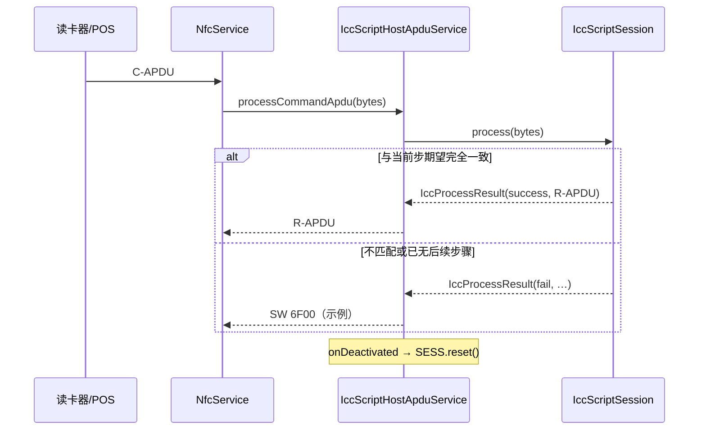

## 一、项目概述

本工程 **`hce-pos-java-view`** 演示如何在 Android 上使用 **`HostApduService`** 做 **卡模拟（HCE）**：读卡器下发的每条 **C-APDU** 与预先准备的 **ICC 脚本（JSON）** 中的向量 **按会话顺序、逐字节比对**；命中则返回脚本中对应的 **R-APDU**。适用于 **授权、封闭环境** 下联调 EMV/内核风格的 **非接交易会话**（应用选择、GPO、读记录、GENERATE AC 等步骤均可写入同一份脚本）。

脚本格式 **不与某一发卡组织绑定**：凡能导出为下文 **`APDU_CMDS` + `APDU0`/`RPDU0`…** 结构的测试向量（银联、外卡、MIR 等），替换 `assets` 即可复用同一套代码路径。**不涉及真实清算网络**，禁止用于生产或未授权场景。

---

### 1.1 核心实现思路

逻辑分为三层：

1. **声明层**：Manifest 声明 NFC 权限与 HCE 硬件能力；注册 `IccScriptHostApduService`，并通过 `res/xml/apdu_service.xml` 声明 **`payment`** 类别下的 **AID 列表**，使系统在 SELECT（PPSE / 应用）时能把 APDU 路由到本应用。

2. **脚本层**：`IccScriptLoader` 从 `assets`（默认 `icc_apdu_script.json`）解析有序步骤；`IccScript` / `IccScriptStep` 承载「期望 C-APDU → 应答 R-APDU」；`ApduHex` 负责十六进制与 `byte[]` 互转。

3. **会话层**：`IccScriptSession` 维护当前步序号；每次 `processCommandApdu` 仅与 **当前步** 的期望 C-APDU 比较；成功则返回对应 R-APDU 并前进；**`onDeactivated`** 时 **重置步序号**，下一次触碰从头开始。



---

### 1.2 关键组件

| 组件 | 职责 |
|------|------|
| **MainActivity** | 查询 **NFC / HCE** 是否可用（`PackageManager` Feature）；从 assets **加载脚本** 用于界面展示「脚本已加载」及步数占位；提供跳转 **NFC 付款设置 / NFC 设置**，提示用户将本应用设为默认付款应用或触碰时手动选择。 |
| **IccScriptLoader** | 读取 UTF-8 JSON，解析根对象下的 **`APDU_CMDS`**，按 **`APDU0`/`RPDU0`、`APDU1`/`RPDU1`…** 递增序号组装 **`IccScript`**；支持 `loadFromAssets`、`load(InputStream)`，便于测试注入流。 |
| **ApduHex** | 十六进制字符串 → `byte[]`（忽略空白、大小写不敏感）；`byte[]` → 连续十六进制字符串（日志用）。 |
| **IccScript / IccScriptStep** | 不可变步骤列表：每一步包含 **完整 C-APDU** 与 **完整 R-APDU**（含状态字如 `9000`）。 |
| **IccScriptSession** | 顺序状态机：`process(byte[])` 与当前步期望比较；**数组相等**则返回该步 R-APDU 并 `stepIndex++`；否则返回失败原因供上层打日志。 |
| **IccScriptHostApduService** | `onCreate` 中加载脚本并创建 Session；`processCommandApdu` 调用 Session，成功则返回 R-APDU，失败则 **`Log.e`** 打印实际/期望 hex 并返回 **`6F00`**；`onDeactivated` 调用 **`session.reset()`**。 |
| **IccHceDebugState** | 静态 volatile 字段：**脚本是否加载成功**、**下一步序号**、**总步数**，供 Activity 与 Service 共用，便于界面展示会话进度（触碰后由 Service 更新）。 |

---

### 1.3 项目结构（与 HCE / ICC 脚本相关源码）

```
hce-pos-java-view/app/src/main/
├── AndroidManifest.xml
├── assets/
│   └── icc_apdu_script.json          # 默认脚本；可替换（见 IccScriptLoader.ASSET_FILE_NAME）
├── java/com/example/hce/pos/
│   ├── MainActivity.java
│   └── iccsim/
│       ├── ApduHex.java
│       ├── IccScript.java
│       ├── IccScriptStep.java
│       ├── IccScriptLoader.java
│       ├── IccScriptSession.java
│       ├── IccProcessResult.java
│       ├── IccScriptHostApduService.java
│       └── IccHceDebugState.java
└── res/xml/apdu_service.xml          # host-apdu-service + payment aid-group
```

单元测试位于 `app/src/test/java/com/example/hce/pos/iccsim/`（`ApduHexTest`、`IccScriptLoaderTest`、`IccScriptSessionTest`）。

---

## 二、ICC 脚本 JSON 格式

约定根对象包含 **`APDU_CMDS`** 对象；其中 **`APDU`*n* 与 `RPDU`*n* 成对出现**，*n* 从 **0** 连续递增，缺一不可。

- 值为 **十六进制字符串**，表示 **完整** C-APDU / R-APDU 字节序列（含 **Le**、**SW1 SW2** 等，与真实抓包一致）。
- 解析时十六进制中的 **空白会被忽略**，字母 **大小写不敏感**。

示例结构（字段名固定）：

```json
{
  "APDU_CMDS": {
    "APDU0": "00A40400…",
    "RPDU0": "6F…9000",
    "APDU1": "…",
    "RPDU1": "…"
  }
}
```

替换脚本时：保持文件名与 **`IccScriptLoader.ASSET_FILE_NAME`**（默认 `icc_apdu_script.json`）一致，或修改该常量指向新文件。

---

## 三、功能模块详解

### 3.1 Manifest 与系统路由

- **`android.permission.NFC`**：使用 NFC API 所需。
- **`android.hardware.nfc`**、**`android.hardware.nfc.hce`**：`required="true"` 表示仅在有 NFC + HCE 的设备上安装（按需可改为 `false` 以扩大安装范围，由应用在运行时判断）。

**Service 注册要点：**

- `android:name=".iccsim.IccScriptHostApduService"`
- `android:permission="android.permission.BIND_NFC_SERVICE"`（系统绑定约束）
- Intent：`android.nfc.cardemulation.action.HOST_APDU_SERVICE`
- Meta-data：`android.nfc.cardemulation.host_apdu_service` → **`@xml/apdu_service`**

### 3.2 `apdu_service.xml` 与 AID

`host-apdu-service` 内 **`aid-group`** 使用 **`android:category="payment"`**，便于系统在「触碰付款」场景列出本应用。

**`aid-filter` 的 `android:name` 为十六进制字符串**（无 `0x` 前缀），须覆盖读卡器 **SELECT** 时会用到的 **PPSE（如 `2PAY.SYS.DDF01`）** 以及 **目标应用 AID**。示例中与内置脚本一致的两个过滤器为：

- `325041592E5359532E4444463031`（PPSE DF Name）
- `A0000006581010`（示例应用 AID）

**若更换脚本**，请根据新脚本中 SELECT 命令的数据字段 **同步修改** `aid-filter`，否则 **OS 不会把后续 APDU 交给本服务**。

### 3.3 脚本加载与会话匹配

1. **加载**：`IccScriptLoader.loadFromAssets(Context)` 打开 assets 下默认文件名，解析为 `IccScript`。
2. **会话**：`IccScriptSession` 初始 `stepIndex = 0`。第 *k* 条收到的 C-APDU 必须与脚本第 *k* 步的 **`commandApdu`** **完全一致**（`Arrays.equals`）。
3. **结束一轮**：NFC 场断开或会话结束时 **`HostApduService.onDeactivated`** 触发 → **`reset()`**，下一轮触碰再从 `APDU0` 开始。
4. **失败**：不匹配时 Service 记录 **`IccProcessResult.failureReason`**，并以 **`ApduHex`** 打印 **actual / expected**；返回 **`6F00`** 作为示例错误响应（非 EMV 标准含义，仅用于调试区分）。

### 3.4 MainActivity 与 UI

- **能力检测**：`FEATURE_NFC`、`FEATURE_NFC_HOST_CARD_EMULATION`。
- **脚本状态**：启动/回到前台时再次 `IccScriptLoader.loadFromAssets`，用于界面「脚本：已加载 / 失败原因」；并用 **`cachedScriptStepCount`** 在 Service 未启动时仍能显示总步数。
- **会话步数**：`IccHceDebugState.sessionNextStepIndex` / `sessionTotalSteps` 在 Service 处理 APDU 时更新；界面取 **`max(静态总步数, 本地缓存步数)`** 展示「下一步 / 共几步」。
- **用户引导**：文案提示将应用设为 **默认付款应用** 或在触碰界面 **手动选择**；按钮跳转 **`Settings.ACTION_NFC_PAYMENT_SETTINGS`**，不可用时回退 **`ACTION_NFC_SETTINGS`** / **`ACTION_WIRELESS_SETTINGS`**。

---

## 四、测试与调试建议

- **单元测试**：`src/test/.../iccsim/` 覆盖 Hex 解析、JSON 解析顺序、`IccScriptSession` 前进与重置逻辑；不依赖真机 NFC。
- **真机联调**：若某一步返回 `6F00` 或 POS 报错，对照 **logcat** 中 **`IccScriptHostApduService`**  tag：`actual=` 与 `expected=` 即为 POS 下发与脚本向量差异；需更新脚本向量或终端配置使双方字节一致。
- **默认付款**：若「贴卡无响应」，优先检查 **默认付款应用** 与 **AID 声明** 是否与脚本一致。

---

## 五、局限说明

- **首版为字节级全匹配**：不对 TLV 单字段做模糊匹配；POS 与脚本任一字段不同即失败。
- **脚本为静态向量**：不替代真实卡片密钥运算与发卡行授权；仅用于协议层对齐与教学联调。

---

## 六、相关文件索引

| 说明 | 路径 |
|------|------|
| 默认 ICC 脚本 | `app/src/main/assets/icc_apdu_script.json` |
| AID 与 payment 声明 | `app/src/main/res/xml/apdu_service.xml` |
| HCE 服务实现 | `app/src/main/java/com/example/hce/pos/iccsim/IccScriptHostApduService.java` |
| 脚本解析入口 | `app/src/main/java/com/example/hce/pos/iccsim/IccScriptLoader.java` |
| 项目说明（精简） | `README.md` |
