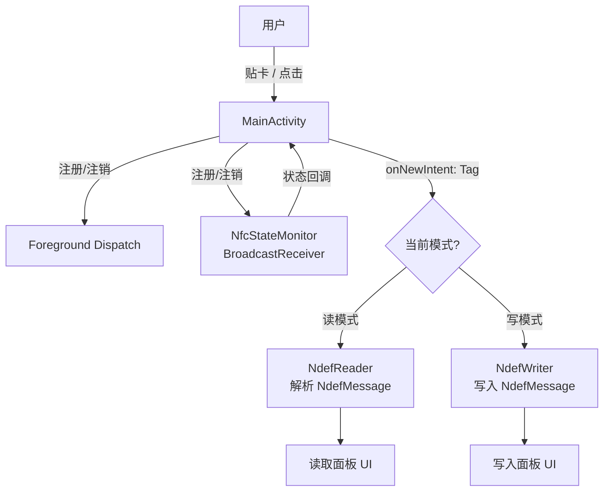
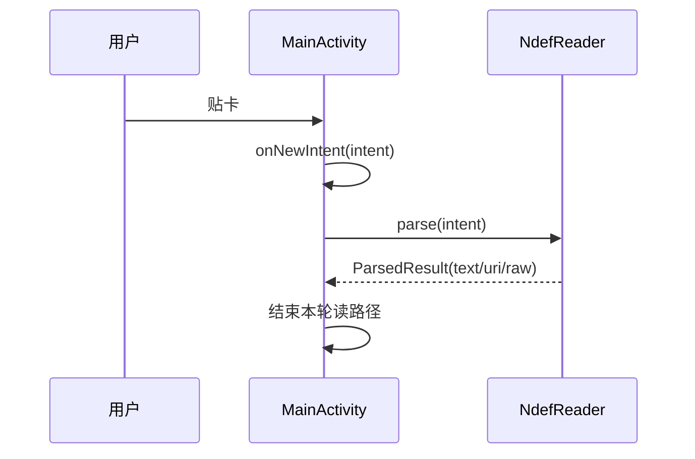
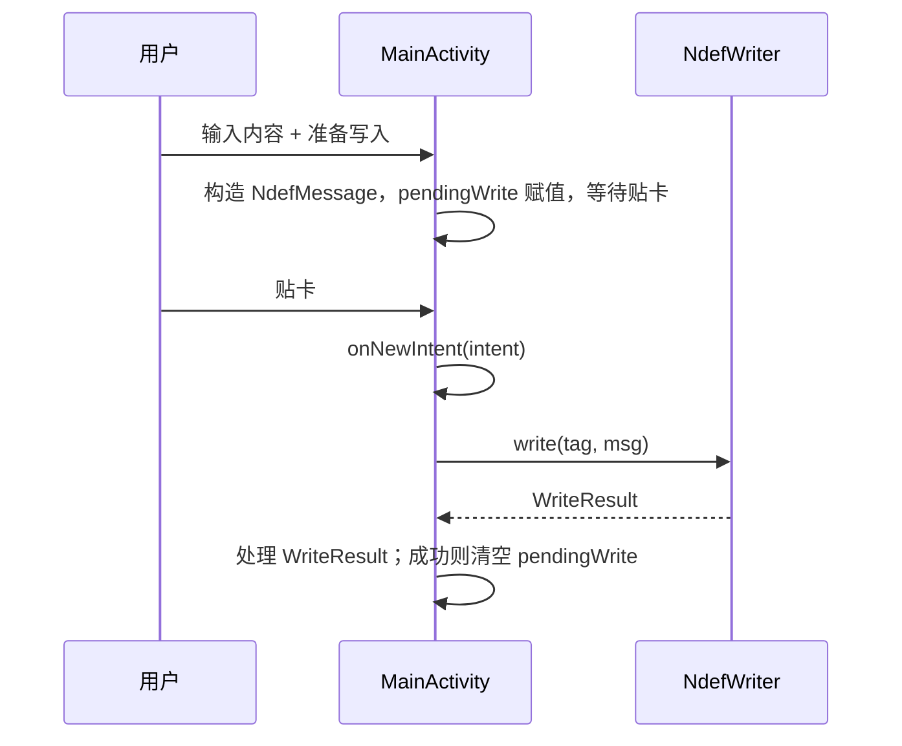

## 一、项目概述

逻辑分为两层：**Activity 负责生命周期与 NFC 事件入口**（前台调度注册/注销、`onNewIntent` 分发）；**`com.example.ndef.basic.nfc` 包内为纯 Java 工具类**，承载解析 NDEF、构造记录、写入标签及适配器状态监听，便于对照官方文档与测试。

### 1.1 核心实现思路

项目主要有两条主线：
1. **状态线**：`NfcStateMonitor` 监听 `NfcAdapter.ACTION_ADAPTER_STATE_CHANGED`，并结合 `getDefaultAdapter()` 是否为 `null`，得到 **不支持 / 已关闭 / 已开启**。用于在 NFC 未就绪时短路读写逻辑，避免无效调度。

2. **数据线**：`onResume` 中在适配器可用且已启用时 `enableForegroundDispatch`；标签到达后通过 `onNewIntent`（或冷启动携带的 NFC Intent）进入 `dispatchNfcIntent`。**读模式**调用 `NdefReader.parse(intent)`；**写模式**在已构造 `pendingWrite`（`NdefMessage`）时调用 `NdefWriter.write(tag, pendingWrite)`，**成功则清空 `pendingWrite`**，避免同一张标签未移开时重复写入。



### 1.2 关键组件

整体流程是：**MainActivity** 接到系统投递的标签事件后，在读模式下交给 **NdefReader** 解析，在写模式下用 **NdefPayloads** 事先组好的消息交给 **NdefWriter** 落盘；**NfcStateMonitor** 则在旁持续反映「设备是否具备 NFC、开关是否打开」，避免在不可用状态下空跑上述路径。各组件分工如下。

| 组件 | 职责 |
|------|------------------|
| MainActivity | 串联生命周期与 NFC 调度：进入前台时启用前台分发，离开时关闭；收到新 Intent 时判断当前是读还是写，把同一条事件交给解析或写入逻辑；写入前先让用户确认内容，在内存里记下「待写入的一条消息」，贴卡写入成功后再丢掉这份记录，防止同一张标签连续触发时重复写入。 |
| NfcStateMonitor | 把「适配器状态变化」封装成可订阅的回调：在 Activity 注册时开始监听，销毁或离开时注销；对外只表达不支持、已关闭、已开启三态，供上层决定要不要启用读写。 |
| NdefReader | 负责「从一次标签事件中还原 NDEF 内容」：尽量直接使用 Intent 里携带的报文，若没有则再从标签对象上读缓存；把文本、URI 等记录翻译成可读说明；取出标签对象时兼容新版本系统对 Parcelable 获取方式的差异。 |
| NdefWriter | 负责「把一条组装好的 NDEF 消息写到标签上」：若标签已是 NDEF 则先建立连接、确认可写且未超容量再写入；若还是空白则走格式化并写入；无论成败都会在结束时断开连接，并把结果归类成成功、不可写、超限、I/O 或格式错误等，返回给调用方。 |
| NdefPayloads | 专管常见载荷的构造：按规范生成「纯文本」和「URI」记录（语言编码、正文或 URI 压缩规则都在此类中完成），写入流程只负责调用这里拿到记录，再封装成一条完整消息。 |

Manifest 中 `NDEF_DISCOVERED`（`text/plain`）与 `TECH_DISCOVERED`（`nfc_tech_filter.xml`）用于 **应用未在前台时** 仍可由系统按意图拉起；日常读写在代码侧以前台调度过滤为主。

### 1.3 项目结构（与 NFC 相关源码）

```
ndef-basic-java-view/app/src/main/
├── AndroidManifest.xml
├── java/com/example/ndef/basic/
│   ├── MainActivity.java
│   └── nfc/
│       ├── NfcStateMonitor.java
│       ├── NdefReader.java
│       ├── NdefWriter.java
│       └── NdefPayloads.java
└── res/xml/nfc_tech_filter.xml
```

## 二、功能模块详解

### 2.1 NFC 基础状态检测与权限处理

技术要点：
使用 NfcAdapter.getDefaultAdapter()判断设备是否支持 NFC。
监听 NfcAdapter.ACTION_ADAPTER_STATE_CHANGED广播，实时响应 NFC 开关状态变化。
处理权限声明（android.permission.NFC）和 Feature 声明。

状态变化：NfcStateMonitor 收到广播 → 主线程回调 → 顶部状态栏更新；OFF 时禁用读写按钮，并显示「去开启」按钮跳转 Settings.ACTION_NFC_SETTINGS。

### 2.1 读流程（mode = READ）

技术要点：
前台调度：使用 ForegroundDispatch 机制，确保当前 Activity 优先接收 NFC 事件。
数据解析：从 Intent 中获取 Tag对象，解析 NdefMessage和 NdefRecord。
Intent 过滤：学习配置 ACTION_NDEF_DISCOVERED或 ACTION_TAG_DISCOVERED。



### 2.2 写流程（mode = WRITE）

技术要点：
格式化检查：判断标签是否可写、是否需要先格式化。
数据封装：构造 NdefRecord（文本型 TNF_WELL_KNOWN或 URI 型），封装成 NdefMessage。
连接与写入：通过 Ndef.get(tag)获取对象，调用 connect()和 writeNdefMessage()。




### 2.4 UI 结构

整体改为一个垂直 `LinearLayout`（外层仍可保留根 `ConstraintLayout` 处理 insets），结构：

- **状态栏区**（`@+id/statusBar`）
  - `TextView` 状态文本（如「NFC 未启用」）
  - `Button` 跳转 `Settings.ACTION_NFC_SETTINGS`（仅在「关闭」时可见）
- **模式切换**（`@+id/modeGroup`，`MaterialButtonToggleGroup` 或 `RadioGroup`）
  - 「读取」「写入」两选一
- **读取面板**（`@+id/readPanel`）
  - 顶部提示「请将标签贴近手机背面」
  - `TextView` 显示解析结果（type、payload、原始字节）
  - 「清空」按钮
- **写入面板**（`@+id/writePanel`，默认 `gone`）
  - `RadioGroup`：文本（`TNF_WELL_KNOWN` + `RTD_TEXT`）/ URI（`TNF_WELL_KNOWN` + `RTD_URI`）
  - `EditText` 待写入内容
  - 「准备写入」按钮（按下后进入「等待贴卡」状态）
  - `TextView` 写入结果与错误信息


## 三、实现效果

- 支持设备：状态栏显示 NFC 已开启，可切换读/写并完成贴卡读写。
- 无 NFC 或 NFC 关闭：状态栏明确提示；关闭时可一键进系统 NFC 设置；相关按钮禁用。
- 写入成功后再次贴同一张卡不会重复写入（除非用户再次「准备写入」）。


## 四、问题与边界（实现时注意点）

1. **Parcelable API 差异**：API 33+ 对 `Tag` 等使用 `getParcelableExtra(key, Class)`，`NdefReader.extractTag` 已分支处理。
2. **容量与可写性**：写入前检查 `isWritable` 与 `getMaxNdefSize`，超限返回 `SIZE_EXCEEDED`。
3. **空白标签**：仅支持 `NdefFormatable` 时需 `format(message)` 才能建立 NDEF。
4. **RTD_TEXT**：`NdefPayloads.textRecord` 中 status 字节与语言码、编码需一致。
5. **同一 Tag 多次回调**：写成功后必须清空 `pendingWrite`，避免重复写入。
