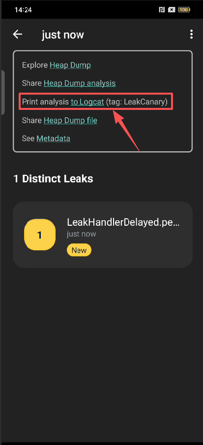

## 一、LeakCanary 概述

### 1.1 什么是 LeakCanary 

Profiler 是功能强大的**通用分析工具**，而 LeakCanary 是专门针对**内存泄漏这一单一场景的自动化专家**。它们的主要区别在于**发现问题的主动性**和**排查效率**。

- 解决“不知道哪里漏”的盲区：Profiler 的前提是你**已经知道**或者**强烈怀疑**某个页面或操作有内存问题。而 LeakCanary 是在你**完全不知情**的情况下，自动告诉你：“你刚刚退出页面时，这个 Activity 没被回收，原因是它被一个单例持有了”。
-  消灭“手动分析”的繁琐过程
- 捕捉“转瞬即逝”的泄漏：有些泄漏发生在特定的交互瞬间（如快速点击、页面跳转）。等你反应过来去打开 Profiler，可能已经错过了那个状态。LeakCanary 是 7x24 小时在线的监控，不会错过任何一次 `onDestroy()`后的异常。


### 1.2 LeakCanary 的使用场景

- **日常开发首选 LeakCanary**：把它作为 Debug 构建的标配。它能像编译器报错一样，在编码阶段就把内存隐患暴露出来，**防患于未然**。

- **深度调优使用 Profiler**：当你需要分析**内存抖动**、**大数组**、**图片缓存**策略，或者 LeakCanary 无法覆盖的复杂泄漏（如 Native 内存、线程池泄漏）时，Profiler 是不可替代的**深度解剖刀**。

**一句话总结**：LeakCanary 是帮你**自动发现**问题的“报警器”，Profiler 是让你**手动深挖**问题的“显微镜”。两者结合，才能构建最完善的内存防护体系。


## 二 使用 LeakCanary 

### 2.1 导入依赖

```
dependencies {
  // debugImplementation because LeakCanary should only run in debug builds.
  debugImplementation 'com.squareup.leakcanary:leakcanary-android:2.14'
}
```

在安装运行软件的时候，也会安装 **Leaks** 这个软件。这个是通过 Android 的 **`<activity-alias>`（Activity 别名）** 机制实现的。如果你长按这个“Leaks”图标查看应用信息，你会发现它的**包名**和你自己的应用**完全一致**，这证明它只是你应用的一个“分身”。


这个入口的作用是：

- **查看历史报告**：当通知消失后，你可以通过点击这个图标，直接打开 LeakCanary 的报告界面，查看所有已分析完成的内存泄漏详情（泄漏路径、签名等）。
- **独立进程**：它通常运行在一个独立的 `:leakcanary`进程中，这样可以避免堆转储和分析操作阻塞你主应用的 UI 线程。


### 2.2 LeakCanary  的使用方式

LeakCanary 的工作模式分为两层：

- **自动模式**：针对 Android 标准组件（Activity/Fragment/ViewModel/Service/View），它**全自动**完成“销毁监听 -> 自动挂载监控 -> 自动分析”的全流程。

- **手动模式**：针对**非标准对象**（如自定义的 Presenter、View 层、Data 类等），LeakCanary 无法自动感知它们的生命周期。我们再对象不在需要的时候调用下面的代码，以实现监听

  ```
  AppWatcher.objectWatcher.watch(myDetachedView, "View was detached")
  ```


### 2.3 转储触发逻辑

同时，LeakCanary 的转储逻辑是**智能且自动的**，它会根据应用状态（前台/后台）动态调整阈值：

| 应用状态                     | 默认阈值 | 触发逻辑                                                     |
| ---------------------------- | -------- | ------------------------------------------------------------ |
| **应用可见 (Visible)**       | **5 个** | 如果当前 retained objects 数量 < 5，LeakCanary 会**等待并重试**，不会立即转储。 |
| **应用不可见 (Not visible)** | **1 个** | 只要 retained objects ≥ 1，就会自动触发转储。                |

> 这里的 retained objects（滞留对象）指被标为不再需要但仍存活的对象，但并非全部是最终确认的内存泄漏对象。

这意味着，如果你在调试时发现通知栏显示“Found 4 retained objects”但没转储。此时，我们可以手动转储：

- **只需按 Home 键将 App 切到后台**，LeakCanary 会立即将阈值降为 1，从而自动触发堆转储。
- 点击通知来手动触发立即转储， 或者点击 Leaks 软件中的按钮 `Dump Heap Now`。

当转储触发后，应用会找到泄露对象并分析泄漏路径。


### 2.4 查看泄漏路径的方式

直接在手机上面查看泄漏西信息。或者点击 `Print analysis to Logcat` .

推荐在 Logcat 上面查看，可以在日志里面直接跳转到对应的代码。




## 二、精准定位内存泄漏

修复过程标准化为四个步骤，其中 LeakCanary 帮你完成了前两步的重活：

1. **Find the leak trace（找到泄漏路径）**：LeakCanary **自动**生成从 GC Root 到泄漏对象的引用链。
2. **Narrow down the suspect references（缩小嫌疑引用范围）**：LeakCanary **自动**分析对象状态，排除不可能导致泄漏的节点（如 Application 单例）。
3. **Find the reference causing the leak（找到导致泄漏的引用）**：**你**需要根据上一步的结果，在代码中找到那个本该被清除但未清除的引用。
4. **Fix the leak（修复泄漏）**：**你**在正确的生命周期（如 `onDestroy`）将引用置空或解注册。


2.1 找到

 LeakTrace（泄漏路径）是；从 **GC Root**（垃圾回收根节点，永远不会被回收的对象）到**泄漏对象**（如已销毁的 Activity）的**最短强引用路径**。这条链“拽着”对象，导致它无法被 GC 回收。

例如：

```
┬───
│ GC Root: System class
│
├─ android.provider.FontsContract class
│    ↓ static FontsContract.sContext
├─ com.example.leakcanary.ExampleApplication instance
│    Leaking: NO (Application is a singleton)
│    ↓ ExampleApplication.leakedViews
│                         ~~~~~~~~~~~
├─ java.util.ArrayList instance
│    ↓ ArrayList.elementData
│                ~~~~~~~~~~~
├─ java.lang.Object[] array
│    ↓ Object[].[0]
│               ~~~
├─ android.widget.TextView instance
│    Leaking: YES (View.mContext references a destroyed activity)
│    ↓ TextView.mContext
╰→ com.example.leakcanary.MainActivity instance
```

泄漏的直接原因是：`ExampleApplication.leakedViews`这个**静态字段**（属于 `Application`单例）持有了一个 `TextView`的引用，而该 `TextView`又持有了一个已被销毁的 `MainActivity`实例的引用。


- `Leaking: YES`： 这个对象自身是泄漏的（不合理地存活）。帮助**排除嫌疑**。指向这个对象的引用通常**不是**根本原因，因为该对象本身已经是“受害者”或“问题的一部分”。分析应继续向上游（GC Root 方向）寻找。

- `Leaking: NO`：这个对象的存在是**合理**的，它不是一个泄漏。帮助**排除无关路径**。如果一个对象明确不会泄漏（如单例），那么指向它的引用**也不是**泄漏的根本原因。分析可以**跳过**这条路径的评估。


`~~~~~~~~~~~`标记了 LeakCanary 分析后认为的、最有可能导致内存泄漏的引用字段。


下箭头（`↓`）则表示它们之间的持有关系

```
├─ java.util.ArrayList instance
│    ↓ ArrayList.elementData
```

其中，

- 第一行表示**所有者**。这里存在一个 `ArrayList`对象实例。它是“所有者”，是引用路径上的一个节点。
- 第二行表示**通过其内部字段引用下一个对象**。：这个 `ArrayList`实例，**通过其名为 `elementData`的字段**，持有了下一个对象。这里没有直接显示下一个对象是什么，但通过下箭头指明了引用的方向。


### 参考资料

[Fixing a memory leak - LeakCanary](https://square.github.io/leakcanary/fundamentals-fixing-a-memory-leak/#3-find-the-reference-causing-the-leak)
