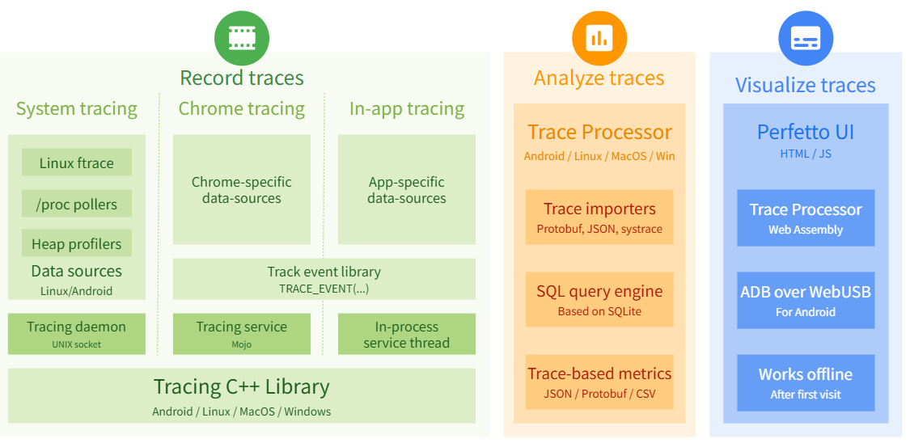

## 一、Prefetto 简介

### 1.1 什么是 Prefetto

[Perfetto](https://perfetto.dev/docs/) 是 Google 主导的**开源性能追踪套件**，也是 Android 10+ 和 Chrome 的**默认系统级性能分析工具**。它通过 SDK、守护进程和可视化工具，帮助开发者定位 App 及系统底层的性能瓶颈。

> Android Studio Profiler 的  System Trace 就是基于它构建的。它屏蔽了 Prefetto 复杂的配置，但也阉割了高级功能。




### 1.2  Prefetto 的使用方式

Android 开发使用 Perfetto 主要分为两步：**录制系统轨迹（Trace）** 和 **在 Web UI 中分析**。它主要用于解决 **UI 卡顿（Jank）、ANR、启动慢** 等系统级性能问题。

#### 1.2.1 录制 system trace

录制方式有：

- [ **Run Perfetto using adb**](https://developer.android.com/studio/command-line/perfetto)：通过 adb 使用 `perfetto` 命令行工具

  ```shell
  # 基础命令：录制 10 秒，包含 CPU/GPU/View 等核心数据
  adb shell perfetto -o /data/misc/perfetto-traces/trace.pftrace -t 10s \
    sched freq idle am wm gfx view binder_driver hal dalvik input res memory
  
  # 拉取文件到电脑
  adb pull /data/misc/perfetto-traces/trace.pftrace .
  ```

- [Recording system traces with Perfetto - Perfetto Tracing Docs](https://perfetto.dev/docs/getting-started/system-tracing): 在 [ui.perfetto.dev](https://ui.perfetto.dev/) 网页中进行可视化操作来录制。Windows 环境下建议使用 **ADB + WebDeviceProxy** 方式来连接设备。

- [Record using Quick Settings tile](https://developer.android.com/topic/performance/tracing/on-device#quick-settings)：在设备里面，通过开发者选项里面的功能来录制。

> 也使用 Android Studio Profiler 的  System Trace


#### 1.2.2 分析 system trace

在 [ui.perfetto.dev](https://ui.perfetto.dev/) 网页中分析，具体细节查看 [Recording system traces with Perfetto - Perfetto Tracing Docs](https://perfetto.dev/docs/getting-started/system-tracing#viewing-your-first-trace)


### 1.3 定义自定义事件

默认的系统跟踪（System Trace）只能看到系统级的线程调度和系统事件（如 `Choreographer`），**看不到你应用的业务方法名**。通过自定义事件，你可以：

- **定位耗时方法**：在 Perfetto 时间轴上直接看到 `onCreate`、`loadData`等具体方法的执行区间。
- **关联系统行为**：将业务代码的耗时与系统的帧渲染、CPU 频率变化进行关联分析。

这个主要是通过插桩的方式来实现的。具体细节查看 

- [Instrumenting Android apps/platform with atrace - Perfetto Tracing Docs](https://perfetto.dev/docs/getting-started/atrace): 使用 `Trace.beginSection()` 和 `Trace.endSection()` 

- [Define custom events  | App quality  | Android Developers](https://developer.android.com/topic/performance/tracing/custom-events#java)：用 Kotlin 的高阶函数和自动资源管理来简化性能追踪，只用调用 `TraceKt.trace` 即可，避免手动调用 `beginSection`/`endSection`的麻烦。

  


## 参考资料

[What is Perfetto? - Perfetto Tracing Docs](https://perfetto.dev/docs/)