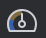
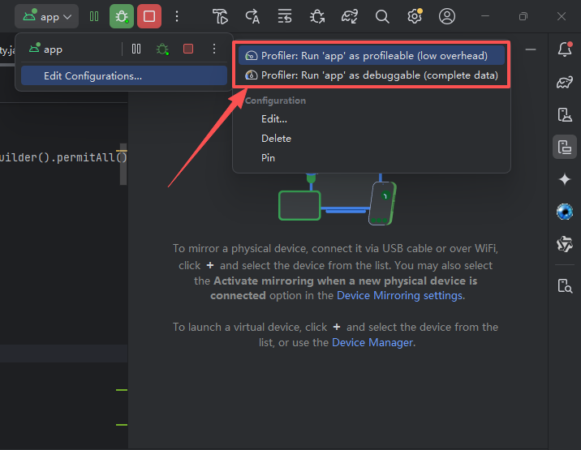
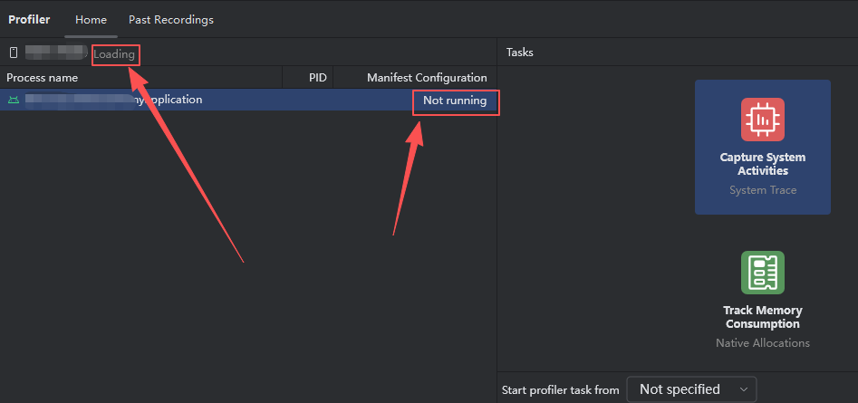

[TOC]

## 一、Android Studio Profiler 概述

### 1.1 什么是 Android Studio Profiler


### 1.2 性能分析器任务

性能分析器任务的任务分为：

- 实时监控（Real-time Telemetry）：这部分数据是**持续流动**的，不需要手动触发，连接设备后即可查看。但是看不到具体的**方法调用栈**或**对象分配详情**。

- 录制分析（Recorded Tasks）：这部分任务必须**先点击 Record（录制）**，操作 App 复现问题，然后**点击 Stop（停止）**，工具才会生成分析报告供你查看。**火焰图、调用栈等深度数据均属于此类**。

Android Studio Profiler 里面的任务类型如下所示：

| 任务名称                                                     | 所属 Profiler | 数据模式                | 核心功能                                                     | 典型场景                                              |
| :----------------------------------------------------------- | :------------ | :---------------------- | :----------------------------------------------------------- | :---------------------------------------------------- |
| [**Find CPU Hotspots (Callstack Sample)**](https://developer.android.google.cn/studio/profile/sample-callstack) | CPU           | **Sampling (采样)**     | 定期捕获调用栈，**低开销**估算方法耗时。输出火焰图、调用图等。 | 长时间运行监控，初步定位性能瓶颈。                    |
| [**Find CPU Hotspots (Java/Kotlin Method)**](https://developer.android.google.cn/studio/profile/record-java-kotlin-methods) | CPU           | **Instrumented (插桩)** | 记录每个方法入口/出口，**高精度**统计耗时（含 `Wall Time`/`Thread Time`）。 | 短时间（≤5s）深度分析，精确优化关键路径。             |
| [**Analyze Memory Usage (Heap Dump)**](https://developer.android.google.cn/studio/profile/capture-heap-dump) | Memory        | **Snapshot (快照)**     | 捕获**某一时刻**的堆内存全量快照（`.hprof`），分析对象引用链及内存泄漏。 | 定位 `Activity`/`Fragment` 内存泄漏，分析大对象残留。 |
| [**Track Memory Consumption (Java/Kotlin Allocations)**](https://developer.android.google.cn/studio/profile/record-java-kotlin-allocations) | Memory        | **Tracking (追踪)**     | 记录一段时间内**对象的分配与释放历史**，支持按调用栈聚合。   | 分析内存抖动、短生命周期对象滥用、GC 频繁触发。       |
| [**Track Memory Consumption (Native Allocations)**](https://developer.android.google.cn/studio/profile/record-native-allocations) | Memory        | **Sampling (采样)**     | 跟踪 C/C++ 代码的内存分配（`malloc`/`new`），需 Android 10+。 | JNI 开发，排查 Native 层内存泄漏或碎片化。            |
| [**Capture System Activities (System Trace)**](https://developer.android.google.cn/studio/profile/cpu-profiler) | System        | **System Trace**        | 录制**系统级**事件（渲染、调度、锁、I/O），使用 Perfetto 引擎。 | 分析 UI 卡顿（Jank）、线程阻塞、系统资源竞争。        |
| [**View Live Telemetry**](https://developer.android.google.cn/studio/profile/inspect-app-live) | All           | **Live (实时)**         | 实时查看 CPU、内存、网络、电量的高层次曲线，**无详细调用栈**。 | 宏观健康监控，快速定位异常时间段。                    |


## 二、Profiler 启动流程

### 2.1 使用要求

[Profile your app performance  | Android Studio  | Android Developers](https://developer.android.google.cn/studio/profile#requirements)

配置类型

| 配置类型        | 构建变体  | 用途           | 性能开销       | 功能限制                        |
| --------------- | --------- | -------------- | -------------- | ------------------------------- |
| **Profileable** | `release` | 低开销性能监控 | 低             | 不支持 Heap Dump、Java 分配跟踪 |
| **Debuggable**  | `debug`   | 完整调试和分析 | 高（影响性能） | 支持所有 Profiler 功能          |

另外，`Profileable App` 还需要单独的 `<profileable>`配置，运行性能分析工具解析应用代码。在 `AndroidManifest.xml` 文件中的 [application-element](https://developer.android.google.cn/guide/topics/manifest/application-element) 中 添加 [<profileable>](https://developer.android.google.cn/guide/topics/manifest/profileable-element)，具体内容如下：

```xml
<profileable android:shell="true" />
```


### 2.2 使用步骤

#### 2.2.1 构建并运行 app

1. 选择 build variant (Build > Select Build Variant)
2. click **Profile 'app' with low overhead**  to use a profileable app and click **Profile 'app' with complete data**  to use a debuggable app.



注意，构建并运行 app 要稍微花点时间。


#### 2.2.2 启动 Profiler

1. 点击 Android Studio 顶部菜单 **View > Tool Windows > Profiler，** 在 Profiler 窗口中选择你的应用进程
2. 选择**从何处启动性能分析器任务以及相应的性能分析器任务。**


## 三、性能分析基本理论

### 3.1 火焰图

#### 3.1.1 火焰图基本原理

**火焰图**（Flame Graph）是一种用于**可视化系统性能特征**的高级剖析工具。它通过聚合大量的采样数据，将复杂的性能数据转化为直观的、类似火焰的图形，使开发者能够**快速识别性能瓶颈和热点代码**。

> 火焰图横轴（X 轴）的排序规则非常反直觉：**它不按时间顺序排列，而是按函数名的字母顺序（Alphabetical Order）进行聚合排序**。这种设计是为了“合并同类项”，让你能一眼看到最宽（最耗时）的函数，而不是被时间线打乱。

火焰图的关键元素主要有：

- **X 轴（宽度）**：**资源消耗的度量**（如 CPU 时间、阻塞时间、内存操作量）。越宽的函数块，代表其消耗的资源比例越高，是首要的优化目标。
- **Y 轴（高度）**：**函数调用栈的深度**，表示“谁调用了谁”的层级关系。自下而上阅读，可以看到从系统底层到应用顶层的完整调用链。
- **颜色**：通常用于区分代码来源（如应用代码、系统库、第三方库），无统一标准，取决于生成工具。

在使用火焰图分析性能瓶颈的时候，首先锁定“最宽火苗”，这是主要的性能瓶颈。然后从下到上追溯”调用链“，定位问题根源的代码。


#### 3.1.2 火焰图类型

根据**采样目标和数据来源**的不同，火焰图可细分为多种类型，适用于不同的性能问题排查场景。

| 类型                      | 横轴含义                                                     | 纵轴含义   | 核心解决问题                                                 | 关键采样/生成方式                                            |
| :------------------------ | :----------------------------------------------------------- | :--------- | :----------------------------------------------------------- | :----------------------------------------------------------- |
| **On-CPU 火焰图**         | CPU 占用时间                                                 | 函数调用栈 | 定位 CPU 热点函数，分析代码执行路径的热点                    | 固定频率采样 CPU 上正在运行的线程调用栈 (如 `perf record -g`) |
| **Off-CPU 火焰图**        | 线程阻塞时间 (等待IO、锁、调度等)                            | 函数调用栈 | 定位因 I/O、锁竞争、同步等待导致的延迟瓶颈                   | 采样线程不在 CPU 上运行时的状态和调用栈                      |
| **内存火焰图**            | 内存操作量 (分配/释放次数或字节大小)                         | 函数调用栈 | 定位内存泄漏源、高内存分配/释放的热点函数                    | 跟踪内存相关调用 (如 `malloc`/`free`, `brk`, `mmap` 或页错误) |
| **Hot/Cold 火焰图**       | 综合时间 (On-CPU 与 Off-CPU)                                 | 函数调用栈 | 综合分析计算 (CPU) 与等待 (阻塞) 耗时，提供全局性能视图      | 合并 On-CPU 与 Off-CPU 的采样数据 (通常红色表 On-CPU，蓝色表 Off-CPU) |
| **差分火焰图 (红蓝分叉)** | 性能变化量 (通常红色表示性能回退/耗时增加，蓝色表示优化/耗时减少) | 函数调用栈 | 快速定位不同版本、配置或负载下，性能产生回退或改进的具体函数 | 对比两个 On-CPU 火焰图的数据差异生成                         |


### 3.2 分析视图类型

Profiler 提供了不同角度的视图来分析同一份录制数据，它们各有侧重：

| 视图类型                                                     | 核心逻辑                                                     | 适用场景                                                     |
| ------------------------------------------------------------ | ------------------------------------------------------------ | ------------------------------------------------------------ |
| [**Call Chart (调用图表)**](https://developer.android.google.cn/studio/profile/chart-glossary/call-chart) | **看时序**：横轴是时间线，纵轴是调用栈。直观展示“谁在什么时候被调用”。 | 分析调用顺序、间隔和并发情况。                               |
| [**Events Table（事件表格）**](https://developer.android.google.cn/studio/profile/chart-glossary/events-table) | **看列表**：以可排序的表格列出所选线程中的所有调用。点击行可**在时间轴上精准跳转**到该调用的起止时间。 | 按耗时对方法进行排名，或快速查找特定方法（如 `onCreate`）的所有调用实例。 |
| [**Flame Chart (火焰图)**](https://developer.android.google.cn/studio/profile/chart-glossary/flame-chart) | **看占比**：倒置且聚合。**横轴不是时间，而是相对耗时**。合并相同调用栈，快速定位“最宽”的热点。 | **首选**：快速定位最耗 CPU 的代码路径。                      |
| [**Top Down (自上而下)**](https://developer.android.google.cn/studio/profile/chart-glossary/top-bottom-charts) | **看调用链**：从根节点（如 `main`）向下展开，显示完整的父->子调用关系。 | 精确分析某条调用链上每个方法的耗时。                         |
| [**Bottom Up (自下而上)**](https://developer.android.google.cn/studio/profile/chart-glossary/top-bottom-charts) | **看被调用**：从叶子节点（具体方法）向上回溯，显示“谁调用了它”。 | 分析某个特定方法（如 `onCreate`）被哪些路径频繁调用。        |
| [**Process Memory (RSS)**](https://developer.android.google.cn/studio/profile/chart-glossary/process-memory) | **看物理内存**：显示应用使用的**物理内存（驻留集大小）** 构成，包括匿名分配、文件映射和共享内存。 | 在 Android 9+ 设备上，分析应用的整体物理内存占用情况，辅助排查内存相关问题。 |

简单来说，Flame Chart 找热点（什么最慢），Call Chart 看时序（什么时候慢），Top Down/Bottom Up 定细节（为什么慢）。


同时，在视图里面，**橙色**指对**系统 API** 的调用。


## 四、问题

### 3.1 Profiler 无法加载进程

**(1) 项目场景**

在金融POS终端 android 13 上，分析某款 APP 的 CPU使用情况。


**(2) 问题描述** 

在 Android Studio Profiler 窗口中，设备旁边一直显示 `Loading` 。同时，设备名称下方，应用进程显示 `Not running`。




针对同一个应用，

- 可以在 OPPO 手机 Android12 上进行测试。
- 不可以在 POS 终端 Android13 上进行测试。

这个跟设备有关系。


**(3) 原因分析**

| **可能原因**                    | **解决方案**                                             |
| ------------------------------- | -------------------------------------------------------- |
| **POS厂商限制调试**             | 联系厂商获取调试权限或改用其他工具（如 `adb shell top`） |
| **Android 13 Profiler兼容性**   | 更新 Android Studio 或使用 `simpleperf`                  |
| **应用未启用** `**debuggable**` | 确保 `build.gradle`中 `debuggable true`                  |
| **SELinux 限制**                | 临时切换为 `Permissive`模式（需root）                    |
| **USB调试权限不足**             | 尝试 `adb root`或检查开发者选项                          |

##### 3.1.3.1 SELinux 策略

POS终端可能启用了严格的 SELinux 策略，阻止 Profiler 访问进程数据。

设备可能运行在 "Enforcing" 模式，限制调试工具。

解决方案

检查 SELinux 状态：

```plain
adb shell getenforce  # 返回 "Enforcing" 或 "Permissive"
```

如果是 `Enforcing`，尝试临时切换为 `Permissive`（需root权限）：

```plain
adb shell su 0 setenforce 0  # 临时禁用（重启后恢复）
```

注意：金融POS终端通常不允许修改 SELinux，需联系厂商获取调试权限。


## 参考资料

[分析应用性能 | Android Studio | Android Developers](https://developer.android.google.cn/studio/profile?hl=zh-cn)