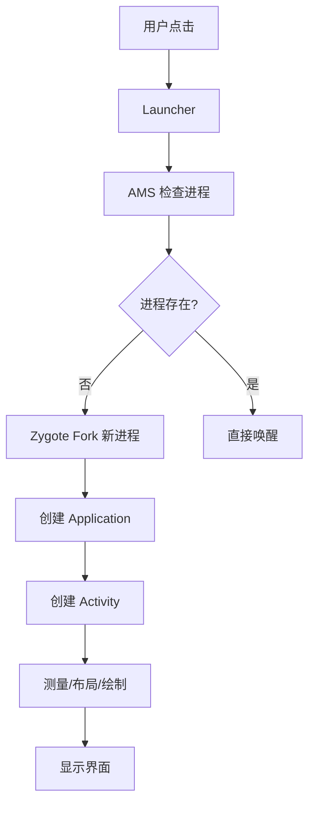
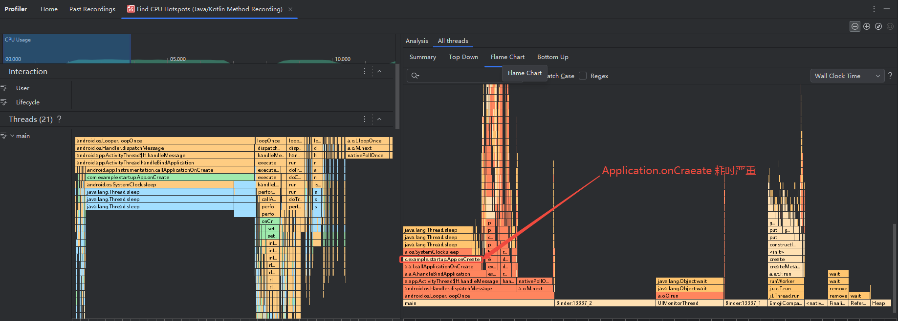
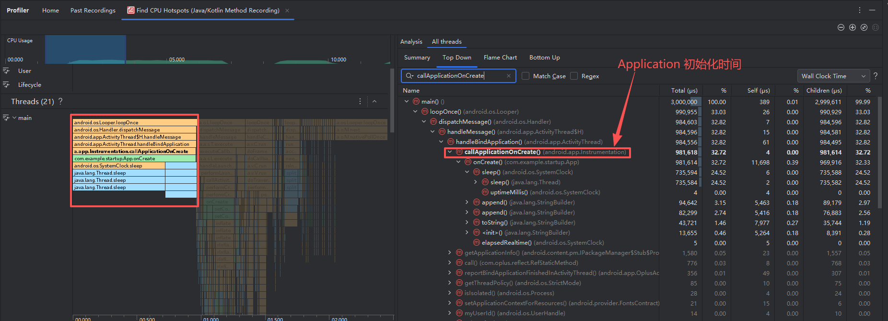
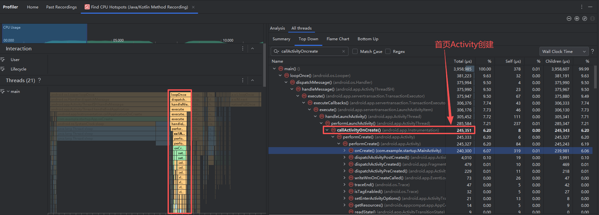
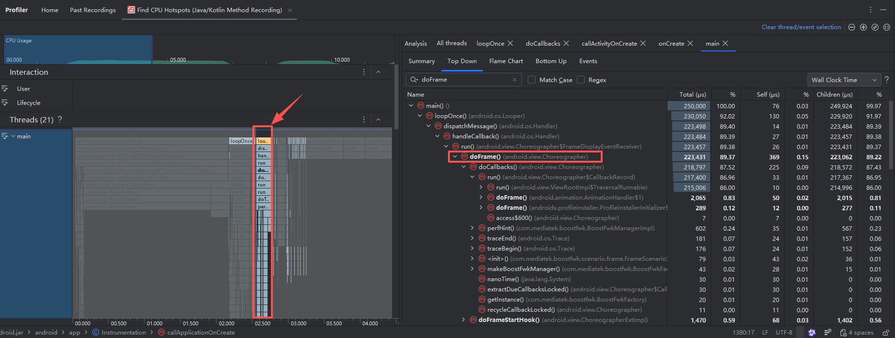

## 一、基本知识

### 1.1 启动方式

系统的 ActivityManagerService (AMS) 根据进程和 Activity 的存活状态自动决策启动方式。

| 维度             | **冷启动 (Cold Start)**                                      | **温启动 (Warm Start)**                                      | **热启动 (Hot Start)**                                       |
| :--------------- | :----------------------------------------------------------- | :----------------------------------------------------------- | :----------------------------------------------------------- |
| **触发条件**     | App 进程**完全不存在**。                                     | App 进程**存在**，但 **Activity 栈已被销毁**（Activity 实例不存在）。 | App 进程**存在**，且 **Activity 仍在任务栈中**（通常在前台或后台）。 |
| **系统核心操作** | 1. AMS 请求 Zygote fork 新进程。<br>2. 创建 Application 对象，执行 `onCreate()`。<br>3. 创建首个 Activity，执行其生命周期。 | 1. 复用已有的 Application 对象（不再执行 `Application.onCreate()`）。<br>2. 重新创建 Activity 实例，执行其生命周期。 | 直接将任务栈顶的 Activity 带到前台（触发 `onRestart()` -> `onStart()` -> `onResume()`）。 |
| **性能表现**     | **最慢**<br>（需完整创建进程、加载类、初始化应用）           | **中等**<br>（省去进程和 Application 的创建开销）            | **最快**<br>（几乎瞬间切换，无需创建核心对象）               |

开发者的核心优化目标是**冷启动**，并确保**温启动**时状态能正确恢复。


### 1.1 白屏与黑屏的真相

简单来说，白屏是可优化的，黑屏通常是系统故障。其本质区别在于**图形系统是否已就绪**：

- **白屏**：**系统已就绪，App 没画完**。
  - 系统已经创建了窗口（Window），但 App 的 UI 还没完成首次绘制。
  - 你看到的是 `android:windowBackground`（默认通常是白色）。
  - **对策**：优化 `onCreate`逻辑，使用 `SplashScreen API`（Android 12+）。
- **黑屏**：**系统未就绪**。
  - `SurfaceFlinger`或 `WindowManager`服务异常，图形系统无法输出画面。
  - **对策**：这是系统级故障，通常需要排查系统服务或内核。

> 注意，这里的白屏和黑屏指的是没有开启深色模式下的屏幕。


### 1.3 系统函数

在 **Call Chart** 视图中，最顶层经常能看到一段连续的 `android.os.Looper.loopOnce`（或同类主线程循环入口）。它本质上是主线程的**消息循环**：不断从消息队列取出任务并执行。应用启动期间的大部分关键工作，例如 `Application` 初始化、`Activity` 创建、布局测量与绘制，最终都是在这条主线程执行链上被调度完成的。

- `bindApplication`：这是系统在 **Zygote fork 出应用进程之后**，开始回调应用代码的关键阶段。沿着这段调用链可以看到 `handleBindApplication()` 和 `callApplicationOnCreate()`，也就是 `Application.onCreate()` 所在的位置。通常可把它视为应用冷启动分析的起点之一。

- `Choreographer#doFrame`：这是 Android 渲染流水线中处理一帧绘制的关键回调。首屏开始绘制时，主线程会收到这一帧任务；首帧完成后，用户才能真正看到界面。因此，分析启动耗时时，常常会把 `bindApplication` 到首帧相关 `doFrame` 之间的区间视为冷启动核心路径。


## 二、启动问题

### 2.1 启动问题分类

遇到问题，先对照下表定位故障层级：

| 现象              | 问题类型       | 核心原因                                      |
| ----------------- | -------------- | --------------------------------------------- |
| **点击无反应**    | 系统服务未就绪 | Launcher 与 AMS 通信失败，或系统负载过高      |
| **白屏/黑屏数秒** | 冷启动性能瓶颈 | `Application`/`Activity.onCreate()`主线程阻塞 |
| **闪退 (FC)**     | 初始化崩溃     | 依赖未注入、资源缺失、权限不足                |
| **ANR (无响应)**  | 主线程死锁     | 死锁、耗时 I/O 操作、过度同步                 |


### 2.2 启动流程核心链路




#### 2.1.1 进程创建 (Zygote Fork)

- **问题**：进程创建失败。
- **原因**：系统内存不足，或 SELinux 策略限制。
- **日志**：`ActivityManager: Start proc`失败。


#### 2.1.2 Application 初始化 (`onCreate()`)

- **问题**：白屏时间长、ANR。
- **原因**：在此处执行了**网络请求、数据库初始化、大量 IO**。
- **铁律**：**严禁**在主线程进行耗时操作。


#### 2.1.3 Activity 启动 (`onCreate()`)

- **问题**：布局加载慢、首帧渲染慢。
- **原因**：布局过深、`View.inflate()`耗时、主线程解析数据。


## 三、分析问题

### 3.1 排查工具

#### 3.1.1 日志筛选 Logcat

通过过滤系统性能监控日志 `package:mine tag=:Quality | ANR_LOG ` ，可快速定位启动瓶颈。

Application初始化严重的案例日志如下所示：

```
# 核心瓶颈：Application初始化耗时严重
ActivityThread: callApplicationOnCreate delay 1869 com.example.startup 15477

# 系统检测到主线程消息处理超时（2.026秒）
>>> msg's executing time is too long
Blocked msg = { when=-2s27ms what=110 target=android.app.ActivityThread$H obj=AppBindData{appInfo=ApplicationInfo{2afb13c com.example.startup}} } , cost  = 2026 ms
>>>Current msg List is:
Current msg <1> = { when=-2s24ms what=159 target=android.app.ActivityThread$H obj=android.app.servertransaction.ClientTransaction@bae9350e }
Current msg <2> = { when=-2s24ms what=159 target=android.app.ActivityThread$H obj=android.app.servertransaction.ClientTransaction@af26f54e }
Current msg <3> = { when=-1s885ms what=164 target=android.app.ActivityThread$H obj=com.example.startup }
Current msg <4> = { when=-1s786ms what=149 target=android.app.ActivityThread$H obj=android.os.BinderProxy@4d8e837 }
Current msg <5> = { when=-1s24ms what=0 target=android.app.ActivityThread$H callback=android.app.ActivityThread$$ExternalSyntheticLambda1 }
>>>CURRENT MSG DUMP OVER<<<

# 总启动耗时
ActivityThread: bindApplication delay 2028 com.example.startup 15477
Blocked msg = Package name: com.example.startup [ schedGroup: 5 schedPolicy: 0 ] process the message: { when=-2s29ms what=110 target=android.app.ActivityThread$H obj=AppBindData{appInfo=ApplicationInfo{2afb13c com.example.startup}} } took 2028 ms

# Activity启动正常
ActivityThread: activityStart delay 142 com.example.startup 15477
```

> delay 在这里表示 “从消息入队到被处理完成所经过的总时间”

可以看到，处理 `callApplicationOnCreate` 花了 1869 ms，处理 `BIND_APPLICATION`消息（核心是执行 `Application.onCreate()`）总共花了 **2028ms**，启动第一个 Activity的 activityStart 耗时 142 ms。

```
bindApplication()  (系统调用，总耗时 2028ms)
    └── handleBindApplication()  (框架处理)
        └── callApplicationOnCreate()  (框架调用你的代码，耗时 1869ms)
            └── app.onCreate()  (你的 Application 类代码)
```


#### 3.1.2 ANR 分析

拉取 `/data/anr/traces.txt`文件，查看主线程 (`main`) 被哪个锁 (`locked`) 阻塞。


#### 3.1.3 Profile 工具

使用 Android Studio 的 **CPU Profiler** 可以抓取启动阶段的 Java / Kotlin 方法耗时；若需要进一步分析系统渲染、线程调度、SurfaceFlinger 等系统层瓶颈，可配合 **System Trace / Perfetto** 一起看。

- **定位应用代码耗时**：优先选择 `Sample Java Methods`，采样开销较低，适合先快速定位热点。
- **定位系统级渲染与调度问题**：选择 `Trace System Calls`，适合查看 `Choreographer`、RenderThread、SurfaceFlinger 等系统组件行为。

**(1) 定位代码耗时**

以 **`Application` 初始化过重** 为例，录制启动时选择 `Process start (restart process)`，让 Profiler 从进程启动开始抓取。重点关注 CPU 时间轴中从 `bindApplication` 到首帧相关 `Choreographer#doFrame` 的这段区间，这通常就是冷启动分析最有价值的时间窗口。先切到 **Flame Chart**，看最宽的调用链；如果问题出在应用早期初始化，通常会直接看到 `Application.onCreate()` 或其下游逻辑占据大量时间。




再看左侧 **Call Chart** 中主线程 `main` 的连续长条，粗略可以分为三段：`Application` 初始化、首页 `Activity` 创建、首帧 `doFrame()`。如果某一段明显偏长，说明启动关键路径里存在阻塞或重活；此时可结合右侧 **Top Down** / **Bottom Up** 查看更精确的函数耗时。

第一个 `android.os.Looper.loopOnce` 里，重点看 `callApplicationOnCreate()`、`Application.onCreate()` 及其下游初始化函数的耗时。



第二个 `android.os.Looper.loopOnce` 里，继续查看首页 `Activity` 创建阶段的耗时，例如 `callActivityOnCreate()`、`callActivityOnResume()` 及其后续布局和数据初始化逻辑，从而判断问题主要卡在 `Application` 还是首屏 `Activity`。



第三个 `android.os.Looper.loopOnce` 里，可以看到首帧 `doFrame()` 的执行时间，用来辅助判断首帧绘制阶段是否仍然过重。




### 3.2 性能优化检查清单

针对“启动慢”的问题，按优先级执行以下优化：

1. **线程治理**
   - 将 `Application`中的第三方 SDK 初始化移至 `子线程`或 `ContentProvider`。
   - 使用 `IdleHandler`延迟非紧急任务。
2. **布局优化**
   - 使用 `ViewStub`延迟加载复杂布局。
   - 避免在 `onCreate`中解析大型 JSON 数据。
3. **启动模式 (`launchMode`)**
   - 注意 `singleTask`和 `singleInstance`可能导致的 `onNewIntent`逻辑错误，引发页面状态异常。
4. **启动器选择**：优化冷启动路径。
   - **冷启动**：进程不存在，从头开始（最慢）。
   - **热启动**：进程在后台，直接唤醒（最快）。
   - **温启动**：进程存在但 Activity 被销毁，需重建。


### 3.3 最佳实践

- **不要阻塞主线程**：这是启动问题的万恶之源。

- **不要过度初始化**：按需加载 SDK，利用 `ContentProvider`自动初始化。

- **理解白屏机制**：白屏是可优化的，黑屏通常是系统故障。

- **慎用启动模式**：除非有明确的跨栈需求，否则优先使用 `standard`或 `singleTop`。


## 参考资料

[App startup analysis and optimization  | App quality  | Android Developers](https://developer.android.com/topic/performance/appstartup/analysis-optimization#major-operations)