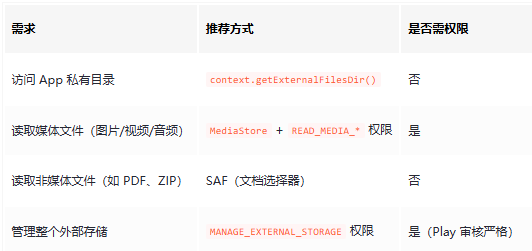

## 一、存储空间概述

Android 系统使用虚拟文件系统（VFS）， VFS 的目录是以"`/"`为根节点，根节点下又有不同的节点。例如：/data, /sytem, /mnt, /storage 等等


### 1.1 存储空间划分

在 Android 4.4 之前设备的机身存储就是内部存储，而为了弥补内部存储空间不足而插入的外置 SD 卡，称为外部存储。

通常，内部存储(Intrenal)存储敏感数据、配置文件、数据库，外部存储私有目录（App-Specific External）存储应用专属媒体、临时缓存，外部存储公共目录（Public External）存储用户共享文件（照片、音乐、下载内容）。




这三者的具体区别如下：

| **特性**               | **内部存储（Internal）**   | **外部存储私有目录（App-Specific External）**        | **外部存储公共目录（Public External）**               |
| ---------------------- | -------------------------- | ---------------------------------------------------- | ----------------------------------------------------- |
| **访问权限**           | 应用私有，无需权限         | 应用私有，无需权限（Android 4.4+）                   | 需 `READ_EXTERNAL_STORAGE`或 `WRITE_EXTERNAL_STORAGE` |
| **卸载应用时是否删除** | ✅ 是                       | ✅ 是                                                 | ❌ 否                                                  |
| **其他应用访问**       | ❌ 不可访问（除非 Root）    | ❌ 不可访问（Android 11+ 需 MANAGE_EXTERNAL_STORAGE） | ✅ 可访问（需用户授权）                                |
| **是否需要运行时权限** | ❌ 否                       | ❌ 否                                                 | ✅ 是（Android 6.0+ 需动态申请）                       |
| **存储内容**           | 敏感数据、配置文件、数据库 | 应用专属媒体、临时缓存                               | 用户共享文件（照片、音乐、下载内容）                  |
| **路径示例**           | `/data/data/<包名>/files/` | `/storage/emulated/0/Android/data/<包名>/files/`     | `/storage/emulated/0/Download/`                       |
| **代码访问方式**       | `context.filesDir()`       | `context.getExternalFilesDir()`                      | `Environment.getExternalStoragePublicDirectory()`     |
| **Android 版本适配**   | 全版本兼容                 | 全版本兼容                                           | Android 10+ 需改用 `MediaStore`                       |
| **典型用例**           | - 用户登录凭证 - 加密密钥  | - 应用专属照片/视频 - 离线地图缓存                   | - 用户导出的 PDF - 共享到社交媒体的图片               |
| **安全性建议**         | 优先使用，无需加密         | 非敏感数据可存放                                     | 避免存储隐私数据                                      |


### 1.2 内部存储(Intrenal)

**私有目录**：仅应用自身可访问（无需权限）

**卸载时删除**：应用卸载后，系统自动清除这些文件。


Android 应用的内部存储目录通常位于 `/data/data/<包名>/`下，包含以下子目录：：

```bash
/data/data/<包名>/files/        # 通用文件
/data/data/<包名>/cache/        # 缓存文件
/data/data/<包名>/databases/    # SQLite 数据库
/data/data/<包名>/shared_prefs/ # SharedPreferences 的 XML 配置文件
```


context.getFilesDir()


### 1.3 外部存储

- **共享目录**：其他应用可能访问（需权限）。
- **卸载时保留**：默认不删除，除非用户手动清理。


#### 1.3.1 外部存储私有目录

**私有目录**（App-specific）：

```bash
/storage/emulated/0/Android/data/<包名>/files/  # 外部文件目录
/storage/emulated/0/Android/data/<包名>/cache/  # 外部缓存目录
```


#### 1.3.2 外部存储公共目录

**公共目录**（需权限）：

```bash
/storage/emulated/0/Download/      # 下载文件
/storage/emulated/0/Pictures/      # 图片
/storage/emulated/0/Music/         # 音频
```


Android 10+ 需改用 `MediaStore` 来替换外部存储公共目录


### 1.4 媒体存储

- **Android 10+ 强制使用**：替代直接访问外部存储公共目录。
- **内容提供器**：通过 URI 操作文件，无需路径权限。


## 二、存储安全

### 2.1 Android 沙盒机制

每个应用都有自己独立的私有存储空间


## 三、应用存储访问方式




### 存储访问框架(SAF)

- **用户选择文件**：通过系统弹窗让用户指定文件/目录。
- **无需路径权限**：通过 URI 访问。


## 四、Android 读写权限

### 4.1 是否需要存储权限

在 Android 系统中，**应用操作自身内部文件是否需要存储权限**，取决于文件存储的位置和访问方式。

| **存储位置**                  | **路径示例**                | **是否需要权限** | **特点**                                                     |
| ----------------------------- | --------------------------- | ---------------- | ------------------------------------------------------------ |
| **应用内部私有目录**          | `/data/data/<包名>/`        | ❌ 不需要         | 只有应用自身可访问，卸载时自动删除                           |
| **应用外部私有目录**          | `/Android/data/<包名>/`     | ❌ 不需要         | Android 4.4+ 后无需权限，但需使用 `Context`的 API 访问       |
| **公共媒体目录（图片/视频）** | `/DCIM/`, `/Pictures/`      | ✅ 需要           | 需要 `READ_EXTERNAL_STORAGE`或 `WRITE_EXTERNAL_STORAGE`（Android 10+ 分区存储限制） |
| **公共下载/文档目录**         | `/Download/`, `/Documents/` | ✅ 需要           | 同上                                                         |
| **根目录或其他应用目录**      | 任意非应用专属路径          | ✅ 需要           | 需要 `MANAGE_EXTERNAL_STORAGE`（Android 11+ 严格限制）       |


### 4.2 权限权限演进时间线

https://juejin.cn/post/7508654134268362762


## 参考资料

[Android内部存储与外部存储（私有目录与公共目录）图文详解_getexternalstoragepublicdirectory-CSDN博客](https://blog.csdn.net/crazestone0614/article/details/130773818)

[Android 存读取权限说明(适配到android 14)Android 读写权限变更详解：从运行时权限到分区存储 随 - 掘金](https://juejin.cn/post/7508654134268362762)