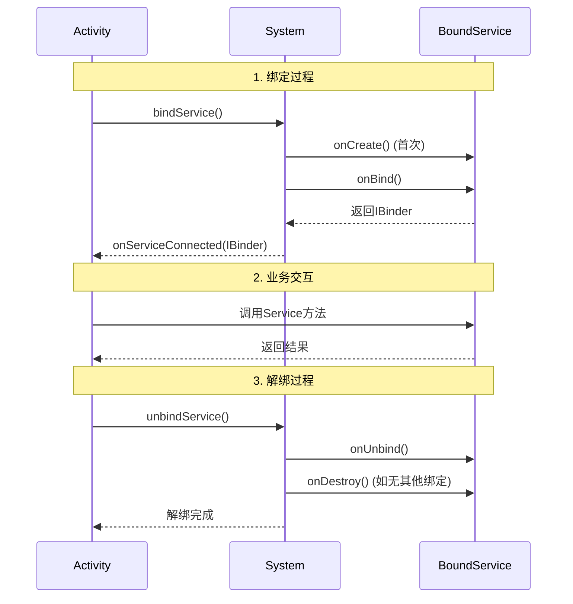

## 一、Service 概述

### 1.1 什么是 Service

[Android Service](https://developer.android.google.cn/develop/background-work/services) 是 Android 系统中的四大组件之一，用于在后台执行长时间运行的操作，不提供用户界面。Service 可以在应用处于后台时继续运行，即使应用被销毁，Service 也可以独立运行。


### 1.2 Service 类型

- **前台服务（Foreground Service）**：在通知栏显示通知，优先级较高，系统不会轻易杀死

- **后台服务（Background Service）**：在后台运行，系统资源紧张时可能被杀死

- **绑定服务（Bound Service）**：通过绑定方式使用，提供客户端-服务器接口


从Android 8.0系统开始，应用的后台功能被大幅削减。现在只有当应用保持在前台可见状态的情况下，Service才能保证稳定运行，一旦应用进入后台之后，Service随时都有可能被系统回收。

如果我们需要在后台执行一些长期任务，可以使用前台 Service 或者 WorkManager。


## 二、Service 基本原理

### 2.1 Service 的启动方式

Service 的启动方式主要有：

- **启动式 Service（Started Service）**：通过 startService() 启动，即使启动组件被销毁，Service 仍可继续运行
- **绑定式 Service（Bound Service）**：通过 bindService() 绑定，多个组件可以绑定到同一个 Service，当所有组件都解绑后，Service 会被销毁

注意，一个 Service 可以同时支持启动式和绑定式。

另外，组件都是通过使用 Intent 来启动 Service 组件的。


####  2.1.1 启动式 Service

通过`Context.startService()`启动，独立运行，需手动调用`stopService()`停止

> Service 内部也可以调用 stopSelf() 函数来停止。


```java
// 1. 定义Service
public class MyStartedService extends Service {
    // 在 Service 第一次创建时调用 
    @Override
    public void onCreate() {
        super.onCreate();
        Log.d("MyStartedService", "Service created");
    }
    
    // 在每次启动 Service 时调用
    @Override
    public int onStartCommand(Intent intent, int flags, int startId) {
        Log.d("MyStartedService", "Service started, startId: " + startId);
        
        // 执行后台任务
        new Thread(() -> {
            // 模拟耗时操作
            try {
                Thread.sleep(5000);
                Log.d("MyStartedService", "Task completed");
            } catch (InterruptedException e) {
                e.printStackTrace();
            }
        }).start();
        
        return START_STICKY;
    }
    
    @Override
    public IBinder onBind(Intent intent) {
        return null; // 启动式Service通常返回null
    }
    
    @Override
    public void onDestroy() {
        super.onDestroy();
        Log.d("MyStartedService", "Service destroyed");
    }
}

// 2. 在Activity中启动Service
public class MainActivity extends AppCompatActivity {
    @Override
    protected void onCreate(Bundle savedInstanceState) {
        super.onCreate(savedInstanceState);
        setContentView(R.layout.activity_main);
        
        Button startBtn = findViewById(R.id.btn_start);
        Button stopBtn = findViewById(R.id.btn_stop);
        
        startBtn.setOnClickListener(v -> {
            // 启动Service
            Intent intent = new Intent(this, MyStartedService.class);
            startService(intent);
        });
        
        stopBtn.setOnClickListener(v -> {
            // 停止Service
            Intent intent = new Intent(this, MyStartedService.class);
            stopService(intent);
        });
    }
}
```


#### 2.1.2 绑定式 Service

在启动式 Service 中，组件启动 Service 后，两者之间基本就没有关联了。绑定式 Service 的设计目的是**建立 Service 与组件之间的紧密关系**，实现双向通信。

绑定式 Service 的核心机制主要有：

1. **Binder 类:**   绑定组件 和 Service 之间通信的桥梁。它允许组件获取 Service 的实例，从而调用 Service 的方法。

2. **ServiceConnection 接口:**  用于监控与 Service 的连接状态。它包含两个重要的回调方法：
   - `onServiceConnected()`：当组件与 Service 成功绑定时调用
   - `onServiceDisconnected()`：当 Service 连接意外断开时调用

绑定式 Service的操作步骤如下：

1. 在建立连接时，绑定组件调用 `Context.bindService()` 绑定，触发 Service 中的 `onBind()` 。`onBind()`  方法返回 IBinder 对象给 Android System。系统调用 `onServiceConnected()`，组件获得 Binder。
2. 在断开连接时，绑定组件调用 `Context.unbindService()` 解绑。

以 Activity 绑定组件为案例，调用过程的时序图如下所示。




相关代码如下所示：

```java
// 1. 定义绑定式Service
public class MyBoundService extends Service {
    // 定义Binder类
    public class MyBinder extends Binder {
        MyBoundService getService() {
            return MyBoundService.this;
        }
    }
    
    private final IBinder binder = new MyBinder();
    
    // Service中的业务方法
    public String getServiceInfo() {
        return "Bound Service is running";
    }
    
    public int calculate(int a, int b) {
        return a + b;
    }
    
    @Override
    public IBinder onBind(Intent intent) {
        Log.d("MyBoundService", "Service bound");
        return binder;
    }
    
    @Override
    public boolean onUnbind(Intent intent) {
        Log.d("MyBoundService", "Service unbound");
        return super.onUnbind(intent);
    }
    
    @Override
    public void onDestroy() {
        super.onDestroy();
        Log.d("MyBoundService", "Service destroyed");
    }
}

// 2. 在Activity中绑定和使用Service
public class MainActivity extends AppCompatActivity {
    private MyBoundService boundService;
    private boolean isBound = false;
    
    // 定义Service连接
    private ServiceConnection connection = new ServiceConnection() {
        @Override
        public void onServiceConnected(ComponentName name, IBinder service) {
            // 获取Service实例
            MyBoundService.MyBinder binder = (MyBoundService.MyBinder) service;
            boundService = binder.getService();
            isBound = true;
            
            // 调用Service方法
            String info = boundService.getServiceInfo();
            Log.d("MainActivity", info);
            
            int result = boundService.calculate(10, 20);
            Log.d("MainActivity", "Calculate result: " + result);
        }
        
        @Override
        public void onServiceDisconnected(ComponentName name) {
            isBound = false;
            boundService = null;
        }
    };
    
    @Override
    protected void onCreate(Bundle savedInstanceState) {
        super.onCreate(savedInstanceState);
        setContentView(R.layout.activity_main);
        
        Button bindBtn = findViewById(R.id.btn_bind);
        Button unbindBtn = findViewById(R.id.btn_unbind);
        Button callBtn = findViewById(R.id.btn_call);
        
        bindBtn.setOnClickListener(v -> {
            // 绑定Service
            Intent intent = new Intent(this, MyBoundService.class);
            bindService(intent, connection, Context.BIND_AUTO_CREATE);
        });
        
        unbindBtn.setOnClickListener(v -> {
            // 解绑Service
            if (isBound) {
                unbindService(connection);
                isBound = false;
            }
        });
        
        callBtn.setOnClickListener(v -> {
            // 调用Service方法
            if (isBound && boundService != null) {
                int result = boundService.calculate(5, 3);
                Toast.makeText(this, "Result: " + result, Toast.LENGTH_SHORT).show();
            }
        });
    }
}
```


#### 2.1.3 混合式 Service

Service 组件能够同时使用 启动式Service 或者 绑定式 Service这两种方式来启动。


#### 2.1.4 Service 启动方式的区别

启动式 Service 启动后跟启动组件就没有关联了，不支持双向通信，适合执行独立的、长时间的后台任务，例如文件上传/下载、定时同步数据。

而绑定式 Service 启动后跟启动组件有关联，支持双向通信，可以给多个组件提供可交互的、共享的服务功能，例如 音乐播放器（需要控制播放、暂停、获取进度）、跨应用功能提供（如地图、支付等SDK）。

| 特性         | 启动式Service (Started Service)         | 绑定式Service (Bound Service)       |
| ------------ | --------------------------------------- | ----------------------------------- |
| **启动方式** | `startService()`                        | `bindService()`                     |
| **生命周期** | 独立于调用者，可长时间运行              | 依赖绑定者，所有客户端解绑后销毁    |
| **停止方式** | 需显式调用`stopService()`或`stopSelf()` | 自动销毁（当所有客户端解绑时）      |
| **交互模式** | 单向操作，无法直接返回值                | 双向通信，可通过IBinder进行方法调用 |
| **使用场景** | 执行独立后台任务                        | 提供功能接口给多个组件              |
| **返回数据** | 通常通过Broadcast、EventBus等           | 可直接通过Binder接口返回            |


### 2.2 生命周期

Android Service 的生命周期根据启动方式不同而有所差异。


#### 2.2.1 启动式 Service 生命周期

- **onCreate()**：首次创建 Service 时调用，用于一次性初始化
- **onStartCommand()**：每次通过 `startService()`启动时调用。
- **onDestroy()**：Service 销毁时调用，用于清理资源。

```
onCreate() → onStartCommand() → onDestroy()
```


同时，`onStartCommand()` 的返回值决定了当系统因内存压力杀死 Service 后，系统应该如何处理这个 Service。

- `START_STICKY` ： Service 被系统杀死后，**系统会自动重新创建 Service**，不会传递原来的 Intent。
- `START_NOT_STICKY`： Service 被系统杀死后，**不会自动重启**

- `START_REDELIVER_INTENT`：Service 被系统杀死后，**系统会自动重新创建 Service**，并重新传递原来的 Intent。


#### 2.2.2 绑定式 Service 生命周期

- **onCreate()**：首次创建 Service 时调用

- **onBind()**：组件调用 `bindService()`时调用，返回 IBinder

- **onUnbind()**：组件解绑时调用

- **onDestroy()**：Service 销毁时调用。当所有绑定组件都被解绑时才会调用

```
onCreate() → onBind() → onUnbind() → onDestroy()
```


#### 2.2.3 混合式 Service 生命周期

根据 Android 系统的机制，一个 Service 只要被启动了或者被绑定了之后，就会处于运行状态，必须要让以上两种条件同时不满足，Service 才会被销毁/


### 2.3 前台 Service

自 Android 8.0（API 级别 26）起，当应用进入后台时，系统会限制普通 Service 的运行，这可能导致其随时被回收。如果需要确保 Service 能够持续稳定地工作，可以考虑使用**前台 Service**。

前台 Service 与普通 Service 的核心区别在于：

1. **前台状态标识**：系统会在状态栏显示一个持续运行的图标，提示用户当前有应用正在前台执行任务。
2. **高优先级**：前台 Service 会被系统视为用户主动知晓且关心的任务，从而获得较高的运行优先级，不易被系统回收。

前台 Service 的实现步骤为：

1. 在 Service 中创建一个 **Notification** 对象，用于在状态栏显示通知。
2. 在 `onCreate()`或 `onStartCommand()`中，调用 `startForeground(notificationId, notification)`方法。这会将当前 Service 设置为前台服务，并显示给定的通知。
3. 当服务任务完成时，调用 `stopForeground()`和 `stopSelf()`来停止前台状态并结束服务。

```java
public class MyForegroundService extends Service {

    private static final String CHANNEL_ID = "ForegroundServiceChannel";
    private static final int NOTIFICATION_ID = 1;

    @Override
    public IBinder onBind(Intent intent) {
        return null;
    }

    @Override
    public int onStartCommand(Intent intent, int flags, int startId) {
        // 1. 创建通知渠道（Android 8.0 及以上必需）
        createNotificationChannel();

        // 2. 构建通知
        Notification notification = new NotificationCompat.Builder(this, CHANNEL_ID)
                .setContentTitle("服务运行中")
                .setContentText("正在执行后台任务...")
                .setSmallIcon(R.drawable.ic_notification)
                .build();

        // 3. 启动为前台服务
        startForeground(NOTIFICATION_ID, notification);

        // 执行你的后台逻辑...

        return START_STICKY;
    }

    private void createNotificationChannel() {
        if (Build.VERSION.SDK_INT >= Build.VERSION_CODES.O) {
            CharSequence channelName = "前台服务通道";
            String channelDescription = "用于显示前台服务的持续运行状态";
            int importance = NotificationManager.IMPORTANCE_LOW; // 重要程度较低，避免打扰用户
            
            NotificationChannel channel = new NotificationChannel(CHANNEL_ID, channelName, importance);
            channel.setDescription(channelDescription);
            
            NotificationManager manager = getSystemService(NotificationManager.class);
            manager.createNotificationChannel(channel);
        }
    }
    
     @Override
    public void onDestroy() {
        super.onDestroy();
        // 停止前台服务
        stopForeground(true);
    }
}
```


## 三、最佳实践


默认情况下，Service 中的代码都是默认运行在主线程。

- 为了避免 ANR 错误， 我们应该在 Service 的每个方法里开启一个子线程。但是，这种 Service 一旦启动，就会一直处于运行状态，必须调用 stopService 、stopSelf、或者系统回收，Service 才会停止
- 使用异步的、会自动停止的 Service， 即 IntentService.


使用 IntentService（在 API 30 之前）:      IntentService是 Service 的子类，自动在工作线程处理请求


> **注意**：IntentService 在 Android 8.0 之后被弃用，推荐使用 WorkManager 或 JobIntentService。


对于需要持久性、可靠的后台任务，使用 WorkManager（Android 5.0+）


## 参考资料

[Services overview  | Background work  | Android Developers](https://developer.android.google.cn/develop/background-work/services)