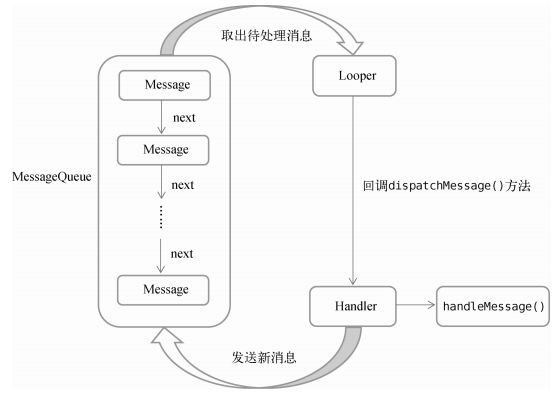

## 一、Android 多线程概述

### 1.1 什么是 Android 多线程

Android 多线程是指在 Android 应用程序中同时执行多个线程的技术。

- **主线程(UI 线程)**: 每个 Android 应用启动时都会创建一个主线程，负责处理用户界面（UI）的更新和事件响应。如果主线程被阻塞超过5秒，系统会抛出 ANR（Application Not Responding）错误。
- **工作线程**： 用于执行耗时操作（网络请求、数据库操作、文件读写等），不能在非主线程中直接更新 UI。


### 1.2 Android 多线程和 Java 多线程的区别

Java 多线程是**通用性的基础**，关注于并发计算和资源利用；而 Android 多线程是在此基础上，为满足**移动端UI响应的苛刻要求**而特化的一个分支，它引入了严格的线程规则和专用的通信机制。理解 **UI 线程模型**和 **Handler 机制**是掌握 Android 多线程编程的关键。

主要区别如下：

| 特性               | Java 多线程                                                  | Android 多线程                                               |
| :----------------- | :----------------------------------------------------------- | :----------------------------------------------------------- |
| **核心目标**       | 最大化利用 CPU 资源，提升计算效率                            | 保证 UI 线程（主线程）的流畅响应，避免应用无响应（ANR）      |
| **线程类型与职责** | 线程角色平等，通常无严格的主从之分                           | 严格区分 **UI 线程（主线程）** 和**工作线程（子线程）**      |
| **UI 操作规则**    | 无特殊限制，任何线程通常都可更新 UI（如 Swing/JavaFX 有特定规则，但不同于 Android） | **黄金法则：只能在主线程中更新 UI**。工作线程更新 UI 会抛出 `CalledFromWrongThreadException` |
| **核心编程工具**   | `Thread`, `Runnable`, `synchronized`, `Lock`, `ExecutorService` 等 Java 并发包（`java.util.concurrent`） | `Handler`, `Looper`, `MessageQueue`, **`AsyncTask`** (已废弃，但体现了设计思想), `IntentService`, **`ViewModel`** 配合 **协程 (Coroutines)** 或 **`LiveData`** (现代推荐) |
| **线程间通信机制** | 主要通过共享内存、锁机制、`wait()`/`notify()` 等实现线程同步 | 基于**消息循环 (Message Loop)** 机制。工作线程通过向主线程的 `MessageQueue` 发送 `Message`，由主线程的 `Handler` 处理并更新 UI |
| **性能与资源管理** | 关注点在线程生命周期开销、锁竞争、CPU 资源利用率             | 除 Java 层面的考量外，更强调**严格控制主线程负载**，并深度整合**线程池**进行资源复用 |


### 1.3 注意事项

- **ANR 约束**： Android 系统要求应用必须在 5秒内响应输入事件，否则会触发 Application Not Responding (ANR) 错误。这是 Android 多线程设计最根本的驱动力，迫使开发者必须将任何可能耗时的操作（网络请求、复杂计算、数据库查询）移至工作线程。
- **UI 线程不安全**：Android 的 UI 控件不是线程安全的。为了简化编程模型并避免复杂的同步逻辑，Android 强制要求所有对 UI 的修改都必须在创建它的主线程中进行。这催生了 `Handler`等通信机制完美地解决了在子线程中进行 UI 更新的问题。


## 二、异步消息处理机制

### 2.1 核心组件

引用 《第一行代码 Android》中的图片。



#### 2.1.1 Message

Message 是消息的载体，包含 what、arg1、arg2、obj 等字段。

> 建议使用 `Message.obtain()`从消息池获取，避免频繁创建对象

```java
public final class Message {
    Handler target;     // 目标 Handler
    Runnable callback;  // 回调
    int what;           // 消息标识
    Object obj;         // 数据
    // ...
}
```


#### 2.1.2 Handler

Handler 是消息的发送者和处理者，与特定线程的 MessageQueue 和 Looper 关联。

Handler 可以发送消息 (`sendMessage()`) 或者可执行任务（`post(Runnable)`），并处理消息（`handleMessage()`）。

```java
// Handler 基本用法
Handler handler = new Handler(Looper.getMainLooper()) {
    @Override
    public void handleMessage(Message msg) {
        // 在主线程处理消息
        switch (msg.what) {
            case 1:
                textView.setText((String) msg.obj);
                break;
        }
    }
};
```


Handler 并不直接与线程绑定，而是与线程的 Looper 对象绑定。每个线程只能有一个 Looper 实例。绑定方式为：

```java
workerHandler = new Handler(workerThread.getLooper());
```


#### 2.1.3 MessageQueue

MessageQueue 是消息的存储队列（单链表实现），按时间顺序排列消息。

每个线程只有一个 MessageQueue。


#### 2.1.4 Looper

Looper 是消息循环的核心，不断从 MessageQueue 中取出消息，分发给对应的 Handler 进行处理。 一个线程可以有多个 Handler，但只有一个 Looper。

```java
// 线程只有一个 Looper
Looper.prepare();  // 每个线程只能调用一次

// 创建多个 Handler，都绑定到当前线程的 Looper
Handler handler1 = new Handler(Looper.myLooper()) {
    @Override
    public void handleMessage(Message msg) {
        if (msg.what == 1) {
            Log.d("Handler1", "Handler1 收到消息: " + msg.obj);
        }
    }
};

Handler handler2 = new Handler(Looper.myLooper()) {
    @Override
    public void handleMessage(Message msg) {
        if (msg.what == 2) {
            Log.d("Handler2", "Handler2 收到消息: " + msg.obj);
        }
    }
};

Handler handler3 = new Handler(Looper.myLooper());

Looper.loop();  // 开始消息循环
```


主线程默认有 Looper，子线程需要手动创建。每个线程中只会有一个 Looper 对象。

```java
// 在子线程创建 Looper
class WorkerThread extends Thread {
    public Handler handler;
    
    @Override
    public void run() {
        Looper.prepare();  // 初始化 Looper
        
        handler = new Handler() {
            @Override
            public void handleMessage(Message msg) {
                // 处理消息
            }
        };
        
        Looper.loop();  // 开始消息循环
    }
}
```


### 2.2 工作流程

[Android Framework面试题：Handler怎么进行线程通信，原理是什么？](https://mp.weixin.qq.com/s?__biz=Mzg3ODY2MzU2MQ==&mid=2247490363&idx=2&sn=c4d0dab07a36bedf8b3608b66df65b9c&chksm=cf1119ddf86690cbca7a37d605c9381c85377d4a2f0c707affaaf86118a1bf4448d8bdf4503c&token=1436311520&lang=zh_CN#rd)


1. 异步通信准备 (初始化)

这是流程的起点，主要完成消息循环机制的搭建。

\- 主线程：系统在应用启动时（ActivityThread.main()）自动调用 Looper.prepareMainLooper()和 Looper.loop()，为主线程创建了 Looper 和 MessageQueue。

\- 子线程：若需在子线程使用 Handler，必须手动调用 Looper.prepare()和 Looper.loop()。

\- Handler 创建：Handler 对象在创建时会自动绑定当前线程的 Looper 和 MessageQueue。如果当前线程没有 Looper，创建 Handler 会抛出异常。


2. 消息入队 (发送)

当开发者调用 handler.sendMessage(msg)或 handler.post(runnable)时：

\- 封装消息：Handler 将消息（Message）或任务（Runnable）封装成 Message 对象，并设置其 target字段指向自己（即哪个 Handler 发送的，就由哪个 Handler 处理）。

\- 入队排序：Handler 调用 MessageQueue.enqueueMessage()将消息插入队列。队列会根据消息的 when（执行时间戳）进行排序，时间早的排在前面，实现延迟消息和即时消息的调度。


3. 消息循环 (轮询与分发)

这是 Looper 的核心工作，它是一个死循环，但不会导致 ANR（应用无响应）。

\- 轮询取消息：Looper 在 loop()方法中不断调用 MessageQueue.next()方法。

\- 阻塞与唤醒：如果队列为空，next()方法会通过 nativePollOnce()让线程进入休眠状态（阻塞），以节省 CPU 资源。当有新消息入队时，会通过 nativeWake()唤醒线程。

\- 消息分发：Looper 从队列中取出消息后，调用 msg.target.dispatchMessage(msg)，将消息分发给对应的 Handler。


4. 消息处理 (回调)

Handler 接收到 Looper 分发的消息后，按照优先级进行处理：

\- 检查 Callback：首先检查 Message.callback（即通过 post(Runnable)发送的任务），如果存在则直接执行 Runnable.run()。

\- 检查 mCallback：如果不存在，则检查 Handler 构造时传入的 Callback接口，如果该接口处理了消息则返回。

\- 默认处理：如果以上都未处理，则调用开发者重写的 handleMessage(Message msg)方法。


### 2.3 消息发送方式

Message、Runnable、延时消息


## 三、最佳实践

Handler 容易引起内存泄漏。


虽然 Handler 机制仍在使用，但现代 Android 开发更推荐：

- Kotlin 协程
- **LiveData + ViewModel**


