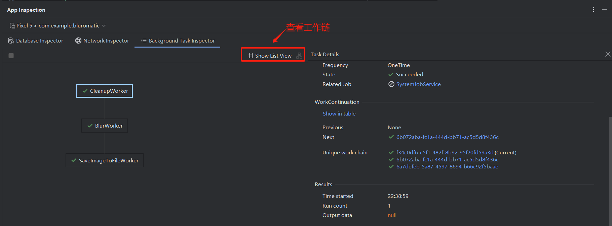

## 一、WorkManager 概述

### 1.1 为什么提出 WorkManager

由于后台功能太过开放，每个应用都想无限地占用后台资源，导致手机内存紧张、耗电等问题。为了解决这些问题，基本上Android系统每发布一个新版本，后台权限都会被进一步收紧。后台API的变更有：

- 4.4系统开始 AlarmManager 的触发时间由原来的精准变为不精准
- 5.0系统中加入了 JobScheduler 来处理后台任务
- 6.0系统中引入了 Doze 和 App Standby 模式用于降低手机被后台唤醒的频率
- 8.0系统开始直接禁用了 Service 的后台功能，只允许使用前台 Service。

为了统一日益碎片化的后台处理方案（如`Service`, `JobScheduler`, `AlarmManager`），解决其在不同系统版本上行为不一致、容易被系统终止、耗电等问题，Android Jetpack 提出了 WorkManager 这一组件。


### 1.2 什么是 WorkManager

WorkManager  是 Android Jetpack 一种[架构组件](http://d.android.com/arch?hl=zh-cn), 为**可延迟执行但要求最终必须完成**的**后台任务**提供一个**统一、可靠且省电**的解决方案。WorkManager 的主要特点如下：

- **保证任务执行**。即使应用退出或设备重启，通过其内置的数据库持久化存储任务信息，确保任务在条件满足时最终被执行。
- **兼容性保证**。根据设备API级别，在底层智能选择最合适的系统调度器。 API 14-22: 使用 `AlarmManager`+ `BroadcastReceiver`的组合方案。**API 23+**: 优先使用 `JobScheduler`。
- **不保证精确定时执行**。这并不是bug，而是系统为了减少电量消耗，可能会将触发时间临近的几个任务放在一起执行，这样可以大幅度地减少CPU被唤醒的次数，从而有效延长电池的使用时间。

WorkManager 是一个极其灵活的库，具有许多其他优势。其中部分优势包括：

- 支持异步一次性任务和定期任务。
- 支持网络条件、存储空间和充电状态等约束条件。
- 链接复杂的工作请求，例如并行运行工作。
- 将来自一个工作请求的输出用作下一个工作请求的输入。
- 处理到 API 级别 14 的 API 级别向后兼容性。
- 无论是否使用 Google Play 服务都可以运行。
- 遵循系统健康最佳实践。
- 支持在应用界面中轻松显示工作请求的状态。


### 1.3 WorkManager 的应用场景

WorkManager 支持定时执行任务、周期性任务、链式任务处理等功能，常见的适用场景有

- 定期将本地数据与网络上的数据同步（如网络请求完成后台执行）
- 日志上传、文件处理
- 周期性任务（最小间隔15分钟）
- 需要持久化保证的任务
- 对图片应用过滤条件，然后保存图片。

> 如需详细了解何时使用 WorkManager，请参阅[后台工作指南](https://d.android.com/guide/background/?hl=zh-cn)。

但是，WorkManager 不适合如下场景：

- 需要立即执行的任务（建议使用协程）
- 精确定时任务（系统限制）
- 前台服务类任务


### 1.4 WorkManager 持久化机制

WorkManager 的核心特性之一就是**持久化存储**，确保任务信息在应用关闭或设备重启后仍然保留。

#### 1.4.1 存储位置

WorkManager 使用 **SQLite 数据库**来持久化任务信息，数据库存储在应用的私有目录中：

```
/data/data/<应用包名>/no_backup/androidx.work.workdb
```

**重要说明：**
- 数据库位于 `no_backup` 目录下，表示这些数据**不会被 Android 的自动备份功能备份**
- 数据库文件包括：
  - `androidx.work.workdb`：主数据库文件
  - `androidx.work.workdb-shm`：共享内存文件
  - `androidx.work.workdb-wal`：预写式日志文件（WAL 模式）


#### 1.4.2 持久化的内容

WorkManager 在数据库中存储以下信息：

- **任务状态**：`ENQUEUED`、`RUNNING`、`SUCCEEDED`、`FAILED`、`CANCELLED`、`BLOCKED`
- **任务信息**：任务 ID、标签（Tag）、约束条件（Constraints）、输入/输出数据
- **执行历史**：任务的创建时间、执行时间、完成时间、重试次数等
- **周期性任务**：周期性任务的调度信息和执行周期


#### 1.4.3 持久化流程

1. **任务入队时**：WorkManager 将任务信息写入 SQLite 数据库
2. **任务执行时**：任务状态的每次变化都会同步更新到数据库
3. **应用关闭后**：数据保留在数据库中，不会丢失
4. **应用重启时**：
   - WorkManager 初始化时从数据库读取所有任务信息
   - `getWorkInfosByTagLiveData()` 等方法会立即返回数据库中保存的状态
   - LiveData 观察者会立即触发，显示历史任务状态


#### 1.4.4 数据库结构

WorkManager 使用 **Room 数据库**，主要数据表包括：

- `workspec`：存储任务规格和状态
- `worktag`：存储任务标签
- `workname`：存储任务名称
- `systemid`：存储系统 ID


## 二、WorkManager 使用方法

### 2.1 核心组件

WorkManager 的核心组件包括四个主要部分：**Worker**（执行任务）、**WorkRequest**（定义任务）、**WorkManager**（调度任务）和 **WorkInfo**（查询状态）。

#### 2.1.1 Worker/CoroutineWorker

**Worker** 是执行实际后台任务的类，需要重写 `doWork()` 方法来实现具体的业务逻辑。这主要有 [`Worker`](https://developer.android.google.cn/reference/androidx/work/Worker?hl=zh-cn) 和 [`CoroutineWorker`](https://developer.android.google.cn/reference/androidx/work/CoroutineWorker?hl=zh-cn)两种实现方式，具体区别如下所示：

| 特性              | Worker                                                       | CoroutineWorker                                              |
| :---------------- | :----------------------------------------------------------- | :----------------------------------------------------------- |
| **执行模型**      | 同步阻塞（在后台线程上）                                     | 异步非阻塞（基于协程挂起）                                   |
| **线程模型**      | 基于 Java 线程池，在后台线程上同步执行 `doWork()` 方法。     | 基于 Kotlin 协程，`doWork()` 是一个挂起函数，默认在 `Dispatchers.Default` 上执行。 |
| **资源占用**      | 每个任务独占一个线程，高并发时资源开销较大。                 | 协程非常轻量，单线程可调度大量协程，资源利用率高。           |
| **异步操作处理**  | 难以处理。若在 `doWork()` 中调用异步 API（如回调），方法会立即返回，导致任务提前结束。 | 天然支持。可以直接在挂起函数中调用其他挂起函数（如 `withContext`），以同步代码风格编写异步逻辑。 |
| **停止/取消处理** | 需要重写 `onStopped()` 方法来响应取消信号。                  | 自动处理。通过协程的取消机制自动传播取消信号。               |

**代码示例：**

```java
// Worker 示例（Java）
public class UploadWorker extends Worker {
    public UploadWorker(@NonNull Context context, @NonNull WorkerParameters params) {
        super(context, params);
    }
    
    @NonNull
    @Override
    public Result doWork() {
        // 执行上传任务
        try {
            // 执行任务逻辑
            return Result.success();
        } catch (Exception e) {
            return Result.failure();
        }
    }
}
```

```kotlin
// CoroutineWorker 示例（Kotlin）
class UploadWorker(context: Context, params: WorkerParameters) : CoroutineWorker(context, params) {
    override suspend fun doWork(): Result {
        // 执行上传任务（可以调用挂起函数）
        return try {
            // 执行任务逻辑
            Result.success()
        } catch (e: Exception) {
            Result.failure()
        }
    }
}
```


#### 2.1.2 WorkRequest

**[`WorkRequest`](https://developer.android.google.cn/reference/androidx/work/WorkRequest.html?hl=zh-cn)** 用于定义任务的执行方式和约束条件。它是抽象类，有两个具体实现：

**两种类型：**

1. **`OneTimeWorkRequest`**：一次性任务，执行一次后完成
2. **`PeriodicWorkRequest`**：周期性任务，按指定间隔重复执行（最小间隔 15 分钟）

**代码示例：**

```java
// 创建一次性任务
OneTimeWorkRequest uploadWork = new OneTimeWorkRequest.Builder(UploadWorker.class)
    .setConstraints(constraints)
    .addTag("upload")
    .build();

// 创建周期性任务（最小间隔 15 分钟）
PeriodicWorkRequest periodicWork = new PeriodicWorkRequest.Builder(
    UploadWorker.class,
    15, TimeUnit.MINUTES)
    .setConstraints(constraints)
    .addTag("periodic_upload")
    .build();
```

**常用配置：**

- **约束条件（[`Constraints`](https://developer.android.google.cn/reference/androidx/work/Constraints.html?hl=zh-cn)）**：设置任务执行的前置条件
  - `setRequiredNetworkType()`：网络要求（无要求、已连接、未计量等）
  - `setRequiresCharging()`：是否需要在充电时执行
  - `setRequiresDeviceIdle()`：是否需要在设备空闲时执行
  - `setRequiresStorageNotLow()`：存储空间是否充足
  - `setRequiresBatteryNotLow()`：电池电量是否充足

- **标签（Tag）**：用于标识和查询任务
  - `addTag("tag_name")`：添加标签

- **输入数据（InputData）**：向 Worker 传递数据
  - `setInputData(Data.Builder().putString("key", "value").build())`

- **初始延迟（InitialDelay）**：延迟执行
  - `setInitialDelay(10, TimeUnit.SECONDS)`


#### 2.1.3 WorkManager 实例

**[`WorkManager`](https://developer.android.google.cn/reference/androidx/work/WorkManager.html?hl=zh-cn)** 是 WorkManager 的核心类，负责调度和管理所有任务。

**获取实例：**
```java
WorkManager workManager = WorkManager.getInstance(context);
```

**核心方法：**

| 方法 | 说明 |
| :--- | :--- |
| `enqueue(WorkRequest)` | 将任务加入队列，等待执行 |
| `cancelWorkById(UUID)` | 根据 ID 取消指定任务 |
| `cancelAllWorkByTag(String)` | 取消所有带指定标签的任务 |
| `cancelAllWork()` | 取消所有任务（不删除历史记录） |
| `getWorkInfoByIdLiveData(UUID)` | 根据 ID 获取任务状态（LiveData） |
| `getWorkInfosByTagLiveData(String)` | 根据标签获取任务状态列表（LiveData） |
| `getWorkInfosForUniqueWorkLiveData(String)` | 根据唯一名称获取任务状态（LiveData） |

**代码示例：**
```java
// 提交任务
workManager.enqueue(uploadWork);

// 取消任务
workManager.cancelWorkById(uploadWork.getId());
workManager.cancelAllWorkByTag("upload");

// 查询任务状态
workManager.getWorkInfoByIdLiveData(uploadWork.getId())
    .observe(this, workInfo -> {
        if (workInfo != null) {
            WorkInfo.State state = workInfo.getState();
            // 处理状态变化
        }
    });
```


#### 2.1.4 WorkInfo

**[`WorkInfo`](https://developer.android.google.cn/reference/androidx/work/WorkInfo.html?hl=zh-cn)** 包含任务的当前状态和相关信息。

**任务状态（State）：**

| 状态 | 说明 |
| :--- | :--- |
| `ENQUEUED` | 任务已加入队列，等待执行 |
| `RUNNING` | 任务正在执行中 |
| `SUCCEEDED` | 任务执行成功 |
| `FAILED` | 任务执行失败 |
| `CANCELLED` | 任务已取消 |
| `BLOCKED` | 任务被阻塞（通常是因为前置任务未完成） |

**WorkInfo 包含的信息：**
- 任务状态（`getState()`）
- 任务 ID（`getId()`）
- 标签列表（`getTags()`）
- 输入数据（`getInputData()`）
- 输出数据（`getOutputData()`）
- 进度信息（`getProgress()`）

**查询 WorkInfo 的方法：**

| **查询方式** | **WorkManager 方法** | **返回类型** | **说明** |
| :----------- | :------------------- | :----------- | :------- |
| 按 **ID** 查询 | `getWorkInfoByIdLiveData(UUID)` | `LiveData<WorkInfo>` | 查询特定任务的状态 |
| 按**标签**查询 | `getWorkInfosByTagLiveData(String)` | `LiveData<List<WorkInfo>>` | 查询所有带指定标签的任务 |
| 按**唯一名称**查询 | `getWorkInfosForUniqueWorkLiveData(String)` | `LiveData<List<WorkInfo>>` | 查询唯一工作链中的所有任务 |

**代码示例：**
```java
// 观察任务状态（LiveData）
workManager.getWorkInfoByIdLiveData(uploadWork.getId())
    .observe(this, workInfo -> {
        if (workInfo != null) {
            WorkInfo.State state = workInfo.getState();
            switch (state) {
                case ENQUEUED:
                    // 任务已加入队列
                    break;
                case RUNNING:
                    // 任务运行中
                    break;
                case SUCCEEDED:
                    // 任务成功
                    Data outputData = workInfo.getOutputData();
                    break;
                case FAILED:
                    // 任务失败
                    break;
                case CANCELLED:
                    // 任务已取消
                    break;
            }
        }
    });
```

**说明：**

- 这些方法返回 [LiveData](https://developer.android.google.cn/topic/libraries/architecture/livedata?hl=zh-cn)，是生命周期感知型可观察数据容器
- 在 Kotlin 中可以通过调用 `.asFlow()` 将其转换为 Flow


### 2.2 基本使用流程

WorkManager 的基本使用流程包括：添加依赖 → 创建 Worker → 构建 WorkRequest → 提交任务 → 观察任务状态。

#### 2.2.1 添加依赖

在应用的 `build.gradle` 文件中添加 WorkManager 依赖。

**Kotlin 项目：**
```kotlin
dependencies {
    // WorkManager dependency (Kotlin)
    implementation("androidx.work:work-runtime-ktx:2.10.0")
}
```

**Java 项目：**
```kotlin
dependencies {
    // WorkManager dependency (Java)
    implementation("androidx.work:work-runtime:2.10.0")
}
```

> 注意：请使用最新的[稳定版本](https://developer.android.google.cn/jetpack/androidx/releases/work?hl=zh-cn)


#### 2.2.2 创建 Worker

创建一个继承自 `Worker`（Java）或 `CoroutineWorker`（Kotlin）的类，重写 `doWork()` 方法来实现具体的任务逻辑。

**Java 示例：**
```java
public class UploadWorker extends Worker {
    private static final String TAG = "UploadWorker";

    public UploadWorker(@NonNull Context context, @NonNull WorkerParameters workerParams) {
        super(context, workerParams);
    }

    @NonNull
    @Override
    public Result doWork() {
        Log.d(TAG, "开始执行后台任务");
        
        try {
            // 执行任务逻辑
            // 例如：上传文件、同步数据等
            for (int i = 0; i < 10; i++) {
                Thread.sleep(1000); // 模拟耗时操作
                Log.d(TAG, "上传进度: " + (i + 1) * 10 + "%");
            }
            
            Log.d(TAG, "后台任务执行完成");
            return Result.success();
        } catch (InterruptedException e) {
            Log.e(TAG, "任务被中断", e);
            return Result.retry();
        } catch (Exception e) {
            Log.e(TAG, "任务执行失败", e);
            return Result.failure();
        }
    }
}
```


#### 2.2.3 构建 WorkRequest

使用 `OneTimeWorkRequest.Builder` 或 `PeriodicWorkRequest.Builder` 创建任务请求。

**创建一次性任务：**
```java
// 创建约束条件（可选）
Constraints constraints = new Constraints.Builder()
        .setRequiredNetworkType(NetworkType.CONNECTED)  // 需要网络连接
        .setRequiresCharging(false)                     // 不需要充电
        .setRequiresBatteryNotLow(false)                // 不需要电池充足
        .build();

// 创建输入数据（可选）
Data inputData = new Data.Builder()
        .putString("file_path", "/path/to/file")
        .putInt("upload_type", 1)
        .build();

// 创建一次性工作请求
OneTimeWorkRequest uploadWorkRequest = new OneTimeWorkRequest.Builder(UploadWorker.class)
        .setConstraints(constraints)                    // 设置约束条件
        .setInputData(inputData)                       // 设置输入数据
        .addTag("upload")                              // 添加标签
        .setInitialDelay(5, TimeUnit.SECONDS)         // 延迟 5 秒执行（仅一次性任务支持）
        .build();
```

**创建周期性任务：**
```java
// 创建周期性工作请求（最小间隔为 15 分钟）
PeriodicWorkRequest periodicWorkRequest = new PeriodicWorkRequest.Builder(
        UploadWorker.class,
        15, TimeUnit.MINUTES)                         // 每 15 分钟执行一次
        .setConstraints(constraints)
        .addTag("periodic_upload")
        .build();
```


#### 2.2.4 提交任务

使用 `WorkManager.getInstance()` 获取实例，然后调用 `enqueue()` 方法提交任务。

```java
// 获取 WorkManager 实例
WorkManager workManager = WorkManager.getInstance(context);

// 提交一次性任务
workManager.enqueue(uploadWorkRequest);

// 提交周期性任务
workManager.enqueue(periodicWorkRequest);
```


#### 2.2.5 观察任务状态

使用 `getWorkInfoByIdLiveData()` 或 `getWorkInfosByTagLiveData()` 观察任务状态变化。


**完整示例：**
```java
public class MainActivity extends AppCompatActivity {
    private WorkManager workManager;
    private static final String WORK_TAG = "upload_work";
    
    @Override
    protected void onCreate(Bundle savedInstanceState) {
        super.onCreate(savedInstanceState);
        setContentView(R.layout.activity_main);
        
        // 1. 获取 WorkManager 实例
        workManager = WorkManager.getInstance(this);
        
        // 2. 创建约束条件
        Constraints constraints = new Constraints.Builder()
                .setRequiredNetworkType(NetworkType.NOT_REQUIRED)
                .build();
        
        // 3. 创建 WorkRequest
        OneTimeWorkRequest uploadWork = new OneTimeWorkRequest.Builder(UploadWorker.class)
                .setConstraints(constraints)
                .addTag(WORK_TAG)
                .build();
        
        // 4. 提交任务
        workManager.enqueue(uploadWork);
        
        // 5. 观察任务状态
        workManager.getWorkInfoByIdLiveData(uploadWork.getId())
                .observe(this, workInfo -> {
                    if (workInfo != null) {
                        WorkInfo.State state = workInfo.getState();
                        // 更新 UI 显示任务状态
                        updateStatus(state.name());
                    }
                });
    }
}
```


## 三、高级用法

### 3.1 唯一工作 (Unique Work)

**唯一工作（Unique Work）** 用于确保同一时间只有一个具有相同名称的工作链在运行。这对于需要避免重复执行的任务非常有用，例如数据同步、日志上传、缓存清理等。

#### 3.1.1 为什么需要唯一工作

| 特性 | 一次性任务（OneTimeWorkRequest） | 唯一工作（Unique Work） |
| :--- | :------------------------------- | :--------------------- |
| **重复提交** | ✅ 可以重复提交，会创建多个任务实例 | ❌ 同一名称只能有一个任务 |
| **任务数量** | 可以同时存在多个相同类型的任务 | 确保同一时间只有一个同名任务 |
| **使用场景** | 上传多个文件、处理多个请求 | 数据同步、避免重复操作 |
| **示例** | 用户可以多次点击上传按钮，创建多个上传任务 | 用户多次点击同步按钮，只保留最新的同步任务 |

**问题场景：**

假设用户快速点击了 3 次"同步数据"按钮：

**使用一次性任务（有问题）：**

```java
// 每次点击都会创建新任务
OneTimeWorkRequest syncWork = new OneTimeWorkRequest.Builder(SyncWorker.class).build();
workManager.enqueue(syncWork);  // 第1次点击
workManager.enqueue(syncWork);  // 第2次点击 - 创建了第2个任务
workManager.enqueue(syncWork);  // 第3次点击 - 创建了第3个任务
// 结果：3个同步任务同时执行，可能导致数据冲突或重复操作
```

**使用唯一工作（正确）：**
```java
// 使用唯一工作，确保只有一个同步任务
OneTimeWorkRequest syncWork = new OneTimeWorkRequest.Builder(SyncWorker.class).build();
workManager.beginUniqueWork(
        "data_sync",
        ExistingWorkPolicy.REPLACE,  // 如果有旧任务，替换它
        syncWork
).enqueue();  // 第1次点击
workManager.beginUniqueWork(
        "data_sync",
        ExistingWorkPolicy.REPLACE,
        syncWork
).enqueue();  // 第2次点击 - 取消第1个任务，创建新任务
workManager.beginUniqueWork(
        "data_sync",
        ExistingWorkPolicy.REPLACE,
        syncWork
).enqueue();  // 第3次点击 - 取消第2个任务，创建新任务
// 结果：只有1个同步任务在执行，避免重复操作
```


#### 3.1.2 唯一工作的使用方法

使用 `beginUniqueWork()` 而不是 `beginWith()` 来创建唯一工作链，需要提供一个唯一的名称和 `ExistingWorkPolicy`。

**完整示例：数据同步场景**

```java
public class MainActivity extends AppCompatActivity {
    private WorkManager workManager;
    private static final String UNIQUE_SYNC_NAME = "data_sync";
    
    private void startDataSync() {
        workManager = WorkManager.getInstance(this);
        
        // 创建同步任务
        OneTimeWorkRequest syncWork = new OneTimeWorkRequest.Builder(SyncWorker.class)
                .addTag("sync")
                .build();
        
        // 使用唯一工作，确保同一时间只有一个同步任务
        workManager.beginUniqueWork(
                UNIQUE_SYNC_NAME,
                ExistingWorkPolicy.REPLACE,  // 如果有旧的同步任务，替换它
                syncWork
        ).enqueue();
    }
}
```

**ExistingWorkPolicy 说明：**

`ExistingWorkPolicy` 定义了当已存在同名唯一工作时的处理策略：

| 策略 | 说明 | 使用场景 |
| :--- | :--- | :--- |
| `REPLACE` | 取消已存在的同名工作，用新工作替换 | 需要立即执行最新任务，忽略旧任务 |
| `KEEP` | 保留已存在的工作，忽略新提交的工作 | 如果已有任务在运行，不创建新任务 |
| `APPEND` | 将新工作追加到现有工作链的末尾 | 需要按顺序执行多个任务 |
| `APPEND_OR_REPLACE` | 如果现有工作已完成，则替换；否则追加 | 灵活处理，根据当前状态决定 |


> 参考文档：[唯一工作指南](https://developer.android.google.cn/guide/background/persistent/how-to/manage-work?hl=zh-cn#unique-work)


### 3.2 任务链 (Chaining Work)

**任务链（Chaining Work）** 允许你将多个任务组合成复杂的工作流，可以顺序执行、并行执行，或者两者结合。任务链中的任务可以传递数据，前一个任务的输出可以作为下一个任务的输入。

**使用场景：**
- 数据处理流水线：下载 → 处理 → 上传
- 图片处理：压缩 → 添加水印 → 保存
- 数据同步：清理旧数据 → 下载新数据 → 更新数据库

#### 3.2.1 顺序执行

顺序执行是指任务按照添加的顺序依次执行，前一个任务完成后才会执行下一个任务。

**基本用法：**
```java
WorkManager workManager = WorkManager.getInstance(context);

// 创建多个任务
OneTimeWorkRequest downloadWork = new OneTimeWorkRequest.Builder(DownloadWorker.class)
        .addTag("download")
        .build();

OneTimeWorkRequest processWork = new OneTimeWorkRequest.Builder(ProcessWorker.class)
        .addTag("process")
        .build();

OneTimeWorkRequest uploadWork = new OneTimeWorkRequest.Builder(UploadWorker.class)
        .addTag("upload")
        .build();

// 顺序执行：download → process → upload
workManager.beginWith(downloadWork)
        .then(processWork)
        .then(uploadWork)
        .enqueue();
```

**数据传递：**
前一个任务的输出数据会自动传递给下一个任务作为输入。

```java
// DownloadWorker 输出数据
public class DownloadWorker extends Worker {
    @NonNull
    @Override
    public Result doWork() {
        // 下载文件
        String filePath = "/path/to/downloaded/file";
        
        // 将文件路径作为输出数据
        Data outputData = new Data.Builder()
                .putString("file_path", filePath)
                .putInt("file_size", 1024)
                .build();
        
        return Result.success(outputData);
    }
}

// ProcessWorker 接收数据
public class ProcessWorker extends Worker {
    @NonNull
    @Override
    public Result doWork() {
        // 获取输入数据（来自 DownloadWorker 的输出）
        String filePath = getInputData().getString("file_path");
        int fileSize = getInputData().getInt("file_size", 0);
        
        // 处理文件
        // ...
        
        return Result.success();
    }
}
```

#### 3.2.2 并行执行

并行执行是指多个任务同时执行，适用于相互独立的任务。

**基本用法：**
```java
// 创建多个并行任务
OneTimeWorkRequest task1 = new OneTimeWorkRequest.Builder(Task1Worker.class).build();
OneTimeWorkRequest task2 = new OneTimeWorkRequest.Builder(Task2Worker.class).build();
OneTimeWorkRequest task3 = new OneTimeWorkRequest.Builder(Task3Worker.class).build();

// 并行执行所有任务
workManager.beginWith(Arrays.asList(task1, task2, task3))
        .enqueue();
```


#### 3.2.3 组合执行

可以将顺序执行和并行执行组合使用，创建复杂的工作流。

**示例：复杂工作流**
```java
// 步骤1：并行下载多个文件
OneTimeWorkRequest download1 = new OneTimeWorkRequest.Builder(DownloadWorker.class).build();
OneTimeWorkRequest download2 = new OneTimeWorkRequest.Builder(DownloadWorker.class).build();

// 步骤2：处理下载的文件（等待所有下载完成后执行）
OneTimeWorkRequest process = new OneTimeWorkRequest.Builder(ProcessWorker.class).build();

// 步骤3：并行上传处理后的文件
OneTimeWorkRequest upload1 = new OneTimeWorkRequest.Builder(UploadWorker.class).build();
OneTimeWorkRequest upload2 = new OneTimeWorkRequest.Builder(UploadWorker.class).build();

// 步骤4：清理临时文件（等待所有上传完成后执行）
OneTimeWorkRequest cleanup = new OneTimeWorkRequest.Builder(CleanupWorker.class).build();

// 组合工作流：
// 1. 并行下载 (download1, download2)
// 2. 处理 (process) - 等待下载完成
// 3. 并行上传 (upload1, upload2) - 等待处理完成
// 4. 清理 (cleanup) - 等待上传完成
workManager.beginWith(Arrays.asList(download1, download2))
        .then(process)
        .then(Arrays.asList(upload1, upload2))
        .then(cleanup)
        .enqueue();
```

#### 3.2.4 条件执行

可以使用 `WorkContinuation` 创建条件分支，根据前一个任务的结果决定执行哪个任务。

**示例：根据结果选择不同路径**
```java
OneTimeWorkRequest checkWork = new OneTimeWorkRequest.Builder(CheckWorker.class).build();
OneTimeWorkRequest successWork = new OneTimeWorkRequest.Builder(SuccessWorker.class).build();
OneTimeWorkRequest failureWork = new OneTimeWorkRequest.Builder(FailureWorker.class).build();

// 先执行检查任务
WorkContinuation continuation = workManager.beginWith(checkWork);

// 根据检查结果执行不同任务
// 注意：这需要在前一个任务中设置不同的输出数据来区分
continuation.then(successWork).enqueue();
// 或者
continuation.then(failureWork).enqueue();
```

#### 3.2.5 完整示例：图片处理流水线

```java
public class ImageProcessingActivity extends AppCompatActivity {
    private WorkManager workManager;
    
    private void processImage(String imageUrl) {
        workManager = WorkManager.getInstance(this);
        
        // 1. 下载图片
        OneTimeWorkRequest downloadWork = new OneTimeWorkRequest.Builder(DownloadImageWorker.class)
                .setInputData(new Data.Builder()
                        .putString("image_url", imageUrl)
                        .build())
                .addTag("download")
                .build();
        
        // 2. 压缩图片
        OneTimeWorkRequest compressWork = new OneTimeWorkRequest.Builder(CompressImageWorker.class)
                .addTag("compress")
                .build();
        
        // 3. 添加水印
        OneTimeWorkRequest watermarkWork = new OneTimeWorkRequest.Builder(WatermarkWorker.class)
                .setInputData(new Data.Builder()
                        .putString("watermark_text", "My App")
                        .build())
                .addTag("watermark")
                .build();
        
        // 4. 保存图片
        OneTimeWorkRequest saveWork = new OneTimeWorkRequest.Builder(SaveImageWorker.class)
                .addTag("save")
                .build();
        
        // 顺序执行：下载 → 压缩 → 添加水印 → 保存
        workManager.beginWith(downloadWork)
                .then(compressWork)
                .then(watermarkWork)
                .then(saveWork)
                .enqueue();
        
        // 观察整个工作流的状态
        workManager.getWorkInfosByTagLiveData("download")
                .observe(this, workInfos -> {
                    // 处理状态变化
                });
    }
}
```

**注意事项：**
- 任务链中的任务必须是 `OneTimeWorkRequest`，不支持 `PeriodicWorkRequest`
- 如果链中任何一个任务失败，后续任务不会执行
- 前一个任务的输出数据会自动传递给下一个任务
- 可以使用标签来查询和取消整个任务链
- 任务链的执行顺序是确定的，但每个任务的执行时间可能不同

> 参考文档：[任务链指南](https://developer.android.google.cn/guide/background/persistent/how-to/chain-work?hl=zh-cn)


## 四、调试与诊断

[高级 WorkManager 和测试](https://developer.android.google.cn/codelabs/basic-android-kotlin-compose-verify-background-work?hl=zh-cn&continue=https%3A%2F%2Fdeveloper.android.google.cn%2Fcourses%2Fpathways%2Fandroid-basics-compose-unit-7-pathway-1%3Fhl%3Dzh-cn%23codelab-https%3A%2F%2Fdeveloper.android.com%2Fcodelabs%2Fbasic-android-kotlin-compose-verify-background-work#8)

### 4.1 后台任务检查器

Android Studio 中有一个工具可让您实时直观呈现、监控和调试 worker。[**后台任务检查器**](https://developer.android.google.cn/studio/inspect/task?hl=zh-cn)适用于搭载 API 级别 26 或更高的模拟器和设备。

worker 详细信息包括以下类别：

- **Description**：此部分列出了包含完全限定软件包的 worker 类名，以及此 worker 的已分配标记和 UUID。
- **Execution**：此部分显示了 worker 的约束条件（若有）、运行频率、状态，以及哪个类创建了此 worker 并将其加入队列。回想一下，BlurWorker 有一个约束条件，可以在电池电量不足时阻止它执行。当您检查具有约束条件的 worker 时，它们会显示在此部分。
- **WorkContinuation**：此部分显示了此 worker 在工作链中所处的位置。如需查看工作链中另一个 worker 的详情，请点击其 UUID。
- **Results**：此部分显示了所选 worker 的开始时间、重试次数和输出数据。




> 参阅[**后台任务检查器**](https://developer.android.google.cn/studio/inspect/task?hl=zh-cn#inspect-jobs-alarms-wakelocks)的参考文档，详细了解可用于检查其他类型的后台工作的工具


### 4.2 日志记录与标签

在创建 `WorkRequest` 时，使用 `.addTag("my-upload-tag")` 添加标签，方便在代码中通过 `getWorkInfosByTag()` 查询，或在日志中进行过滤。


## 参考资料

[使用 WorkManager 调度任务](http://d.android.com/topic/libraries/architecture/workmanager/?hl=zh-cn)

[Android后台任务终极指南：WorkManager从入门到精通WorkManager就像**智能物流调度中心**](https://juejin.cn/post/7471112315682095154)


