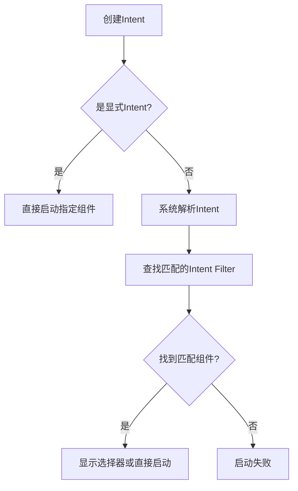
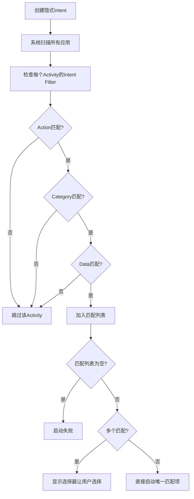

[TOC]

## 一、Intent 核心机制详解

### 1.1 什么是 Intent 

Intent（意图）是 Android 中用于组件之间通信的消息对象，**用于描述要执行的动作、操作的数据以及携带的参数，可通过显式或隐式方式触发 Activity、Service 或 Broadcast。** 是 Android 组件间解耦通信的核心机制。它描述了：

- **要做什么（Action）**
- **对谁做（ComponentName / Data URI）**
- **带什么数据（Extra）**

Intent 的使用案例如下：

```java
// 启动 Activity
Intent intent = new Intent(this, TargetActivity.class);
startActivity(intent);

// 启动 / 绑定 Service
startService(intent);
bindService(intent, connection, BIND_AUTO_CREATE);

// 发送广播
sendBroadcast(intent);

// 跨 App 调用（打开网页、拨号等）
Intent intent = new Intent(Intent.ACTION_VIEW);
intent.setData(Uri.parse("https://www.baidu.com"));
startActivity(intent);

```


### 1.2 Intent 类型

| **类型**        | **特点**                       | **是否需要 intent-filter** |
| :-------------- | :----------------------------- | :------------------------- |
| **显式 Intent** | 明确指定组件                   | ❌ 不需要                   |
| **隐式 Intent** | 通过 Action/Category/Data 匹配 | ✅ 必须                     |

#### 1.2.1  显式 Intent（Explicit Intent）

**显式 intent** 通过指定完整的 `ComponentName` 来指定哪个应用的哪个组件将满足该 intent。您通常会使用显式 intent 来启动自己应用中的组件，因为您知道要启动的 activity 或服务的类名称。例如，您可能会在应用内启动一个新 activity 来响应用户操作，或者启动一项服务在后台下载文件。

**Component Name** 是显式 Intent 必须包含的信息

```
// 启动 Activity
Intent intent = new Intent(MainActivity.this, TargetActivity.class);
intent.putExtra("key", "value");
startActivity(intent);
```


#### 1.2.2 隐式 Intent（Implicit Intent）

**隐式 intent** 不会指定特定组件，而是声明要执行的常规操作，从而允许其他应用的组件处理该 intent。例如，如果您想在地图上向用户显示某个位置，可以使用隐式 intent 请求另一个能够执行此操作的应用在地图上显示指定位置。

![隐式 intent 如何通过系统传递以启动另一 activity：**[1]** *activity A* 创建一个包含操作说明的 `Intent` 并将其传递给 `startActivity()`。**[2]** Android 系统会搜索所有应用，查找与 intent 匹配的 intent 过滤器。找到匹配项后，**[3]** 系统会通过调用匹配 activity（*Activity B*）的 `onCreate()` 方法并向其传递 `Intent` 来启动该 activity。](images/intent-filters_2x.png)

**Action 、Category 、 Data**则是重要的信息。 

```java
Intent intent = new Intent(Intent.ACTION_VIEW);
intent.setData(Uri.parse("https://www.baidu.com"));
startActivity(intent);
```


### 1.3 Intent 解析过程




### 1.4 常用的 Intent

具体细节查看:

- [Common intents  | App architecture  | Android Developers](https://developer.android.google.cn/guide/components/intents-common)
- [Google Maps Intents for Android  | App architecture  | Android Developers](https://developer.android.google.cn/guide/components/google-maps-intents)


## 二、Intent 组成结构

Intent 的核心属性为：

| **属性**                       | **作用**                 |
| :----------------------------- | :----------------------- |
| **Component Name**             | 指定要启动的组件         |
| **Action**                     | 要执行的通用动作         |
| **Data（URI） / Type（MIME）** | 操作的数据及其 MIME 类型 |
| **Category**                   | 组件使用场景的补充描述   |
| **Extra**                      | 执行业务所需的附加数据   |
| **Flags**                      | 启动方式与任务栈行为控制 |


### 2.1 Action

Action表示 Intent 要执行的动作，

- 是一个 **字符串**

- 一个 Intent **只能有一个 Action**

- 用来匹配 `<intent-filter>`里的 `<action>`
- 决定 Intent 的整体结构（Data / Extra 的组织方式）


#### 2.1.1 常见的系统 Action

| **Action**                  | **含义**                       |
| :-------------------------- | :----------------------------- |
| `Intent.ACTION_VIEW`        | 查看内容（网页 / 图片 / 文件） |
| `Intent.ACTION_DIAL`        | 打开拨号界面                   |
| `Intent.ACTION_CALL`        | 直接拨打电话（需权限）         |
| `Intent.ACTION_SEND`        | 分享                           |
| `Intent.ACTION_SENDTO`      | 发短信 / 邮件                  |
| `Intent.ACTION_MAIN`        | 程序入口                       |
| `Intent.ACTION_BATTERY_LOW` | 电量低广播                     |


#### 2.1.2 广播相关（系统发出）

| **Action**                     | **说明**     |
| :----------------------------- | :----------- |
| `ACTION_BOOT_COMPLETED`        | 开机完成     |
| `ACTION_SCREEN_ON`             | 屏幕点亮     |
| `ACTION_AIRPLANE_MODE_CHANGED` | 飞行模式变化 |


#### 2.1.3 自定义 Action

**必须加包名前缀**，防止与其他应用冲突

```
public static final String ACTION_TIMETRAVEL =
        "com.example.action.TIMETRAVEL";
```


### 2.2 Category

Category表示 Intent 所属的类别 / 使用场景。特点有：

- 是一个 字符串
- 一个 Intent 可以有多个 Category
- 用来进一步筛选谁可以响应这个 Intent


| **Category**         | **说明**         |
| :------------------- | :--------------- |
| `CATEGORY_DEFAULT`   | 默认（隐式必须） |
| `CATEGORY_LAUNCHER`  | 桌面启动         |
| `CATEGORY_BROWSABLE` | 浏览器可访问     |


注意，Intent 在隐式启动时，系统会自动添加 CATEGORY_DEFAULT。Intent Filter 永远不会默认添加 CATEGORY_DEFAULT。 因此，任何希望通过隐式 Intent 启动的 Activity，必须在 `<intent-filter>`中显式声明 `android.intent.category.DEFAULT`。


### 2.3 Data

注意，在使用过程中，不要同时设置 URI 与 MIME，应该使用 `setDataAndType` 函数。

```
// ❌ 错误写法（互相覆盖）
intent.setData(uri);
intent.setType(type);

// 正确写法
intent.setDataAndType(uri, "image/png");
```


在显式 intent 中，这块内容对应 intent-filter 中 `<data>` 配置。


#### 2.3.1 Data URI

URI（Uniform Resource Identifier，统一资源标识符）

- 表示 **要操作的数据**
- 通常是 `Uri`对象（http / content / file）

```
// 标准 URI 结构
scheme:[//authority][path][?query][#fragment]

// 示例
https://www.example.com:8080/path/page.html?id=123#top
```


#### 2.3.2 MIME Type

描述数据的 **类型**

帮助系统精准匹配组件


### 2.4 Extra

#### 2.4.1 基本概念

以 **Key-Value** 形式存储，用于完成 Action 所需的业务参数

```
intent.putExtra(Intent.EXTRA_EMAIL, "test@example.com");
intent.putExtra(Intent.EXTRA_SUBJECT, "Hello");
```


#### 2.4.2 Bundle 批量传递

```
Bundle bundle = new Bundle();
bundle.putString("user", "Alice");
bundle.putInt("age", 18);
intent.putExtras(bundle);
```


#### 2.4.3 自定义 Extra Key

```
public static final String EXTRA_GIGAWATTS =
        "com.example.EXTRA_GIGAWATTS";
```


### 2.5 Flags（启动标志）

#### 2.5.1 作用

- 控制 **Activity 启动方式**
- 控制 **Task / Back Stack 行为**
- 影响 **是否在最近任务列表中显示**

```java
intent.setFlags(Intent.FLAG_ACTIVITY_NEW_TASK);
```


#### 2.5.2 常见 Flags

| Flag                       | 说明           |
| -------------------------- | -------------- |
| `FLAG_ACTIVITY_NEW_TASK`   | 在新任务中启动 |
| `FLAG_ACTIVITY_CLEAR_TOP`  | 清除栈顶       |
| `FLAG_ACTIVITY_SINGLE_TOP` | 栈顶复用       |


## 三、隐式 Intent 启动方式

隐式 Intent 不仅可以用于启动程序内的 Activity ，还可以用于启动程序外的 Activity。

### 3.1 包可见性配置

从Android 10（API 29）开始，Google引入了**重大隐私和安全变更**，这直接影响了Intent查询的结果。

| Android版本         | 默认行为                                                     |
| :------------------ | :----------------------------------------------------------- |
| **Android 9及以下** | 可查询所有应用                                               |
| **Android 10+**     | 只能查询自己应用和少数系统应用, [包可见性](https://developer.android.google.cn/training/package-visibility)过滤 (Package Visibility Filtering) |

在 Android 10+ 中，，需要在 `AndroidManifest.xml`中显式声明可查询的目标。

```xml
   <queries>
        <!-- 方式1：声明Intent类型 -->
        <intent>
            <action android:name="android.intent.action.VIEW" />
            <data android:scheme="https" />
        </intent>
        
        <!-- 方式2：声明具体包名 -->
        <package android:name="com.heytap.browser" />
        <package android:name="com.android.chrome" />
        <package android:name="com.android.browser" />
    </queries>
```


### 3.2 响应组件——intent-filter

#### 3.2.1 intent-filter 的作用

[`intent-filter`](https://developer.android.google.cn/guide/topics/manifest/intent-filter-element) **只服务于隐式 Intent**，用于声明组件能够响应的行为。通过在 `<intent-filter>`中声明组件能响应的操作类型，系统可以识别哪些组件能够处理特定的Intent：

```xml
<activity android:name=".WebViewActivity">
    <intent-filter>
        <action android:name="android.intent.action.VIEW" />
        <category android:name="android.intent.category.DEFAULT" />
        <category android:name="android.intent.category.BROWSABLE" />
        <data android:scheme="http" />
        <data android:scheme="https" />
    </intent-filter>
</activity>
```

**配置说明**：

- **Action**：定义组件能执行的核心操作（如VIEW查看、SEND发送、CALL拨打电话等）
- **Category**：指定组件的使用场景（DEFAULT为必须项，BROWSABLE表示可通过浏览器安全启动）
- **Data**：定义组件能处理的数据格式（协议类型、主机名、MIME类型等）


#### 3.2.2 intent-filter 匹配规则

每个Intent中只能指定一个action，但可以指定多个category。系统按照以下规则进行匹配：

1. **Action匹配**：Intent的action必须与Intent Filter中声明的某个action完全匹配
2. **Category匹配**：Intent中的所有category都必须在Intent Filter中有对应声明
3. **Data匹配**：Intent 的data必须与Intent Filter中data规则一致（协议、主机、路径等）

具体匹配流程示例：




**隐式 Intent 必须匹配 `DEFAULT` category**

当不指定 category 时，系统不会默认指定 `DEFAULT`。

**如果 Intent Filter 指定了 data，但 Intent 里面没有 data，这个 Intent 将无法匹配到该 Activity**。只有当`<data>`标签中指定的内容和Intent中携带的Data完全一致时，当前Activity才能够响应该Intent。


### 3.3 启动方式

#### 3.3.1 选择器机制（Chooser）

当存在 **多个可处理该 Intent 的应用** 时，可使用 Chooser 让用户选择。

```java
Intent intent = new Intent(Intent.ACTION_VIEW);
intent.setData(Uri.parse("https://www.example.com"));

Intent chooser = Intent.createChooser(intent, "选择浏览器");
startActivity(chooser);
```

注意，不同的手机操作系统会修改这个选择器。选择器也有可能会失败。


#### 3.3.2  安全启动

每个Intent中只能指定一个action，但能指定多个category。

通过 `Intent.setData()` 方法将 Uri 设置给 Intent 对象，可以让系统知道要操作的具体资源是什么，从而选择合适的应用来处理该资源。

```java
// 创建隐式Intent：查看网页
Intent intent = new Intent(Intent.ACTION_VIEW);
intent.setData(Uri.parse("https://www.example.com"));	

// 添加可选category（如果Intent Filter中有声明）
intent.addCategory(Intent.CATEGORY_BROWSABLE);

// 安全启动：检查是否有应用能处理此Intent
if (intent.resolveActivity(getPackageManager()) != null) {
    // 有应用可处理，显示选择器
    Intent chooser = Intent.createChooser(intent, "选择浏览器");
    startActivity(chooser);
} else {
    // 无应用可处理，提供降级方案
    Toast.makeText(this, "没有找到可以处理此链接的应用", Toast.LENGTH_SHORT).show();
    
    // 可选：引导用户下载相关应用
    openAppStoreForBrowser();
}
```


## 五、最佳实践

### 5.1 数据传递限制

- **大小限制**：Intent传递数据有大小限制（通常约1MB）
- **类型安全**：确保数据类型匹配，避免类型转换异常
- **空值处理**：总是为获取的数据提供默认值


### 5.2 性能优化

- 避免在Intent中传递过大对象
- 使用Bundle传递多个相关数据
- 对于复杂数据考虑使用全局变量或数据库


## 参考资料

[Intent  | API reference  | Android Developers](https://developer.android.google.cn/reference/android/content/Intent#CATEGORY_DESK_DOCK)

[Intents and intent filters  | App architecture  | Android Developers](https://developer.android.google.cn/guide/components/intents-filters#Receiving)
