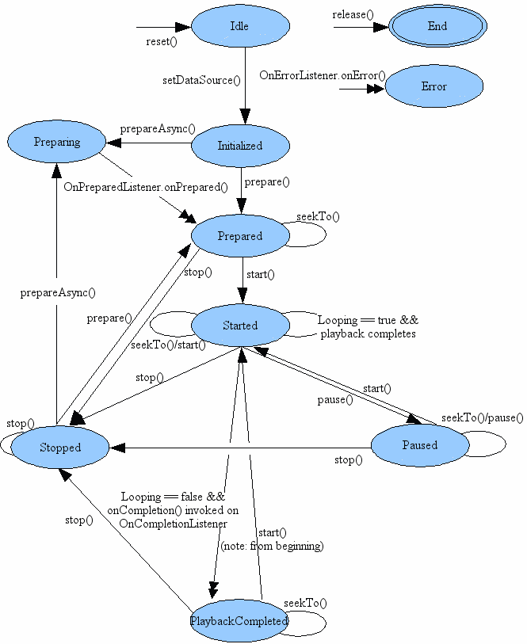

[TOC]

## 一、音视频框架概述

### 1.1 Application Framework 组件

ndroid Application Framework 层提供了一系列原生多媒体 API，构成了音视频能力的系统基础：

| **组件**                     | **作用**                                   |
| :--------------------------- | :----------------------------------------- |
| **MediaPlayer**              | 高层播放器 API（封装提取→解码→渲染）       |
| **MediaRecorder**            | 高层录制 API                               |
| **MediaCodec**               | 访问底层编解码器（H.264/AAC 等），Java API |
| **MediaExtractor**           | 解析容器格式（MP4/MKV），分离音视频轨道    |
| **MediaMuxer**               | 多轨道封装写回容器                         |
| **AudioTrack / AudioRecord** | PCM 音频播放 / 录制                        |
| **MediaSync / MediaSession** | 音画同步 / 播放状态控制                    |


## 二、MediaPlayer

### 2.1 什么是 MediaPlayer

[MediaPlayer](https://developer.android.com/reference/android/media/MediaPlayer#developer-guides) 可以用于播放网络、本地以及应用程序安装包中的音视频。这三种方式的区别在于**数据源设置、访问权限、缓冲机制、错误处理和性能**等方面。

| 特性             | 网络音频                                                     | 本地音频                                                     | 应用资源音频                                                 |
| ---------------- | ------------------------------------------------------------ | ------------------------------------------------------------ | ------------------------------------------------------------ |
| **数据源设置**   | `setDataSource(String url)`<br>`setDataSource(Context, Uri)`<br>`setDataSource(String url, Map<String, String> headers)` | `setDataSource(String path)`<br>`setDataSource(FileDescriptor)`<br>`setDataSource(Context, Uri)` | `MediaPlayer.create(Context, R.raw.audio)`<br>`setDataSource(AssetFileDescriptor)`<br>`setDataSource(AssetFileDescriptor, long, long)` |
| **访问权限**     | 需网络权限                                                   | 需存储权限（Android 10+）或使用 `MediaStore` API             | 无需额外权限                                                 |
| **缓冲机制**     | 需要网络缓冲<br>支持监听缓冲进度                             | 基本无缓冲                                                   | 无缓冲                                                       |
| **准备方法**     | 必须用 `prepareAsync()`                                      | 可用 `prepare()` 或 `prepareAsync()`                         | 可用 `MediaPlayer.create()`<br>或 `prepare()`                |
| **协议支持**     | HTTP/HTTPS, RTSP, HLS, DASH 等                               | 本地文件系统                                                 | 仅应用内资源文件                                             |
| **错误类型**     | 网络超时、连接中断、服务器错误、缓冲不足                     | 文件不存在、权限拒绝、格式不支持                             | 资源ID无效、APK损坏                                          |
| **性能特征**     | 启动慢、依赖网络、耗电高                                     | 启动快、稳定、耗电中                                         | 启动最快、最稳定、增加应用体积                               |
| **适用场景**     | 在线音乐、直播、播客                                         | 本地音乐播放、录音回放                                       | 应用提示音、游戏音效、内置音频                               |
| **生命周期管理** | 需注意暂停/恢复时的网络状态                                  | 需注意文件句柄释放                                           | 随应用生命周期自动管理                                       |


### 2.2 MediaPlayer 常用 API

在使用 MediaPlayer 的过程中，我们想要了解 MediaPlayer 的状态机。




#### 2.2.1 状态控制方法

```java
// 基础播放控制
void start()                     // 开始播放
void pause()                    // 暂停播放
void stop()                     // 停止播放
void release()                  // 释放所有资源
void reset()                    // 重置到空闲状态
void seekTo(int msec)           // 跳转到指定位置（毫秒）
void setLooping(boolean looping) // 设置循环播放
void setVolume(float leftVolume, float rightVolume) // 设置音量

// 状态查询
boolean isPlaying()             // 是否正在播放
int getCurrentPosition()        // 获取当前播放位置（毫秒）
int getDuration()               // 获取音频总时长（毫秒）
```


#### 2.2.2 数据源设置方法

```
// 网络音频
void setDataSource(String path)  // 从URL或文件路径
void setDataSource(Context context, Uri uri)  // 从Uri
void setDataSource(String path, Map<String, String> headers) // 带请求头

// 本地音频
void setDataSource(FileDescriptor fd)  // 从文件描述符
void setDataSource(FileDescriptor fd, long offset, long length) // 部分文件

// 应用资源
void setDataSource(AssetFileDescriptor afd)  // 从Asset资源
void setDataSource(AssetFileDescriptor afd, long offset, long length)

// 静态创建方法（常用于资源音频）
static MediaPlayer create(Context context, int resid)  // 从资源ID创建
static MediaPlayer create(Context context, Uri uri)    // 从Uri创建
static MediaPlayer create(Context context, Uri uri, SurfaceHolder holder) // 带Surface
```


#### 2.2.3 准备与配置方法

```
void prepare()                  // 同步准备（阻塞UI线程）
void prepareAsync()             // 异步准备（推荐）
void setAudioStreamType(int streamtype)  // 设置音频流类型
void setAudioAttributes(AudioAttributes attributes)  // 设置音频属性（API 21+）
void setWakeMode(Context context, int mode)  // 设置唤醒模式
void setScreenOnWhilePlaying(boolean screenOn)  // 设置播放时保持屏幕亮起
```


#### 2.2.4 监听器接口

```java
// 设置监听器
void setOnPreparedListener(MediaPlayer.OnPreparedListener listener)
void setOnCompletionListener(MediaPlayer.OnCompletionListener listener)
void setOnErrorListener(MediaPlayer.OnErrorListener listener)
void setOnInfoListener(MediaPlayer.OnInfoListener listener)
void setOnBufferingUpdateListener(MediaPlayer.OnBufferingUpdateListener listener)
void setOnSeekCompleteListener(MediaPlayer.OnSeekCompleteListener listener)

// 回调接口定义
interface OnPreparedListener {
    void onPrepared(MediaPlayer mp)  // 准备完成
}

interface OnCompletionListener {
    void onCompletion(MediaPlayer mp)  // 播放完成
}

interface OnErrorListener {
    boolean onError(MediaPlayer mp, int what, int extra)  // 错误回调
}

interface OnInfoListener {
    boolean onInfo(MediaPlayer mp, int what, int extra)  // 信息回调
}

interface OnBufferingUpdateListener {
    void onBufferingUpdate(MediaPlayer mp, int percent)  // 缓冲进度更新
}
```


#### 2.2.5 重要常量/错误码

```java
// 错误码（what参数）
int MEDIA_ERROR_UNKNOWN = 1;           // 未知错误
int MEDIA_ERROR_SERVER_DIED = 100;     // 服务器失效
int MEDIA_ERROR_NOT_VALID_FOR_PROGRESSIVE_PLAYBACK = 200; // 渐进播放无效
int MEDIA_ERROR_IO = -1004;           // I/O错误
int MEDIA_ERROR_MALFORMED = -1007;     // 格式错误
int MEDIA_ERROR_UNSUPPORTED = -1010;   // 不支持格式
int MEDIA_ERROR_TIMED_OUT = -110;      // 超时

// 信息码（what参数）
int MEDIA_INFO_UNKNOWN = 1;            // 未知信息
int MEDIA_INFO_VIDEO_TRACK_LAGGING = 700; // 视频轨道延迟
int MEDIA_INFO_BUFFERING_START = 701;  // 缓冲开始
int MEDIA_INFO_BUFFERING_END = 702;    // 缓冲结束
int MEDIA_INFO_NETWORK_BANDWIDTH = 703; // 网络带宽
int MEDIA_INFO_BAD_INTERLEAVING = 800;  // 交错错误
int MEDIA_INFO_NOT_SEEKABLE = 801;     // 不可跳转
int MEDIA_INFO_METADATA_UPDATE = 802;  // 元数据更新
```


## 三、VideoView 组件

### 2.1 什么是 VideoView

在 Android 应用开发中，[`VideoView`](https://developer.android.com/reference/android/widget/VideoView#VideoView(android.content.Context))是一个专为视频播放设计的高级视图组件，它通过封装 `MediaPlayer`和 `SurfaceView`，大大简化了视频播放功能的实现流程。

VideoView的核心定位是成为一个开箱即用的视频播放解决方案。它与纯 MediaPlayer的主要区别在于：

| 特性       | VideoView                              | MediaPlayer                    |
| ---------- | -------------------------------------- | ------------------------------ |
| 封装层级   | 高级视图组件（继承自 SurfaceView）     | 低级媒体引擎                   |
| 开发复杂度 | 低（自动处理视频显示与同步）           | 高（需手动处理 SurfaceView等） |
| UI控制     | 内置 MediaController，提供标准控制界面 | 无内置控制器，需完全自定义     |
| 灵活性     | 较低，功能相对固定                     | 高，可实现高度定制化功能       |


### 3.2 VideoView 的使用方法

#### 3.2.1 常用 API

| 类别       | 方法                                | 说明                     |
| ---------- | ----------------------------------- | ------------------------ |
| 基本控制   | start()                             | 开始或继续播放           |
|            | pause()                             | 暂停播放                 |
|            | stopPlayback()                      | 停止播放并释放资源       |
|            | suspend()                           | 暂停播放并释放播放器资源 |
|            | resume()                            | 重新开始播放             |
| 状态控制   | isPlaying()                         | 是否正在播放             |
|            | canPause()                          | 是否可以暂停             |
|            | canSeekForward()                    | 是否可以快进             |
|            | canSeekBackward()                   | 是否可以快退             |
| 进度控制   | getCurrentPosition()                | 获取当前播放位置(ms)     |
|            | getDuration()                       | 获取视频总时长(ms)       |
|            | seekTo(int msec)                    | 跳转到指定位置           |
| 数据源设置 | setVideoPath(String path)           | 设置本地文件路径         |
|            | setVideoURI(Uri uri)                | 设置URI(支持本地/网络)   |
| UI控制     | setMediaController(MediaController) | 设置媒体控制器           |
|            | getMediaController()                | 获取媒体控制器           |
|            | requestFocus()                      | 请求焦点                 |
| 尺寸控制   | onMeasure()                         | 测量视图尺寸             |
|            | setVideoScaleType(int)              | 设置视频缩放类型         |
| 状态监听   | setOnPreparedListener()             | 准备完成监听             |
|            | setOnCompletionListener()           | 播放完成监听             |
|            | setOnErrorListener()                | 错误监听                 |
|            | setOnInfoListener()                 | 信息监听                 |


#### 3.2.2 工作流程

1. **添加布局**：在 XML 布局文件中添加 `VideoView`组件

   ```xml
   <VideoView
       android:id="@+id/video_view"
       android:layout_width="match_parent"
       android:layout_height="match_parent" />
   ```

2. **设置视频源并播放**：在 Activity 或 Fragment 中，找到该视图并设置视频源，可以是本地文件路径或网络 URL

   ```java
   VideoView videoView = findViewById(R.id.video_view);
   
   // 播放本地视频
   videoView.setVideoPath("/sdcard/Movies/sample.mp4");
   // 或者播放网络视频
   // videoView.setVideoURI(Uri.parse("https://example.com/sample.mp4"));
   
   videoView.start(); // 开始播放
   ```

3. **添加控制栏**：通过 `MediaController`可以为 `VideoView`添加一个标准的播放控制界面（包含播放/暂停、进度条、快进/快退等）

   ```java
   MediaController mediaController = new MediaController(this);
   videoView.setMediaController(mediaController);
   ```

   


### 3.3 最佳实践

**权限问题**：播放本地存储（如 SD 卡）中的视频需要申请 `READ_EXTERNAL_STORAGE`权限；播放网络视频则需要申请 `INTERNET`权限。

**生命周期管理**：`VideoView`不会在应用进入后台时自动保存播放状态（如播放位置、暂停/播放状态）。开发者需要主动在 `onSaveInstanceState`和 `onRestoreInstanceState`等方法中处理状态的保存与恢复。

**资源释放**：在 Activity 或 Fragment 销毁时（如在 `onDestroy`方法中），应调用 `videoView.suspend()`或确保其被正确销毁，以释放 MediaPlayer 占用的资源


## 参考资料

[MediaPlayer  | API reference  | Android Developers](https://developer.android.com/reference/android/media/MediaPlayer#developer-guides)

[About MediaPlayer  | Android media  | Android Developers](https://developer.android.google.cn/media/platform/mediaplayer)
