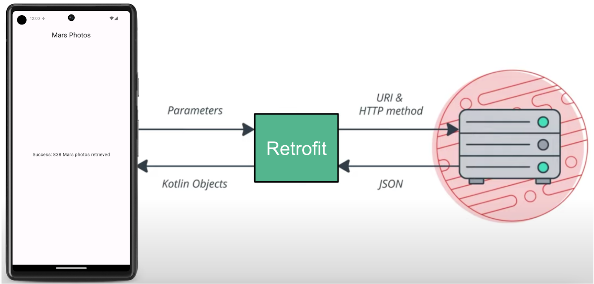

## 一、Retrofit 概述

### 1.1 为什么引入 Retrofit

多数业务开发更关心“请求哪个接口、拿到什么数据”，而不是底层如何建连、如何解析字节流。若直接使用 `HttpURLConnection` 或手写 OkHttp 调用，往往要自己处理：拼 URL、组请求体、切线程发请求、读响应流、按 JSON 解析成对象、再回主线程更新 UI，代码重复且易出错。**Retrofit** 把“发请求 + 反序列化”抽象成**声明式接口**：用注解描述请求方式和路径，方法返回类型即业务所需类型（如 `Call<List<Post>>`），由库在后台执行请求并用转换器自动反序列化，从而减少样板代码、提高可读性和可维护性。


### 1.2 什么是 Retrofit

在 Android 中，**Retrofit** 是声明式 HTTP 客户端，用于将 REST API 转换为类型安全的 Kotlin/Java 接口。

Retrofit 库与 REST 后端进行通信。



Retrofit 会根据 Web 服务的内容为应用创建网络 API。它从 Web 服务提取数据，并通过独立的转换器库来路由数据。该库知道如何解码数据，并以 `String` 等对象形式返回这些数据。Retrofit 内置对 XML 和 JSON 等常用数据格式的支持。Retrofit 最终会创建一个代码来为您调用和使用此服务，包括关键详细信息（例如在后台线程上运行请求）。


### 1.3 常用注解

在接口方法上使用注解描述“请求方法、路径、参数”，Retrofit 会根据这些注解生成实际 HTTP 请求。常见注解如下。

| 注解 | 作用 | 示例 |
|------|------|------|
| **请求方法** | 指定 HTTP 方法，括号内为相对路径（相对 baseUrl） | `@GET("posts")`、`@POST("users")`、`@PUT("posts/{id}")`、`@DELETE("posts/{id}")` |
| `@Path` | 替换 URL 路径中的占位符 | `@GET("posts/{id}") Call<Post> getPost(@Path("id") long id)` → `/posts/1` |
| `@Query` | 添加查询参数（?key=value） | `@GET("posts") Call<List<Post>> list(@Query("userId") int uid)` → `/posts?userId=1` |
| `@QueryMap` | 批量添加查询参数 | `@GET("posts") Call<...> list(@QueryMap Map<String, String> params)` |
| `@Body` | 将方法参数作为请求体（通常 JSON，由转换器序列化） | `@POST("posts") Call<Post> create(@Body Post post)` |
| `@Header` / `@Headers` | 单次请求头 / 固定请求头 | `@Header("Authorization") String token`；`@Headers("Cache-Control: no-cache")` |
| `@Field` / `@FormUrlEncoded` | 表单提交（application/x-www-form-urlencoded） | 与 `@POST` 配合，方法上加 `@FormUrlEncoded`，参数用 `@Field("name")` |

**简要说明**：路径中的占位符用 `{名称}` 书写，方法参数用 `@Path("名称")` 绑定；GET 的查询参数用 `@Query`；POST 的 JSON 体用 `@Body`；需要自定义请求头时用 `@Header` 或 `@Headers`。


## 二、Retrofit 使用案例

Retrofit 的核心是：**定义接口描述 API → 创建 Retrofit 实例 → 调用接口方法获取数据**

### 2.1 添加依赖

**结论：核心库 + 一个转换器即可。** 转换器有多种，对应不同“响应体 → 代码里用的类型”的方式，**只选一个**按需添加。

- **retrofit**：必选，负责发 HTTP 请求、接收响应（底层使用 OkHttp，无需单独声明），不会自动把 JSON 转成 Java/Kotlin 对象。
- **converter-xxx**：把响应体转换成你接口里声明的类型，必选其一。不加的话接口只能返回 `ResponseBody` 或配合 Scalar 返回 `String`；加了 Gson/Moshi 才能返回 `Call<List<Post>>` 这类对象类型。
| 依赖 | 作用 | 适用场景 |
|------|------|----------|
| `converter-gson` | JSON ↔ 对象（如 `List<Post>`） | 最常用，接口返回 `Call<List<Post>>` 等 |
| `converter-scalars` | 响应体 → `String` | 只要原始 JSON 字符串、自己再解析或仅做展示 |
| `converter-moshi` | JSON ↔ 对象（Moshi 库） | Kotlin 项目、偏好 Moshi 时 |
- **协程适配器 / 日志拦截器**：可选。协程适配器仅 Kotlin 且用协程时需要；Java 用 `Call.enqueue()` 即可。日志拦截器用于调试时打印请求与响应。

```kotlin
// build.gradle.kts (Module 级) — 常用写法
dependencies {
    implementation("com.squareup.retrofit2:retrofit:2.11.0")
    // 转换器只选一个：要 JSON 转对象就用 Gson
    implementation("com.squareup.retrofit2:converter-gson:2.11.0")

    // 以下为可选：
    // implementation("com.squareup.retrofit2:converter-moshi:2.11.0")  // 不用 Gson 时可改用 Moshi
    // implementation("com.jakewharton.retrofit:retrofit2-kotlin-coroutines-adapter:0.9.2")  // Kotlin 协程
    // implementation("com.squareup.okhttp3:logging-interceptor:4.12.0")  // 调试时打日志
}
```


### 2.2 定义 API 接口

通常接口文件建议以具体的功能种类名开头，并以 Service 结尾。

在实现过程中，关键点有：

- 添加注解，设置相对路径。另外，考虑到接口地址中的部分内容可能动态变化，使用占位符来设置动态地址。
- 返回值必须声明成 Retrofit 的 Call 类型。另外，Retrofit 提供了 Call Adapters 功能来允许我们自定义方法返回值的类型。

**重点说明**：我们**只定义接口、不写实现类**。Retrofit 在运行时会根据注解生成实现，把“方法调用”变成一次 HTTP 请求。路径是相对于 `baseUrl` 的；返回类型 `Call<T>` 中的 `T` 会由转换器（如 Gson）将响应体反序列化得到。

示例（以 JSONPlaceholder 的帖子接口为例）：

```java
// 数据模型：字段名与 JSON 键一致，便于 Gson 反序列化
public class Post {
    private int id;
    private String title;
    private String body;
    // getter / setter
}

// API 接口：用注解描述“怎么请求”
public interface JsonPlaceholderService {

    // GET {baseUrl}posts → 响应体由 Gson 转为 List<Post>
    @GET("posts")
    Call<List<Post>> getPosts();

    // GET {baseUrl}posts?userId=1 → @Query 会拼成查询参数
    @GET("posts")
    Call<List<Post>> getPostsByUserId(@Query("userId") int userId);

    // POST 示例：@Body 将参数序列化为请求体；返回 ResponseBody 表示不解析响应、拿原始字节流
    @POST("posts")
    Call<ResponseBody> createPost(@Body Post post);
}
```


### 2.3 创建 Retrofit 实例

通过 `Retrofit.Builder` 配置并生成唯一实例，建议应用内**单例复用**，以便统一管理 baseUrl、超时和拦截器。`baseUrl` 必须以 `/` 结尾；相对路径（如 `@GET("posts")`）会拼在 baseUrl 后面。要得到 Java 对象而非原始字符串，必须添加 **Converter**（如 `GsonConverterFactory`），否则只能使用 `ResponseBody` 或 `Call<String>`（需 Scalar 转换器）。

```java
public final class RetrofitClient {

    // baseUrl 必须以 "/" 结尾，否则与相对路径拼接会报错
    private static final String BASE_URL = "https://jsonplaceholder.typicode.com/";

    private static volatile Retrofit sRetrofit;

    public static Retrofit getInstance() {
        if (sRetrofit == null) {
            synchronized (RetrofitClient.class) {
                if (sRetrofit == null) {
                    sRetrofit = new Retrofit.Builder()
                            .baseUrl(BASE_URL)
                            // 添加 Gson 转换器：响应 JSON 自动反序列化为 T（如 List<Post>）
                            .addConverterFactory(GsonConverterFactory.create())
                            .build();
                }
            }
        }
        return sRetrofit;
    }

    // create(接口.class) 得到接口的“实现”，每次调用都会复用同一 Retrofit 实例
    public static JsonPlaceholderService getApi() {
        return getInstance().create(JsonPlaceholderService.class);
    }
}
```


### 2.4 调用接口并处理结果

接口方法返回的是 `Call<T>`，表示“一次未执行的请求”。执行方式有两种：
- **同步** `execute()`（会阻塞线程，需在子线程调用）
- **异步** `enqueue(Callback)`（回调在主线程，适合在 Activity 中更新 UI）。成功时从 `Response.body()` 取已反序列化好的 `T`；失败或网络错误在 `onFailure` 中处理。

```java
// 在 Activity 或 Fragment 中
JsonPlaceholderService api = RetrofitClient.getApi();
Call<List<Post>> call = api.getPosts();

// 异步请求：结果通过回调返回，回调所在线程由 Retrofit/OkHttp 保证（Android 上通常为主线程）
call.enqueue(new Callback<List<Post>>() {
    @Override
    public void onResponse(Call<List<Post>> call, Response<List<Post>> response) {
        if (response.isSuccessful() && response.body() != null) {
            List<Post> posts = response.body();  // 已是 Java 对象，Gson 已解析
            // 更新 UI：例如把 posts 显示到列表
        } else {
            // HTTP 错误码：如 404、500
            int code = response.code();
        }
    }

    @Override
    public void onFailure(Call<List<Post>> call, Throwable t) {
        // 网络异常、解析异常等
    }
});
```


## 三、最佳实现

- **架构位置**：在 Repository 层使用，ViewModel 通过 Repository 访问网络

- **异步处理**：**只用协程**，弃用 `Call`/`RxJava`

- **错误处理**：统一封装响应，使用 `sealed class`或 `Result`类

- **配置管理**：单例 Retrofit 实例，统一配置超时、拦截器

- **依赖注入**：结合 Hilt/Dagger 管理 Retrofit 实例生命周期

- **测试**：使用 MockWebServer 进行网络测试


## 参考资料

 [Retrofit](https://square.github.io/retrofit/) 文档

[用于 Kotlin 序列化的 Retrofit 2 Converter.Factory](https://github.com/JakeWharton/retrofit2-kotlinx-serialization-converter)