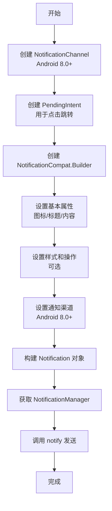

## 一、基础概念

### 1.1 通知

#### 1.1.1 什么是通知

通知是 Android 系统提供的一种**消息推送机制**，允许应用在后台运行时向用户显示重要信息。当应用不在前台运行时，可以通过通知栏、状态栏、锁屏界面等方式向用户传递消息。通知可以包含标题、内容、图标、声音、震动等多种元素，用户点击通知后可以跳转到指定的应用界面。

通知一般在 Android 应用的 **Service 或 BroadcastReceiver** 中创建，很少在 Activity 中创建。具体取决于通知触发的场景：

- 后台服务 (Service): 当应用在后台执行长时间任务时，通过 Service 创建通知。例如：音乐播放、文件下载、位置更新等。
- 广播接收器 (BroadcastReceiver): 接收到系统广播或自定义广播时创建通知。例如：网络状态变化、开机启动、定时任务触发等


#### 1.1.2 通知类型

- [**标准通知**](https://developer.android.google.cn/develop/ui/views/notifications/build-notification)： 最基本的通知类型，包含标题、内容、图标等基础元素，适用于大多数消息推送场景。
- **媒体通知**：专门用于媒体播放场景，显示在通知栏和锁屏界面，提供播放/暂停、上一首、下一首等控制按钮，支持系统级媒体控制。这是通过`MediaSession`和`MediaStyle`通知实现的。应用在后台播放音乐时，会创建一个前台服务并绑定媒体会话，系统会自动生成这个媒体控制通知，无需开发者手动创建复杂的通知布局。

- **进度通知**：显示长时间任务的进度，如文件下载、数据同步等，通过进度条直观展示完成情况。


### 1.2 通知渠道

在 Android 8.0 之前，用户只能选择完全关闭或开启某个应用的所有通知，无法按类别进行管理。部分应用为了拥有更高的打开率，会想尽办法给用户发送通知。如果所有应用都这么做的话，用户手机状态栏会被各种通知信息堆满，不胜其烦。

因此， Android 8.0（API 26）引入[通知渠道](https://developer.android.google.cn/develop/ui/views/notifications/channels)这一重要概念，用于**对通知进行分类管理**。每个通知必须属于一个通知渠道，用户可以在系统设置中按渠道管理通知的显示方式（如是否显示、是否静音、是否在锁屏显示等）。通过渠道管理，用户可以更精细地控制不同类别通知的显示行为，避免被不重要的通知打扰。


## 二、Notification 实现

### 2.1 核心 API 概览

#### 2.1.1 主要 API 类

| 类名                                            | 功能                 | Android 版本 | 重要性 |
| ----------------------------------------------- | -------------------- | ------------ | ------ |
| **NotificationCompat.Builder**                  | 构建通知的核心类     | 所有版本     | ⭐⭐⭐⭐⭐  |
| **NotificationManagerCompat**                   | 通知管理器（兼容版） | 所有版本     | ⭐⭐⭐⭐⭐  |
| **NotificationManager**                         | 通知管理器（系统）   | 所有版本     | ⭐⭐⭐⭐⭐  |
| **NotificationChannel**                         | 通知渠道（API 26+）  | Android 8.0+ | ⭐⭐⭐⭐   |
| **NotificationCompat.Action**                   | 通知操作按钮         | 所有版本     | ⭐⭐⭐⭐   |
| **RemoteInput**                                 | 远程输入（用于回复） | 所有版本     | ⭐⭐⭐    |
| **NotificationCompat.Style**                    | 通知样式             | 所有版本     | ⭐⭐⭐    |
| **NotificationCompat.BigTextStyle**             | 大文本通知样式       | 所有版本     | ⭐⭐⭐    |
| **NotificationCompat.BigPictureStyle**          | 大图片通知样式       | 所有版本     | ⭐⭐⭐    |
| **NotificationCompat.MessagingStyle**           | 聊天消息样式         | 所有版本     | ⭐⭐⭐    |
| **NotificationCompat.InboxStyle**               | 收件箱样式           | 所有版本     | ⭐⭐⭐    |
| **NotificationChannelGroup**                    | 通知渠道分组         | Android 8.0+ | ⭐⭐     |
| **NotificationCompat.DecoratedCustomViewStyle** | 自定义视图样式       | 所有版本     | ⭐⭐     |


#### 2.1.2 NotificationCompat.Builder 核心方法

`NotificationCompat.Builder` 用于构建通知。

```
// 基本设置
setSmallIcon()      // 设置小图标
setContentTitle()   // 设置标题
setContentText()    // 设置内容文本
setContentIntent()  // 设置点击意图
setAutoCancel()     // 点击后自动取消
setPriority()       // 设置优先级

// 高级设置
setStyle()          // 设置样式（大文本、大图片等）
addAction()         // 添加操作按钮
setProgress()       // 设置进度条
setGroup()          // 设置分组
setSound()          // 设置声音
setVibrate()        // 设置震动
setLights()         // 设置LED灯
```


### 2.2 基本发送流程

#### 2.2.1 流程图




#### 2.2.2 详细步骤

1. **创建通知渠道**（Android 8.0+）

   ```java
   if (Build.VERSION.SDK_INT >= Build.VERSION_CODES.O) {
       // 创建通知渠道
       NotificationChannel channel = new NotificationChannel(
           "channel_id",      // 渠道ID
           "渠道名称",         // 渠道名称
           NotificationManager.IMPORTANCE_DEFAULT
       );
       
       // 可选：配置渠道
       channel.setDescription("渠道描述");
       channel.enableLights(true);
       channel.setLightColor(Color.RED);
       channel.enableVibration(true);
       channel.setVibrationPattern(new long[]{0, 300, 200, 300});
       
       // 注册渠道
       NotificationManager notificationManager = 
           getSystemService(NotificationManager.class);
       notificationManager.createNotificationChannel(channel);
   }
   ```

2. **创建 PendingIntent**：PendingIntent 是一种特殊的 Intent，它允许外部应用在拥有调用方权限的情况下执行预定义的操作，可以理解为"延迟执行的 Intent"。

   ```java
   // 创建跳转意图
   Intent intent = new Intent(this, MainActivity.class);
   intent.putExtra("extra_key", "extra_value");
   
   // 创建 PendingIntent, 启动 Activity
   PendingIntent pendingIntent = PendingIntent.getActivity(
       this,                    // Context
       0,                       // Request code
       intent,                  // Intent
       PendingIntent.FLAG_UPDATE_CURRENT |  // 标志位
       PendingIntent.FLAG_IMMUTABLE
   );
   ```

3. **构建通知**：

   ```java
   // 使用 Builder 模式构建通知
   NotificationCompat.Builder builder = new NotificationCompat.Builder(this, "channel_id")
       .setSmallIcon(R.drawable.ic_notification)    // 必须设置
       .setContentTitle("通知标题")                  // 必须设置
       .setContentText("通知内容")                   // 必须设置
       .setContentIntent(pendingIntent)             // 点击跳转
       .setAutoCancel(true)                         // 点击后自动消失
       .setPriority(NotificationCompat.PRIORITY_DEFAULT)
       .setTicker("新通知到达")                      // 状态栏提示
       .setWhen(System.currentTimeMillis());        // 设置时间
   ```

4. **发送通知**：通知 ID 是通知的唯一标识符，用于区分和管理应用中的不同通知。

   ```java
   // 获取通知管理器
   NotificationManagerCompat notificationManager = 
       NotificationManagerCompat.from(this);
   
   // 发送通知（第一个参数是通知ID，用于后续管理）
   notificationManager.notify(1, builder.build());
   ```


### 2.3 不同通知类型的实现

#### 2.3.1 简单通知

```java
NotificationCompat.Builder builder = new NotificationCompat.Builder(context, "channel_id")
    .setSmallIcon(R.drawable.ic_notification)
    .setContentTitle("简单通知")
    .setContentText("这是一条简单的通知")
    .setAutoCancel(true);
```


#### 2.3.2 大文本通知

```java
NotificationCompat.BigTextStyle bigTextStyle = new NotificationCompat.BigTextStyle()
    .bigText("这是一条大文本通知，可以显示很多内容..." +
            "这是第二行内容..." +
            "这是第三行内容...")
    .setBigContentTitle("大文本通知标题")
    .setSummaryText("摘要信息");

NotificationCompat.Builder builder = new NotificationCompat.Builder(context, "channel_id")
    .setSmallIcon(R.drawable.ic_notification)
    .setContentTitle("大文本通知")
    .setContentText("点击展开查看完整内容")
    .setStyle(bigTextStyle)
    .setAutoCancel(true);
```


#### 2.3.3 进度通知

```java
// 发送进度通知
NotificationCompat.Builder builder = new NotificationCompat.Builder(context, "channel_id")
    .setSmallIcon(R.drawable.ic_notification)
    .setContentTitle("下载中")
    .setContentText("正在下载文件...")
    .setProgress(100, 50, false)  // 最大值, 当前值, 是否不确定
    .setOngoing(true)              // 设置为持续通知
    .setOnlyAlertOnce(true);       // 只提醒一次

// 更新进度
notificationManager.notify(progressId, 
    builder.setProgress(100, 75, false)
           .setContentText("下载进度: 75%")
           .build());
```


#### 2.3.4 带操作按钮的通知

```java
// 创建操作按钮意图
Intent actionIntent = new Intent(this, ActionReceiver.class);
actionIntent.setAction("ACTION_REPLY");
PendingIntent actionPendingIntent = PendingIntent.getBroadcast(
    this, 0, actionIntent, PendingIntent.FLAG_UPDATE_CURRENT | PendingIntent.FLAG_IMMUTABLE
);

// 创建操作按钮
NotificationCompat.Action action = new NotificationCompat.Action.Builder(
    R.drawable.ic_reply,    // 图标
    "回复",                  // 标题
    actionPendingIntent     // 点击意图
).build();

// 构建通知
NotificationCompat.Builder builder = new NotificationCompat.Builder(context, "channel_id")
    .setSmallIcon(R.drawable.ic_notification)
    .setContentTitle("新消息")
    .setContentText("你收到一条新消息")
    .addAction(action)      // 添加操作按钮
    .setAutoCancel(true);
```


#### 2.3.5 可回复通知

**可回复通知**允许用户直接在通知栏中输入文本并发送，无需打开应用，提供了更直接的交互方式。主要应用于：

1. **即时通讯**：快速回复消息
2. **邮件应用**：快速回复邮件
3. **社交媒体**：快速评论或回复
4. **任务管理**：快速添加任务备注
5. **语音助手**：语音转文字回复

**可回复通知的核心**在于 `RemoteInput`和 `MUTABLE PendingIntent`的组合使用。

```java
// 创建 RemoteInput
RemoteInput remoteInput = new RemoteInput.Builder("reply_key")
    .setLabel("请输入回复")
    .build();

// 创建回复意图
Intent replyIntent = new Intent(this, ReplyReceiver.class);
PendingIntent replyPendingIntent = PendingIntent.getBroadcast(
    this, 0, replyIntent, PendingIntent.FLAG_UPDATE_CURRENT | PendingIntent.FLAG_MUTABLE
);

// 创建回复操作
NotificationCompat.Action replyAction = new NotificationCompat.Action.Builder(
    R.drawable.ic_reply,
    "回复",
    replyPendingIntent
).addRemoteInput(remoteInput)
 .setAllowGeneratedReplies(true)
 .build();

// 构建通知
NotificationCompat.Builder builder = new NotificationCompat.Builder(context, "channel_id")
    .setSmallIcon(R.drawable.ic_notification)
    .setContentTitle("可回复通知")
    .setContentText("点击回复按钮输入内容")
    .addAction(replyAction)
    .setAutoCancel(true);
```


### 2.4 通知管理

#### 2.4.1 取消通知

**取消通知**主要用于以下几种场景：

1. **任务完成时**：当后台任务（如下载、上传、处理）完成后，需要移除对应的进度通知
2. **用户已处理**：当用户点击通知跳转到应用后，可以取消相关通知
3. **信息过期**：当通知内容已不再有效时（如活动结束、消息已读）
4. **避免重复提醒**：防止同一内容多次提醒用户

```java
// 取消单个通知
notificationManager.cancel(notificationId);

// 取消所有通知
notificationManager.cancelAll();
```


#### 2.4.2 更新通知

**更新通知**主要用于动态更新通知内容，常见场景包括：

1. **进度更新**：文件下载、上传的进度实时显示
2. **状态变化**：任务从"进行中"变为"已完成"
3. **内容追加**：聊天消息、新闻推送的连续更新
4. **错误处理**：任务失败时更新为错误状态

```java
// 更新现有通知
notificationManager.notify(notificationId, updatedBuilder.build());
```


## 参考资料

[About notifications  | Views  | Android Developers](https://developer.android.google.cn/develop/ui/views/notifications)