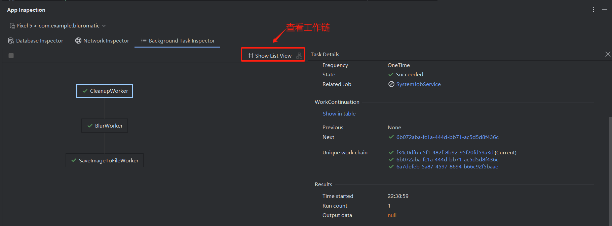

## 一、WorkManager 概述

### 1.1 什么是 WorkManager

WorkManager 是一个 API，用于处理无论应用进程是否仍在运行都需要运行的后台工作。

WorkManager 可以创建可查询、可重用和可链接的任务。WorkManager 是 Android 平台上推荐的**任务调度程序**。

WorkManager 属于 [Android Jetpack](http://d.android.com/jetpack?hl=zh-cn) 的一部分，是一种[架构组件](http://d.android.com/arch?hl=zh-cn)，用于处理既需要机会性执行，又需要有保证的执行的后台工作。机会性执行意味着 WorkManager 会尽快执行您的后台工作。有保证的执行意味着 WorkManager 会负责通过逻辑保障在各种情况下启动您的工作，即使用户离开您的应用也无妨。

WorkManager 是一个极其灵活的库，具有许多其他优势。其中部分优势包括：

- 支持异步一次性任务和定期任务。
- 支持网络条件、存储空间和充电状态等约束条件。
- 链接复杂的工作请求，例如并行运行工作。
- 将来自一个工作请求的输出用作下一个工作请求的输入。
- 处理到 API 级别 14 的 API 级别向后兼容性（请参阅备注）。
- 无论是否使用 Google Play 服务都可以运行。
- 遵循系统健康最佳实践。
- 支持在应用界面中轻松显示工作请求的状态。

> **注意**：WorkManager 依赖于若干 API，例如 [`JobScheduler`](https://developer.android.google.cn/reference/android/app/job/JobScheduler.html?hl=zh-cn) 和 [`AlarmManager`](https://developer.android.google.cn/reference/android/app/AlarmManager?hl=zh-cn)。WorkManager 会根据用户设备 API 级别等条件选择适合使用的 API。如需了解详情，请参阅[使用 WorkManager 调度任务](https://developer.android.google.cn/topic/libraries/architecture/workmanager/?hl=zh-cn)和 [WorkManager 文档](https://developer.android.google.cn/reference/androidx/work/WorkManager?hl=zh-cn)。


### 1.2 何时使用 WorkManager

WorkManager 库非常适合您需要完成的任务。**这些任务的运行不依赖于应用在工作加入队列后继续运行。即使应用已关闭或用户返回主屏幕，这些任务仍会运行。**

以下是一些适合使用 WorkManager 的典型示例任务：

- 定期查询最新新闻报道。
- 对图片应用过滤条件，然后保存图片。
- 定期将本地数据与网络上的数据同步。

WorkManager 是在主线程以外运行任务的一种方式，但不是在主线程之外运行所有类型的任务的万全之选。[协程](https://developer.android.google.cn/kotlin/coroutines?hl=zh-cn)是在之前的 Codelab 中讨论过的另一种方式。

> 如需详细了解何时使用 WorkManager，请参阅[后台工作指南](https://d.android.com/guide/background/?hl=zh-cn)。


## 二、WorkManager 使用方法

### 添加 WorkManager 依赖

`WorkManager` 需要以下 Gradle 依赖项。

```
dependencies {
    // WorkManager dependency
    implementation("androidx.work:work-runtime-ktx:2.8.1")
}
```

您必须在应用中使用 `work-runtime-ktx` 的最新[稳定版本](https://developer.android.google.cn/jetpack/androidx/releases/work?hl=zh-cn)。


### WorkManager 的基础知识

 WorkManager 常用的类：

- [**`Worker`**](https://developer.android.google.cn/reference/androidx/work/Worker?hl=zh-cn) / [**`CoroutineWorker`**](https://developer.android.google.cn/reference/androidx/work/CoroutineWorker?hl=zh-cn)：Worker 是一个在后台线程上同步执行工作的类。因为我们需要的是异步工作，所以可以使用 CoroutineWorker，它可与 Kotlin 协程进行互操作。在此应用中，您将扩展 CoroutineWorker 类并替换 [`doWork()`](https://developer.android.google.cn/reference/androidx/work/CoroutineWorker?hl=zh-cn#doWork()) 方法。此方法用于放置您希望在后台执行的实际工作的代码。

- [**`WorkRequest`**](https://developer.android.google.cn/reference/androidx/work/WorkRequest.html?hl=zh-cn)：此类表示请求执行某些工作。`WorkRequest` 用于定义 worker 是需要运行一次还是定期运行。也可以对 `WorkRequest` 设置[约束条件](https://developer.android.google.cn/reference/androidx/work/Constraints.html?hl=zh-cn)，要求在运行工作之前满足特定条件。例如，设备在开始请求的工作之前在充电。您将在创建 `WorkRequest` 的过程中传入 `CoroutineWorker`。

  `WorkRequest` 有两种类型：

  - `OneTimeWorkRequest`：仅执行一次的 `WorkRequest`。
  - `PeriodicWorkRequest`：按周期重复执行的 `WorkRequest`。

- [**`WorkManager`**](https://developer.android.google.cn/reference/androidx/work/WorkManager.html?hl=zh-cn)：此类实际上会调度 `WorkRequest` 并使其运行。它以一种在系统资源上分散负载的方式调度 `WorkRequest`，同时遵循您指定的约束条件。


## 三、高级功能

### unique-work

[unique-work](https://developer.android.google.cn/guide/background/persistent/how-to/manage-work?hl=zh-cn#unique-work)

有时，您**一次只希望运行一个工作链**。例如，也许您有一条将本地数据与服务器同步的工作链。您可能需要先完成首次数据同步，然后再开始新的数据同步。为此，请使用 [`beginUniqueWork()`](https://developer.android.google.cn/reference/kotlin/androidx/work/WorkManager?hl=zh-cn#beginUniqueWork(java.lang.String,androidx.work.ExistingWorkPolicy,androidx.work.OneTimeWorkRequest)) 而非 [`beginWith()`](https://developer.android.google.cn/reference/kotlin/androidx/work/WorkManager?hl=zh-cn#beginWith(androidx.work.OneTimeWorkRequest))，并且要提供唯一的 `String` 名称。这个输入会命名**整个**工作请求链，以便您一起引用和查询这些请求。

您还需要传入 [`ExistingWorkPolicy`](https://developer.android.google.cn/reference/kotlin/androidx/work/ExistingWorkPolicy?hl=zh-cn) 对象。此对象会告知 Android OS 如果工作已存在，会发生什么情况。可能的 [`ExistingWorkPolicy`](http://d.android.com/reference/androidx/work/ExistingWorkPolicy?hl=zh-cn) 值为 [`REPLACE`](https://developer.android.google.cn/reference/kotlin/androidx/work/ExistingWorkPolicy?hl=zh-cn#REPLACE)、[`KEEP`](https://developer.android.google.cn/reference/kotlin/androidx/work/ExistingWorkPolicy?hl=zh-cn#KEEP)、[`APPEND`](https://developer.android.google.cn/reference/kotlin/androidx/work/ExistingWorkPolicy?hl=zh-cn#APPEND) 或 [`APPEND_OR_REPLACE`](https://developer.android.google.cn/reference/kotlin/androidx/work/ExistingWorkPolicy?hl=zh-cn#APPEND_OR_REPLACE)。


## 获取工作信息

下表显示了三种不同的方法，您可以通过调用这些方法来获取工作信息：

| **类型**                   | **WorkManager 方法**                                         | **说明**                                                     |
| -------------------------- | ------------------------------------------------------------ | ------------------------------------------------------------ |
| 使用 **id** 获取工作       | [`getWorkInfoByIdLiveData()`](https://developer.android.google.cn/reference/androidx/work/WorkManager?hl=zh-cn#getWorkInfoByIdLiveData(java.util.UUID)) | 此函数按 ID 返回特定 WorkRequest 的单个 **LiveData<WorkInfo>**。 |
| 使用**唯一链名称**获取工作 | [`getWorkInfosForUniqueWorkLiveData()`](https://developer.android.google.cn/reference/androidx/work/WorkManager?hl=zh-cn#getWorkInfosForUniqueWorkLiveData(java.lang.String)) | 此函数为 WorkRequest 的唯一链中的所有工作返回 **LiveData<List<WorkInfo>>**。 |
| 使用**标记**获取工作       | [`getWorkInfosByTagLiveData()`](https://developer.android.google.cn/reference/androidx/work/WorkManager?hl=zh-cn#getWorkInfosByTagLiveData(java.lang.String)) | 此函数为标记返回 **LiveData<List<WorkInfo>>**。              |

`WorkInfo` 对象包含有关 `WorkRequest` 的当前状态的详细信息，其中包括：

- 工作是否为 [`BLOCKED`](https://developer.android.google.cn/reference/androidx/work/WorkInfo.State?hl=zh-cn#BLOCKED)、[`CANCELLED`](https://developer.android.google.cn/reference/androidx/work/WorkInfo.State?hl=zh-cn#CANCELLED)、[`ENQUEUED`](https://developer.android.google.cn/reference/androidx/work/WorkInfo.State?hl=zh-cn#ENQUEUED)、[`FAILED`](https://developer.android.google.cn/reference/androidx/work/WorkInfo.State?hl=zh-cn#FAILED)、[`RUNNING`](https://developer.android.google.cn/reference/androidx/work/WorkInfo.State?hl=zh-cn#RUNNING) 或 [`SUCCEEDED`](https://developer.android.google.cn/reference/androidx/work/WorkInfo.State?hl=zh-cn#SUCCEEDED)。
- `WorkRequest` 是否已完成，并且工作有任何输出数据。

这些方法会返回 [LiveData](https://developer.android.google.cn/topic/libraries/architecture/livedata?hl=zh-cn)。LiveData 是生命周期感知型可观察数据容器。我们通过调用 [`.asFlow()`](https://developer.android.google.cn/reference/kotlin/androidx/lifecycle/LiveData?hl=zh-cn#(androidx.lifecycle.LiveData).asFlow()) 将其转换为 [`WorkInfo`](http://d.android.com/reference/androidx/work/WorkInfo?hl=zh-cn) 对象的 Flow。


### 工作约束

`WorkManager` 支持 [`Constraints`](https://developer.android.google.cn/reference/androidx/work/Constraints.html?hl=zh-cn)。约束条件是运行 WorkRequest 之前必须满足的要求。

以下是 [`requiresDeviceIdle()`](https://developer.android.google.cn/reference/androidx/work/Constraints?hl=zh-cn#requiresDeviceIdle()) 和 [`requiresStorageNotLow()`](https://developer.android.google.cn/reference/androidx/work/Constraints?hl=zh-cn#requiresStorageNotLow()) 的一些约束条件示例。

- 对于 `requiresDeviceIdle()` 约束条件，如果向其传递值 `true`，则仅当设备空闲时，工作才会运行。
- 对于 `requiresStorageNotLow()` 约束条件，如果向其传递值 `true`，则仅当存储空间不足时，工作才会运行。


## 四、Android Studio 相关工具

[高级 WorkManager 和测试](https://developer.android.google.cn/codelabs/basic-android-kotlin-compose-verify-background-work?hl=zh-cn&continue=https%3A%2F%2Fdeveloper.android.google.cn%2Fcourses%2Fpathways%2Fandroid-basics-compose-unit-7-pathway-1%3Fhl%3Dzh-cn%23codelab-https%3A%2F%2Fdeveloper.android.com%2Fcodelabs%2Fbasic-android-kotlin-compose-verify-background-work#8)

Android Studio 中有一个工具可让您实时直观呈现、监控和调试 worker。[**后台任务检查器**](https://developer.android.google.cn/studio/inspect/task?hl=zh-cn)适用于搭载 API 级别 26 或更高的模拟器和设备。

worker 详细信息包括以下类别：

- **Description**：此部分列出了包含完全限定软件包的 worker 类名，以及此 worker 的已分配标记和 UUID。
- **Execution**：此部分显示了 worker 的约束条件（若有）、运行频率、状态，以及哪个类创建了此 worker 并将其加入队列。回想一下，BlurWorker 有一个约束条件，可以在电池电量不足时阻止它执行。当您检查具有约束条件的 worker 时，它们会显示在此部分。
- **WorkContinuation**：此部分显示了此 worker 在工作链中所处的位置。如需查看工作链中另一个 worker 的详情，请点击其 UUID。
- **Results**：此部分显示了所选 worker 的开始时间、重试次数和输出数据。




> 参阅[**后台任务检查器**](https://developer.android.google.cn/studio/inspect/task?hl=zh-cn#inspect-jobs-alarms-wakelocks)的参考文档，详细了解可用于检查其他类型的后台工作的工具


## 参考资料

[使用 WorkManager 调度任务](http://d.android.com/topic/libraries/architecture/workmanager/?hl=zh-cn)