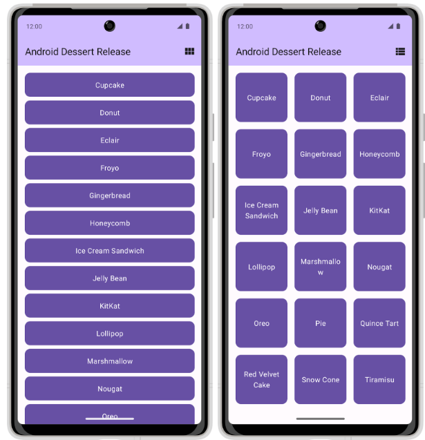

## 项目描述

Dessert Release 应用会显示 Android 版本列表。通过应用栏中的图标，可在网格视图和列表视图之间切换布局。

在当前状态下，应用不会保留布局选择。当您关闭应用后，系统不会保存您的布局选择，并且会将设置还原为默认选择。在此 Codelab 中，您会**将 `DataStore` 添加到 Dessert Release 应用中，并使用它来存储关于布局选择的偏好设置。**