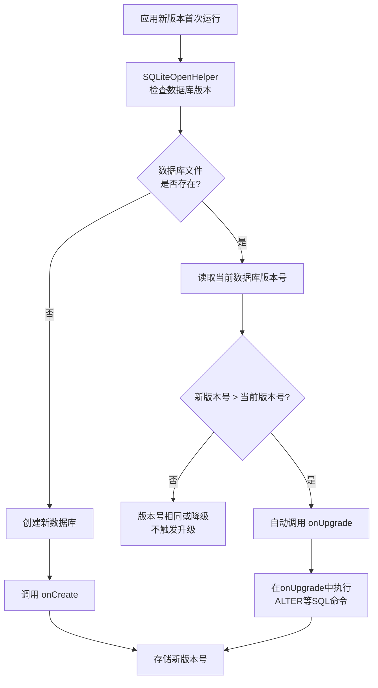

## 一、SQLite 概述

### 1.1 什么是 SQLite 

SQLite 是一个轻量级的嵌入式关系型数据库，它不需要独立的服务器进程，数据存储在单个磁盘文件中。SQLite 是 Android 平台上最常用的本地数据库解决方案。通常，数据库文件会存放在 `/data/data/<package name>/databases/` 目录下。

- SQLite不仅支持标准的SQL语法，还遵循了数据库的ACID事务
- SQLite 运算速度非常快，占用资源很少，通常只需要几百KB的内存就足够了


### 1.2 核心组件

- SQLiteOpenHelper：管理数据库的创建和版本控制
- SQLiteDatabase：执行数据库操作的主要类。
- Cursor：用于遍历查询结果。


### 1.3 辅助工具

使用插件 `Database Navigator` 查看数据库


## 二、SQLite 使用教程

### 2.1 数据库创建和升级

Android系统会根据数据库是否存在和版本号自动决定执行路径：

- **全新安装**：数据库文件不存在 → 执行`onCreate()`
- **升级安装**：数据库文件存在且版本号增加 → 执行`onUpgrade()`



#### 2.1.1 数据库创建

SQLiteOpenHelper 是一个抽象类，可以用于对数据库进行创建和升级。

- getReadableDatabase() 和 getWritableDatabase()。这两个方法都可以创建或打开一个现有的数据库（如果数据库已存在则直接打开，否则要创建一个新的数据库），并返回一个可对数据库进行读写操作的对象 SQLiteDatabase。借助这个对象，我们可以对数据进行 CRUD 操作

```java
public class DatabaseHelper extends SQLiteOpenHelper {
    // 数据库信息
    private static final String DATABASE_NAME = "my_database.db";
    private static final int DATABASE_VERSION = 1;
    
    // 表名和列名
    public static final String TABLE_USERS = "users";
    public static final String COLUMN_ID = "_id";
    public static final String COLUMN_NAME = "name";
    public static final String COLUMN_EMAIL = "email";
    public static final String COLUMN_AGE = "age";
    
    // 创建表的 SQL 语句
    private static final String CREATE_TABLE_USERS = 
        "CREATE TABLE " + TABLE_USERS + " (" +
        COLUMN_ID + " INTEGER PRIMARY KEY AUTOINCREMENT, " +
        COLUMN_NAME + " TEXT NOT NULL, " +
        COLUMN_EMAIL + " TEXT UNIQUE, " +
        COLUMN_AGE + " INTEGER" +
        ");";
    
    public DatabaseHelper(Context context) {
        super(context, DATABASE_NAME, null, DATABASE_VERSION);
    }
    
    @Override
    public void onCreate(SQLiteDatabase db) {
        // 创建表
        db.execSQL(CREATE_TABLE_USERS);
    }
       
    @Override
    public void onUpgrade(SQLiteDatabase db, int oldVersion, int newVersion) {
        // 删除旧表并创建新表
        db.execSQL("DROP TABLE IF EXISTS " + TABLE_USERS);
        onCreate(db);
    }
}
```


#### 2.1.1 数据库升级

**在您发布新版本应用时，如果新版本的数据库结构（如表、字段）发生了变化，这套机制能自动、安全地将用户设备上旧版本的数据库更新到新版本，同时尽力保留用户原有的数据**

触发升级的关键在于 **版本号**。当您在 `SQLiteOpenHelper`的构造函数中传入的版本号（`newVersion`）高于设备上已存在数据库的版本号（`oldVersion`）时，系统就会自动调用 `onUpgrade`方法。在 `onUpgrade`方法中，您需要编写具体的 SQL 命令来完成数据库结构的修改。


### 2.2 数据 CRUD 操作

SQLiteDatabase 用于执行数据的 CRUD 操作。

#### 2.2.1 插入数据

SQLiteDatabase中提供了一个 insert() 方法，专门用于添加数据。它接收3个参数：

- 第一个参数是表名，我们希望向哪张表里添加数据，这里就传入该表的名字；
- 第二个参数用于在未指定添加数据的情况下给某些可为空的列自动赋值 NULL，一般我们用不到这个功能，直接传入null即可；
- 第三个参数是一个 ContentValues对象，它提供了一系列的put()方法重载，用于向ContentValues中添加数据，只需要将表中的每个列名以及相应的待添加数据传入即可。

**返回值**：方法执行成功时，返回一个 `long`类型的值，代表**新插入行的行 ID**（通常是自增主键的值）。如果插入失败（例如由于唯一性约束冲突），则会返回 **-1**

```java
public long addUser(User user) {
    SQLiteDatabase db = this.getWritableDatabase();
    
    ContentValues values = new ContentValues();
    values.put(COLUMN_NAME, user.getName());
    values.put(COLUMN_EMAIL, user.getEmail());
    values.put(COLUMN_AGE, user.getAge());
    
    // 插入数据并返回新行的 ID
    long id = db.insert(TABLE_USERS, null, values);
    db.close();
    
    return id;
}
```


#### 2.2.2 查询数据

`SQLiteDatabase`的 `query()`方法是执行数据库查询的核心方法，它将标准的 SQL `SELECT`语句结构分解为多个逻辑参数，使查询构建更安全、更符合面向对象的编程习惯。该方法最终返回一个 `Cursor`对象，它是访问查询结果集的唯一接口。

下表详细说明了 `query()`方法的各个参数如何对应到 SQL 语句的各个部分：

| **query() 方法参数** | **对应 SQL 子句**           | **描述与说明**                                               |
| :------------------- | :-------------------------- | :----------------------------------------------------------- |
| **table**            | `FROM table_name`           | 指定要查询的表名。也支持多表联合查询，例如 `"user INNER JOIN order ON user.id = order.uid"`。 |
| **columns**          | `SELECT column1, column2`   | 指定要返回的列名数组。传 `null`会返回所有列（`SELECT *`），但出于性能考虑，不建议这样做，以避免读取不需要的数据。 |
| **selection**        | `WHERE column = value`      | 指定查询的过滤条件（即 `WHERE`子句的内容）。可以使用占位符 `?`来防止 SQL 注入。 |
| **selectionArgs**    | -                           | 为 `selection`中的占位符 `?`提供实际的值。数组中的值将按顺序、并以字符串形式绑定到占位符上。 |
| **groupBy**          | `GROUP BY column`           | 指定用于分组的列。传 `null`表示不对结果进行分组。            |
| **having**           | `HAVING column = value`     | 对分组后的结果进行过滤。只有在使用了 `groupBy`时才有效，传 `null`则包含所有分组。 |
| **orderBy**          | `ORDER BY column1 ASC/DESC` | 指定结果的排序方式。传 `null`将使用默认的、可能无序的排序方式。 |
| **limit**            | `LIMIT count`               | 限制返回的记录条数。也可以用于分页，例如 `"5, 10"`表示跳过5条记录后返回10条记录。 |

`query()`方法有多个重载版本， 8参数版本示例如下：

```java
// 根据 ID 查询单个用户
public User getUserById(int id) {
    SQLiteDatabase db = this.getReadableDatabase();
    
    Cursor cursor = db.query(TABLE_USERS, 
        new String[]{COLUMN_ID, COLUMN_NAME, COLUMN_EMAIL, COLUMN_AGE},
        COLUMN_ID + "=?",
        new String[]{String.valueOf(id)}, 
        null, null, null, null);
    
    if (cursor != null && cursor.moveToFirst()) {
        User user = new User();
        user.setId(cursor.getInt(cursor.getColumnIndex(COLUMN_ID)));
        user.setName(cursor.getString(cursor.getColumnIndex(COLUMN_NAME)));
        user.setEmail(cursor.getString(cursor.getColumnIndex(COLUMN_EMAIL)));
        user.setAge(cursor.getInt(cursor.getColumnIndex(COLUMN_AGE)));
        
        cursor.close();
        db.close();
        return user;
    }
    
    if (cursor != null) cursor.close();
    db.close();
    return null;
}
```


#### 2.2.3 更新数据

SQLiteDatabase中提供了一个非常好用的update()方法，用于对数据进行更新。该方法接收四个参数，共同精确指定了“**更新哪张表的哪些数据，以及具体更新成什么**”。

- **table (表名)**：指定要更新数据的数据库表的名称。
- **values (新数据值)**：这是一个 `ContentValues`对象，它包含了您希望更新的**列名（Key）** 和对应的**新值（Value）**。您只需要在此对象中放入需要修改的列及其新值即可，未包含的列将保持不变。
- **whereClause (条件子句)**：这是一个 SQL `WHERE`子句（不包含 `WHERE`关键字本身），用于**指定需要更新哪些行**。它定义了更新的条件。如果传入 `null`，则**表中的所有行都将被更新**。请务必谨慎使用。
- **whereArgs (条件参数)**：这是一个字符串数组，用于为 `whereClause`中的占位符 `?`提供具体的值。这种使用占位符的方式可以有效防止 SQL 注入攻击，是推荐的做法。

该方法返回一个整数，表示此次更新操作**成功影响的记录行数**。您可以通过检查这个返回值来判断更新是否成功以及影响了多少行数据。

```java
public int updateUser(User user) {
    SQLiteDatabase db = this.getWritableDatabase();
    
    ContentValues values = new ContentValues();
    values.put(COLUMN_NAME, user.getName());
    values.put(COLUMN_EMAIL, user.getEmail());
    values.put(COLUMN_AGE, user.getAge());
    
    // 更新数据
    int rowsAffected = db.update(TABLE_USERS, values, 
        COLUMN_ID + " = ?", 
        new String[]{String.valueOf(user.getId())});
    
    db.close();
    return rowsAffected;
}
```


#### 2.2.4 删除数据

SQLiteDatabase中提供了一个delete()方法，专门用于删除数据。这个方法接收3个参数：

- 第一个参数仍然是表名，这个没什么好说的；
- 第二、第三个参数用于约束删除某一行或某几行的数据，不指定的话默认会删除所有行。

```java
public void deleteUser(int id) {
    SQLiteDatabase db = this.getWritableDatabase();
    db.delete(TABLE_USERS, COLUMN_ID + " = ?", 
        new String[]{String.valueOf(id)});
    db.close();
}

// 删除所有用户
public void deleteAllUsers() {
    SQLiteDatabase db = this.getWritableDatabase();
    db.delete(TABLE_USERS, null, null);
    db.close();
}
```


### 2.3 高级查询

#### 2.3.1 条件查询

```java
public List<User> getUsersByName(String name) {
    List<User> userList = new ArrayList<>();
    
    SQLiteDatabase db = this.getReadableDatabase();
    Cursor cursor = db.query(TABLE_USERS,
        new String[]{COLUMN_ID, COLUMN_NAME, COLUMN_EMAIL, COLUMN_AGE},
        COLUMN_NAME + " LIKE ?",
        new String[]{"%" + name + "%"},
        null, null, null);
    
    if (cursor.moveToFirst()) {
        do {
            User user = new User();
            user.setId(cursor.getInt(cursor.getColumnIndex(COLUMN_ID)));
            user.setName(cursor.getString(cursor.getColumnIndex(COLUMN_NAME)));
            user.setEmail(cursor.getString(cursor.getColumnIndex(COLUMN_EMAIL)));
            user.setAge(cursor.getInt(cursor.getColumnIndex(COLUMN_AGE)));
            
            userList.add(user);
        } while (cursor.moveToNext());
    }
    
    cursor.close();
    db.close();
    return userList;
}
```


#### 2.3.2 排序和限制

```java
public List<User> getUsersSortedByAge(int limit) {
    List<User> userList = new ArrayList<>();
    
    SQLiteDatabase db = this.getReadableDatabase();
    Cursor cursor = db.query(TABLE_USERS,
        new String[]{COLUMN_ID, COLUMN_NAME, COLUMN_EMAIL, COLUMN_AGE},
        null, null, null, null,
        COLUMN_AGE + " DESC", // 按年龄降序排序
        String.valueOf(limit)); // 限制结果数量
    
    if (cursor.moveToFirst()) {
        do {
            User user = new User();
            user.setId(cursor.getInt(cursor.getColumnIndex(COLUMN_ID)));
            user.setName(cursor.getString(cursor.getColumnIndex(COLUMN_NAME)));
            user.setEmail(cursor.getString(cursor.getColumnIndex(COLUMN_EMAIL)));
            user.setAge(cursor.getInt(cursor.getColumnIndex(COLUMN_AGE)));
            
            userList.add(user);
        } while (cursor.moveToNext());
    }
    
    cursor.close();
    db.close();
    return userList;
}
```


### 2.4 事务处理

使用事务处理批量操作，避免频繁打开关闭数据库。

Android中事务的标准用法：

1. 首先调用SQLiteDatabase的 beginTransaction()方法开启一个事务，
2. 然后在一个异常捕获的代码块中执行具体的数据库操作，当所有的操作都完成之后，调用setTransactionSuccessful()表示事务已经执行成功了
3. 最后在finally代码块中调用endTransaction()结束事务。

```java
public void addMultipleUsers(List<User> users) {
    SQLiteDatabase db = this.getWritableDatabase();
    
    try {
        db.beginTransaction(); // 开始事务
        
        for (User user : users) {
            ContentValues values = new ContentValues();
            values.put(COLUMN_NAME, user.getName());
            values.put(COLUMN_EMAIL, user.getEmail());
            values.put(COLUMN_AGE, user.getAge());
            
            db.insert(TABLE_USERS, null, values);
        }
        
        db.setTransactionSuccessful(); // 标记事务成功
    } catch (Exception e) {
        e.printStackTrace();
    } finally {
        db.endTransaction(); // 结束事务
        db.close();
    }
}
```


### 2.5 使用 SQL 操作数据库

除了查询数据的时候调用的是SQLiteDatabase的rawQuery()方法，其他操作都是调用的execSQL()方法。

```

```


```
public List<User> getAllUsers() {
    List<User> userList = new ArrayList<>();
    
    // 选择所有列
    String selectQuery = "SELECT * FROM " + TABLE_USERS;
    
    SQLiteDatabase db = this.getReadableDatabase();
    Cursor cursor = db.rawQuery(selectQuery, null);
    
    // 遍历所有行并添加到列表
    if (cursor.moveToFirst()) {
        do {
            User user = new User();
            user.setId(cursor.getInt(cursor.getColumnIndex(COLUMN_ID)));
            user.setName(cursor.getString(cursor.getColumnIndex(COLUMN_NAME)));
            user.setEmail(cursor.getString(cursor.getColumnIndex(COLUMN_EMAIL)));
            user.setAge(cursor.getInt(cursor.getColumnIndex(COLUMN_AGE)));
            
            userList.add(user);
        } while (cursor.moveToNext());
    }
    
    cursor.close();
    db.close();
    return userList;
}
```


## 三、最佳实践

- 单例模式
- 使用 try-with-resources
- 数据库升级策略
- **线程安全**：SQLiteDatabase 实例不是线程安全的，需要确保单线程访问
- **内存管理**：及时关闭数据库和游标
- **性能优化**：使用事务处理批量操作，避免频繁打开关闭数据库


### 3.1 数据库升级策略

一个良好实践的 `onUpgrade`方法通常会处理**跨版本升级**的情况（例如用户直接从版本1跳过版本2升级到版本3），通常会使用一个循环或条件判断，**逐版本应用变更**。

```
@Override
public void onUpgrade(SQLiteDatabase db, int oldVersion, int newVersion) {
    if (oldVersion < 2) {
        // 从版本1升级到版本2
        db.execSQL("ALTER TABLE " + TABLE_USERS + " ADD COLUMN phone TEXT");
    }
    
    if (oldVersion < 3) {
        // 从版本2升级到版本3
        db.execSQL("ALTER TABLE " + TABLE_USERS + " ADD COLUMN address TEXT");
    }
}
```


### 3.2 使用事务

使用事务处理批量操作，避免频繁打开关闭数据库。

在执行数据库升级的时候，也可以使用事务，保证让一系列的操作要么全部完成，要么一个都不会完成。