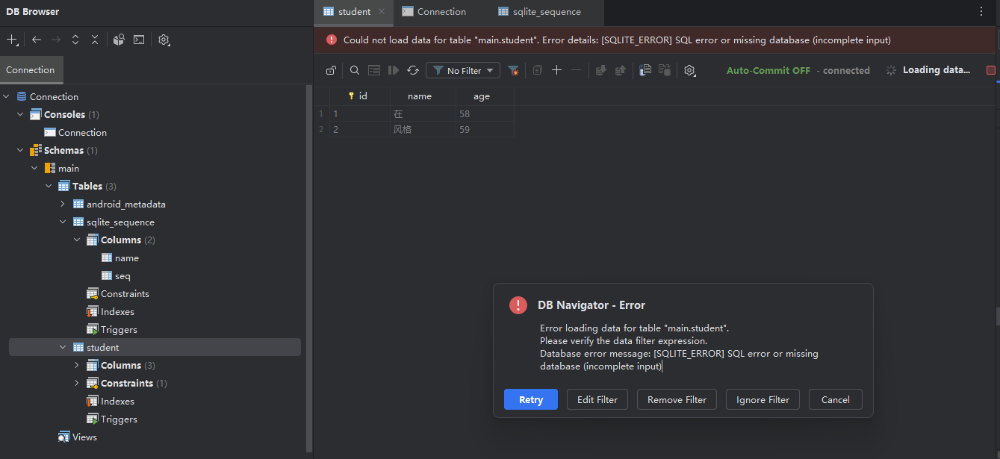
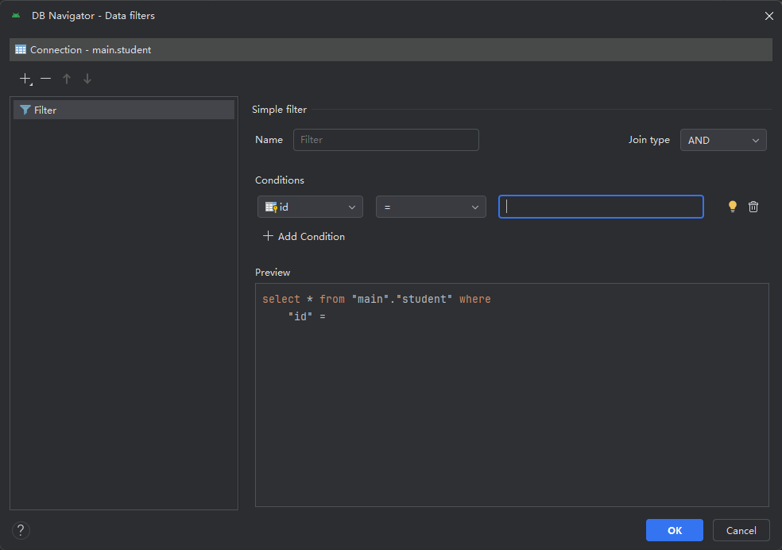

## 一、SQLite 数据库概述

## SQLite 数据库

SQLite 是 Android SDK 为 Android 应用提供的一种常见持久性数据保存方式。SQLite 提供了一个关系型数据库，可让您使用类似于使用 Kotlin 类设计数据结构的方式来表示数据。

> Android 应用能够以多种方式存储数据，包括使用内部和外部存储空间。如需详细了解在 Android 上存储数据的不同方法，请参阅[数据和文件存储概览](https://developer.android.google.cn/training/data-storage?hl=zh-cn)。

具体而言，SQLite 指的是使用结构化查询语言（称为 SQL，有时简短发音为“sequel”）进行关系型数据库管理的一种轻量级 C 库。


### SQLite 数据类型

下表列出了常见的 Kotlin 数据类型与对应的 SQLite 数据类型。

| **Kotlin 数据类型** | **SQLite 数据类型** |
| ------------------- | ------------------- |
| `Int`               | INTEGER             |
| `String`            | VARCHAR 或 TEXT     |
| `Boolean`           | BOOLEAN             |
| `Float`、`Double`   | REAL                |


### Database Inspector

借助 Database Inspector，您可以在应用运行时检查、查询和修改应用的数据库。Database Inspector 可处理普通的 SQLite 数据库或在 SQLite 的基础上构建的库（例如 Room）。

[Database Inspector](https://developer.android.google.cn/studio/inspect/database?hl=zh-cn) 适用于搭载 API 级别 26 及更高版本的模拟器/设备。


### Database Navigator

使用插件 `Database Navigator` 查看数据库


## 问题

### 打开表格却无法加载数据

#### 问题描述

将 Android 手机上的 db 文件保存到电脑里面，使用 Database Navigator 打开。

在建立连接后，查看数据库里面的某张表格的数据，却报错

```
Could not load data for table "main.student". Error detais: [$QllTE ERROR] SOL error or missing database (incomplete input)
```





### 原因分析

使用了过滤器，导致没有数据能通过过滤器




#### 解决方案

不使用 filter 即可。


### 参考资料

- [SQLite 教程 - 简单快速地掌握 SQLite](https://www.sqlitetutorial.net/)

- [Database Inspector](https://developer.android.google.cn/studio/inspect/database?hl=zh-cn)
- [使用 SQLite 保存数据](https://developer.android.google.cn/training/data-storage/sqlite?hl=zh-cn)

- [SQLite 性能](https://developer.android.google.cn/topic/performance/sqlite-performance-best-practices?hl=zh-cn)