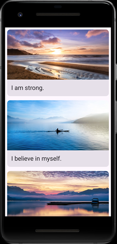

## 项目描述

本项目创建显示配有精美图片的自我肯定话语列表的应用 Affirmations。

## 学习内容

- 使用 [`Card`](https://developer.android.google.cn/reference/kotlin/androidx/compose/material3/package-summary?hl=zh-cn#Card(androidx.compose.ui.Modifier,androidx.compose.ui.graphics.Shape,androidx.compose.material3.CardColors,androidx.compose.material3.CardElevation,androidx.compose.foundation.BorderStroke,kotlin.Function1)) 可组合项创建列表项。
- 使用 [`LazyColumn`](https://developer.android.google.cn/reference/kotlin/androidx/compose/foundation/lazy/package-summary?hl=zh-cn#LazyColumn(androidx.compose.ui.Modifier,androidx.compose.foundation.lazy.LazyListState,androidx.compose.foundation.layout.PaddingValues,kotlin.Boolean,androidx.compose.foundation.layout.Arrangement.Vertical,androidx.compose.ui.Alignment.Horizontal,androidx.compose.foundation.gestures.FlingBehavior,kotlin.Boolean,kotlin.Function1)) 可组合项创建可滚动列表。

- 更改应用的启动器图标。
- 使用 Android Studio 中的 Image Asset Studio 生成启动器图标资源