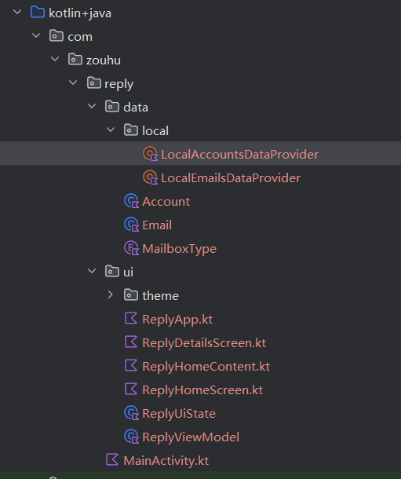
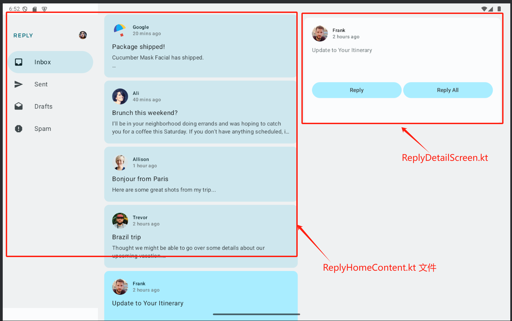
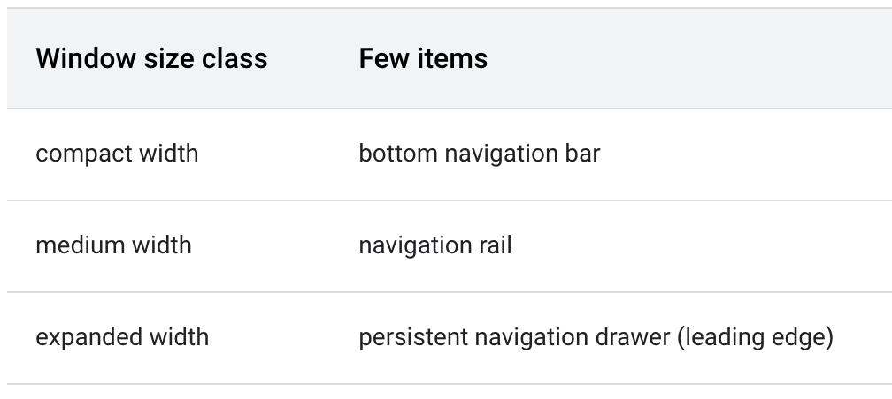
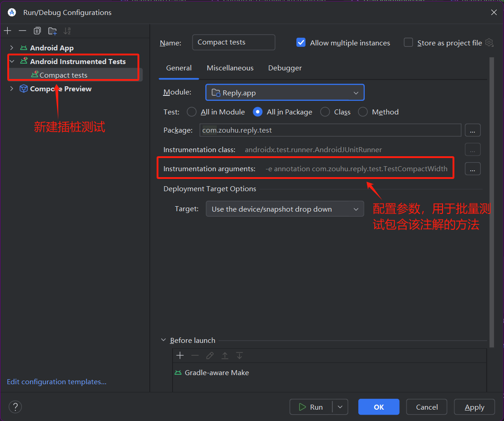

## 一、应用架构

Reply 应用项目的数据和界面层分到了不同的目录中。`ReplyViewModel`、`ReplyUiState` 和其他可组合项位于 `ui` 目录中。用于定义数据层的 `data` 和 `enum` 类以及数据提供程序类均位于 `data` 目录中。



Reply 应用使用 `ReplyApp` 可组合项作为主要可组合项，`viewModel` 和 `uiState` 会在其中声明。各种 `viewModel()` 函数也会作为 `ReplyHomeScreen` 可组合项的 lambda 参数进行传递。

- **`ReplyApp.kt`**:  利用 `WindowWidthSizeClass`  获取屏幕大小，从而设置导航栏和内容的布局位置参数，进而调用 `ReplyHomeScreen`。

- **`ReplyHomeScreen.kt`**：定义整个Home Screen的顶层结构和导航框架。

  包含内容：

  - 整个主页的脚手架结构（如Scaffold）
  - 顶部 AppBar 导航栏
  - 底部 Navigation Bar
  - 可能包含 NavHostController 相关的导航逻辑

- **`ReplyHomeContent.kt`**：实现主页的具体内容区域UI

  包含内容：

  - 邮件列表布局
  - 单个邮件Item的卡片样式

- **`ReplyDetailsScreen.kt`**：邮件详情页的完整实现。

  包含内容：

  - 详情页的完整屏幕布局
  -  详情页特有的小组件（如邮件头、操作按钮组）
  - 可能包含详情页的专场动画
  -  返回导航逻辑




## 二、屏幕导航

### 屏幕更改

本项目在不使用 `NavHost` 的情况下，**利用运行时可变状态，通过简单的条件语句更改屏幕**。这在 Reply 应用等小型应用中尤为有用。在此类应用中，您只需要在两个屏幕之间进行切换。

使用条件，以在用户位于主屏幕上时，显示主屏幕上的内容，在用户不位于主屏幕上时，显示详情屏幕上的内容。

```
@Composable
fun ReplyHomeScreen(
    replyUiState: ReplyUiState,
    onTabPressed: (MailboxType) -> Unit,
    onEmailCardPressed: (Int) -> Unit,
    onDetailScreenBackPressed: () -> Unit,
    modifier: Modifier = Modifier
) {

...

    if (replyUiState.isShowingHomepage) {
        ReplyAppContent(
            replyUiState = replyUiState,
            onTabPressed = onTabPressed,
            onEmailCardPressed = onEmailCardPressed,
            navigationItemContentList = navigationItemContentList,
            modifier = modifier

        )
    } else {
        ReplyDetailsScreen(
            replyUiState = replyUiState,
            onBackPressed = onDetailScreenBackPressed,
            modifier = modifier
        )
    }
}
```


### 创建自定义返回处理程序

使用 `NavHost` 可组合项在屏幕间切换的一个好处是，之前屏幕的方向会保存到返回堆栈中。借助这些已保存的屏幕，系统返回按钮可在调用时轻松导航回上一个屏幕。由于 Reply 应用不使用 `NavHost`，因此您必须添加代码，手动处理返回按钮。

```
...
import androidx.activity.compose.BackHandler
...
@Composable
fun ReplyDetailsScreen(
    replyUiState: ReplyUiState,
    onBackPressed: () -> Unit,
    modifier: Modifier = Modifier
) {
    BackHandler {
        onBackPressed()
    }
... 
```


## 三、构建自适应布局导航布局

构建具有动态导航栏的自适应布局

### 让布局适应不同的屏幕尺寸

[底部导航栏](https://developer.android.google.cn/reference/kotlin/androidx/compose/material3/package-summary?hl=zh-cn#NavigationBar(androidx.compose.ui.Modifier,androidx.compose.ui.graphics.Color,androidx.compose.ui.graphics.Color,androidx.compose.ui.unit.Dp,kotlin.Function1))适用于所有屏幕尺寸。在[响应式界面的导航](https://developer.android.google.cn/guide/topics/large-screens/navigation-for-responsive-uis?hl=zh-cn#responsive_ui_navigation)中针对不同的窗口大小类别，提供了不同的导航元素模式建议。



由于底部导航栏在大屏幕上设计不太合理，Material Design 提出了适用于大屏幕的的导航栏：

- [侧边导航栏](https://developer.android.google.cn/reference/kotlin/androidx/compose/material3/package-summary?hl=zh-cn#NavigationRail(androidx.compose.ui.Modifier,androidx.compose.ui.graphics.Color,androidx.compose.ui.graphics.Color,kotlin.Function1,androidx.compose.foundation.layout.WindowInsets,kotlin.Function1))是 [Material Design](https://m3.material.io/components/navigation-rail/overview) 推出的又一个导航组件，它支持用于从应用的一侧访问主要目标页面的较小导航选项。
- [持续存在的/永久性抽屉式导航栏](https://developer.android.google.cn/reference/kotlin/androidx/compose/material3/package-summary?hl=zh-cn#PermanentNavigationDrawer(kotlin.Function0,androidx.compose.ui.Modifier,kotlin.Function0))由 [Material Design](https://m3.material.io/components/navigation-drawer/overview) 构建，是针对较大屏幕提供工效学访问设计的另一种选择。


### 实现自适应界面导航

```
@Composable
fun ReplyApp(
    windowSize: WindowWidthSizeClass,
    modifier: Modifier = Modifier,
) {
	val navigationType: ReplyNavigationType
    when (windowSize) {
        WindowWidthSizeClass.Compact -> {
            navigationType = ReplyNavigationType.BOTTOM_NAVIGATION
        }
        WindowWidthSizeClass.Medium -> {
            navigationType = ReplyNavigationType.NAVIGATION_RAIL
        }
        WindowWidthSizeClass.Expanded -> {
            navigationType = ReplyNavigationType.PERMANENT_NAVIGATION_DRAWER
        }
        else -> {
            navigationType = ReplyNavigationType.BOTTOM_NAVIGATION
        }
    }
}
```


### 实现抽屉式导航栏

```
 if (navigationType == ReplyNavigationType.PERMANENT_NAVIGATION_DRAWER
        && replyUiState.isShowingHomepage
    ) {
        // 针对较大屏幕维护，创建永久性抽屉式导航栏
        PermanentNavigationDrawer(
            drawerContent = {
                PermanentDrawerSheet(Modifier.width(dimensionResource(R.dimen.drawer_width))) {
                    NavigationDrawerContent(
                        selectedDestination = replyUiState.currentMailbox,
                        onTabPressed = onTabPressed,
                        navigationItemContentList = navigationItemContentList,
                        modifier = Modifier
                            .wrapContentWidth()
                            .fillMaxHeight()
                            .background(MaterialTheme.colorScheme.inverseOnSurface)
                            .padding(dimensionResource(R.dimen.drawer_padding_content))
                    )
                }
            }
        )
```


### 实现侧边导航栏

```
 // 允许应用在某些情况下显示侧边导航栏
        AnimatedVisibility(visible = navigationType == ReplyNavigationType.NAVIGATION_RAIL) {
            val navigationRailContentDescription = stringResource(R.string.navigation_rail)
            ReplyNavigationRail(
                currentTab = replyUiState.currentMailbox,
                onTabPressed = onTabPressed,
                navigationItemContentList = navigationItemContentList,
                modifier = Modifier
                    .testTag(navigationRailContentDescription)
            )
        }
```


## 四、构建自适应内容布局

了解如何通过实现一种规范布局模式，让应用适合在大屏幕上运行。

### 不同屏幕尺寸的预览


### 实现自适应内容布局

为了表示不同类型的内容布局，请在 `WindowStateUtils.kt` 上为不同的内容类型创建新的 `Enum` 类。如果使用较大屏幕，请使用 `LIST_AND_DETAIL` 值；否则，使用 `LIST_ONLY` 值。

```
enum class ReplyContentType {
    LIST_ONLY, LIST_AND_DETAIL
}
```

在 `ReplyHomeScreen.kt` 中，为 `ReplyAppContent` 可组合项添加一个 `if/else` 语句，用于在 `contentType` 值为 `LIST_AND_DETAIL` 时显示 `ReplyListAndDetailContent` 可组合项，并在 `else` 分支上显示 `ReplyListOnlyContent` 可组合项。

```
Column(
            modifier = modifier
                .fillMaxSize()
                .background(MaterialTheme.colorScheme.inverseOnSurface)
        ) {
            if (contentType == ReplyContentType.LIST_AND_DETAIL) {
                ReplyListAndDetailContent(
                    replyUiState = replyUiState,
                    onEmailCardPressed = onEmailCardPressed,
                    modifier = Modifier.weight(1f)
                )
            } else {
                ReplyListOnlyContent(
                    replyUiState = replyUiState,
                    onEmailCardPressed = onEmailCardPressed,
                    modifier = Modifier.weight(1f)
                        .padding(
                            horizontal = dimensionResource(R.dimen.email_list_only_horizontal_padding)
                        )
                )
            }
}
```


## 四、测试

Android Studio 中推出了**[可调整大小的模拟器 Resizable (Experimental)](https://developer.android.com/studio/run/resizable-emulator?hl=zh-cn) ** ，可帮助您测试这些情形。

### 针对不同屏幕尺寸创建特定测试

```
    @get:Rule
    val composeTestRule = createAndroidComposeRule<ComponentActivity>()

    @Test
    @TestCompactWidth
    fun compactDevice_verifyUsingBottomNavigation() {
        // Set up compact window
        composeTestRule.setContent {
            ReplyApp(
                windowSize = WindowWidthSizeClass.Compact
            )
        }
        // Bottom navigation is displayed
        composeTestRule.onNodeWithTagForStringId(
            R.string.navigation_bottom
        ).assertExists()
    }

```


### 使用注解对不同屏幕尺寸的测试进行分组

使用注解对测试进行分组，可以进行大批量测试。

1. 创建注解来指示测试可以在哪些屏幕尺寸中运行，并为相应的设备配置带注解的测试

```
...
annotation class TestCompactWidth
annotation class TestMediumWidth
annotation class TestExpandedWidth
...

@Test
@TestCompactWidth
fun compactDevice_verifyUsingBottomNavigation() {
}
```

2. 添加 “ Android Instrumented Tests”配置，并设置相应参数

   - 将测试重命名为 **Compact tests**，

   - 选择以 **All in Package** 方式运行测试

   - 点击 **Instrumentation arguments** 字段右侧的三个点 (**…**)。然后，点击加号 (+) 按钮并添加额外的 `annotation` 形参，将其值设为 `com.zouhu.reply.test.TestCompactWidth`。

     

