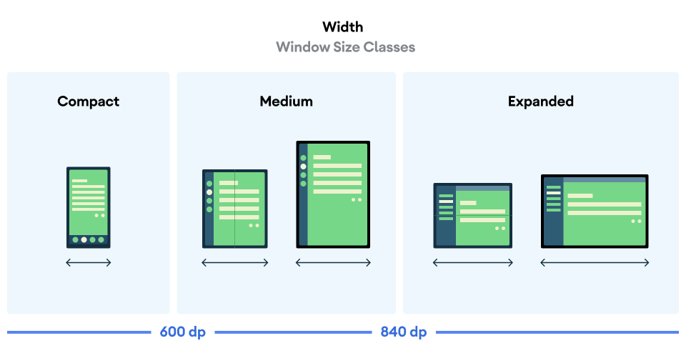
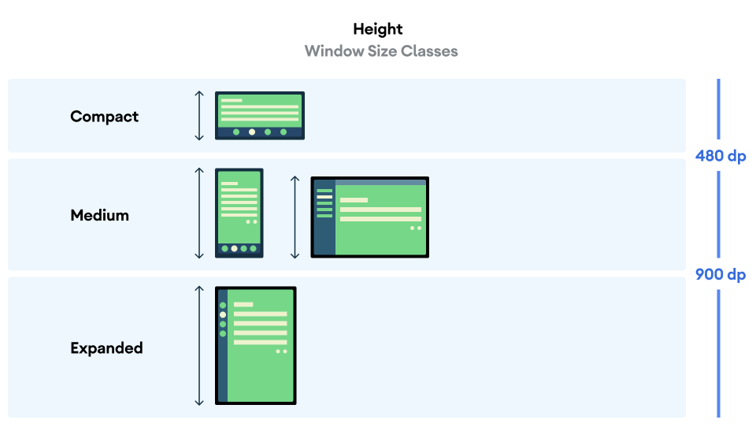

## 自适应布局

自适应布局（Adaptive Layout）是一种界面设计方法，旨在让应用能够**自动适应不同屏幕尺寸、分辨率和设备形态**（如手机、平板、折叠屏等），提供一致的用户体验。


### 断点

如要构建自适应应用，您需要根据屏幕尺寸更改布局。布局发生更改的测量点称为“断点”。Material Design 创建了一个可以涵盖大多数 Android 屏幕的[主观断点范围](https://m3.material.io/foundations/adaptive-design/large-screens/overview)。


根据此断点范围表格，假设您的应用目前在屏幕尺寸小于 600 dp 的设备上运行，则应显示移动设备布局。


### 窗口大小类别

为 Compose 引入的 `WindowSizeClass` API 简化了 Material Design 断点的实现。

窗口大小类别根据应用窗口在横屏或者竖屏模式下所占空间大小引入了三种尺寸：

- Compact
- Medium
- Expanded






 `WindowSizeClass` API 的依赖 

```
...
dependencies {
...
    implementation("androidx.compose.material3:material3-window-size-class")
...
```

使用方法

```
val windowSizeClass = calculateWindowSizeClass(activity)

when(windowSizeClass.widthSizeClass) {
	WindowWidthSizeClass.Compact -> CompactLayout()
	WindowWidthSizeClass.Medium -> CompactLayout()
	WindowWidthSizeClass.Expanded -> CompactLayout()
}

```


## 大屏设备

### 平板

Multi-windows：这个对平板尤其重要。


### 大屏幕

在针对大屏幕（例如平板电脑和可折叠设备）进行设计时，您必须考虑用户工效学以及用户的手指与屏幕之间的距离。使用移动设备时，用户的手指可以轻松地触及大部分屏幕；互动元素（例如按钮和导航元素）的位置则不那么重要。但是，对于大屏幕，将关键的互动元素放在屏幕中间可能会使其难以触及。

> **注意**：竖屏模式是手机的主要屏幕方向，但横屏模式是平板电脑的主要屏幕方向。在设计自适应性时，相关屏幕尺寸会受到当前窗口大小和设备屏幕方向（而不仅仅是设备尺寸）的影响。

[规范布局](https://m3.material.io/foundations/adaptive-design/canonical-layouts)是大屏幕组合，可作为设计和实现的起点。您可以使用三种可用布局来指导如何组织应用中的常见元素，包括列表视图、支持面板和信息流。每种布局都会考虑常见的用例和组件，以满足用户对于应用如何适应不同屏幕尺寸和划分点的期望与需求。 Canonical Layouts 有三种设计模式

- List-Detail
- Supporting Panel
- Feed： 适合新闻和社交媒体


### 大屏设备应用质量指南

若要为 Android 用户打造卓越和一致的体验，构建和测试应用时务必考虑质量。您可以参阅[核心应用质量指南](https://developer.android.google.cn/docs/quality-guidelines/core-app-quality?hl=zh-cn)，了解如何提升应用质量。

如需针对所有设备外形规格打造优质应用，请参阅[大屏设备应用质量指南](https://developer.android.google.cn/docs/quality-guidelines/large-screen-app-quality?hl=zh-cn)。您的应用还必须符合[第 3 层级 - 大屏设备就绪要求](https://developer.android.google.cn/docs/quality-guidelines/large-screen-app-quality?hl=zh-cn#large_screen_ready)。